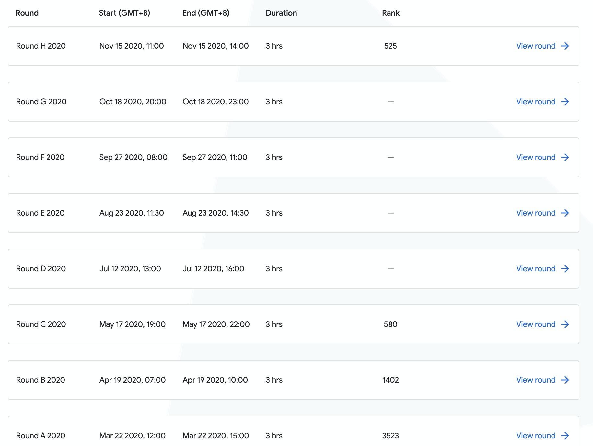

### 总结

---

1. 525，和上次相比又进步了，但总比赛人数也少，不知道要不要开心。。。
2. 第二题数位dp还凑合，但是看到那么大的数据范围一定要注意每一个变量的数据类型啊，因为溢出问题浪费了好多解题时间和罚时！！
3. 第三题想出了题目规律，但是不会做，可能是见的题少，也可能是未知的模板
4. 最后一题做出来了小数据，但大数据集搞错了方向，还是对题目的规律挖掘不够吧，很有借鉴意义的一道题
5. 
   1. 前三个月刷题了，努力打比赛了，所以进步很快；接下来半年没好好刷题，所以没有进步，甚至可能退步了（H轮参赛人数比C轮少）；所以，好好刷题还是有用的，半途而废是不可取的
   2. 名次上升很快，说明我现在在算法上的学习曲线还很陡，说明还是起步阶段，还没达到瓶颈/高原期呢
   3. 我好菜啊

### 第二题

---

1. 题目描述

   ### Problem

   Ron read a book about boring numbers. According to the book, a positive number is called boring if all of the digits at even positions in the number are even and all of the digits at odd positions are odd. The digits are enumerated from left to right starting from 1. For example, the number 1478 is boring as the odd positions include the digits {1, 7} which are odd and even positions include the digits {4, 8} which are even.

   

   Given two numbers **L** and **R**, Ron wants to count how many numbers in the range [**L**, **R**] (**L** and **R** inclusive) are boring. Ron is unable to solve the problem, hence he needs your help.

   

   ### Input

   The first line of the input gives the number of test cases, **T**. **T** test cases follow. Each test case consists of a single line with two numbers **L** and **R**.

   ### Output

   For each test case, output one line containing `Case #x: y`, where `x` is the test case number (starting from 1) and `y` is the count of boring numbers.

   ### Limits
   
   Time limit: 20 seconds.
   Memory limit: 1 GB.
   1 ≤ **T** ≤ 100.
   
   #### Test Set 1

   1 ≤ **L** ≤ **R** ≤ 10^3.

   #### Test Set 2

   1 ≤ **L** ≤ **R** ≤ 10^18.

   ### Sample

   ```
Input
   3
   5 15
   120 125
   779 783
   
   Output
   Case #1: 6
   Case #2: 3
   Case #3: 2
   ```
   
   In Sample Case #1, the numbers in the range are {5, 6, 7, 8, 9, 10, 11, 12, 13, 14, 15} out of which {5, 7, 9, 10, 12, 14} are boring, hence the answer is 6.
   
   In Sample Case #2, the numbers in the range are {120, 121, 122, 123, 124, 125} out of which {121, 123, 125} are boring, hence the answer is 3.
   
   In Sample Case #3, the numbers in the range are {779, 780, 781, 782, 783} out of which {781, 783} are boring, hence the answer is 2.
   
2. 比赛实现

   一道相对简单的数位dp，只需要仔细地推就好，感谢yxc

   大数据10^8，倒是想到了数据范围，但是没考虑全，没想到p5数组也会越界的问题，浪费了时间
   
   ```c++
   #include <iostream>
   #include <vector>
   #include <algorithm>
   
   using namespace std;
   
   vector<long long> p5(1,1);
   
   long long cal(long long x){
       if(x < 0) return 0;
       vector<int> v;
       long long ans = 0;
       long long cur = 5;
       
       while(x > 0){
           v.push_back(x%10);
           x /= 10;
           if(x > 0){
               ans += cur;
               cur *= 5;
           }
       }
       int len = v.size();
       for(int i = 1; len-i >= 0; i++){
           if(i % 2 == 0){
               ans += (v[len-i]+1)/2 * p5[len-i];
               if((i == len) && (v[0] % 2 == 0)) ans++;
               if(v[len-i] % 2 == 1) break;
           }
           else{
               ans += v[len-i]/2 * p5[len-i];
               if((i == len) && (v[0] % 2 == 1)) ans++;
               if(v[len-i] % 2 == 0) break;
           }
       }
       return ans;
   }
   
   int main(){
       long long tmp = 5;
       for(int i = 1; i <= 20; i++){
           p5.push_back(tmp);
           tmp *= 5;
       }
       int t;
       cin >> t;
       for(int i = 1; i <= t; i++){
           long long l,r;
           cin >> l >> r;
           
           cout << "Case #" << i << ": ";
           
           cout << cal(r) - cal(l-1) << endl;
       }
   }
   ```

### 第三题

---

1. 题目描述

   ### Problem

   On a far away planet, rugby is played in the two dimensional Cartesian coordinate system without bounds. The players can occupy integer grid points only and they can move to the neighboring grid points in any of the four cardinal directions. Specifically, if a player is currently at the point (X, Y), then they can move to either of the points (X+1, Y), (X-1, Y), (X, Y+1), or (X, Y-1) in a single step.

   After the game, **N** players are scattered throughout the coordinate system such that any grid point is empty or occupied by one or more players. They want to gather for a picture and form a perfect horizontal line of **N** grid points, one player per point, all occupied points next to each other. Formally, the players have to move so as to occupy the grid points (X, Y), (X+1, Y), (X+2, Y), ..., (X+**N**-1, Y) for some coordinates X and Y. What is the minimum total number of steps the players should make to form a perfect line if they are free to choose the position of the line in the coordinate system and the ordering of players is not important?

   ### Input

   The first line of the input gives the number of test cases **T**. **T** test cases follow. The first line of each test case gives the number of players **N**. The subsequent **N** lines give the initial coordinates of the players. The i-th of these lines contains two integers **Xi** and **Yi**, which describe the initial position of i-th player (1 ≤ i ≤ **N**).

   ### Output

   For each test case, output one line containing `Case #x: y`, where `x` is the test case number (starting from 1) and `y` is the minimum total number of steps that the players need to make in order to form a perfect horizontal line.

   ### Limits

   Memory limit: 1 GB.
   1 ≤ **T** ≤ 100.
   
#### Test Set 1
   
Time limit: 20 seconds.
   1 ≤ **N** ≤ 10.
   -500 ≤ **Xi** ≤ 500.
-500 ≤ **Yi** ≤ 500.
   
#### Test Set 2
   
   Time limit: 40 seconds.
   1 ≤ **N** ≤ 105 for at most 10 cases.
1 ≤ **N** ≤ 104 for the remaining cases.
   -109 ≤ **Xi** ≤ 109.
-109 ≤ **Yi** ≤ 109.
   
   ### Sample
   
   ```
   Input
   2
   2
   1 1
   4 4
   3
   1 1
   1 2
   1 3
   
   Output
Case #1: 5
   Case #2: 4
```
   
In the first test case, one of many optimal solutions is obtained by the second player moving two steps to the left and three steps down to the point (2, 1).
   
   In the second test case, a perfect line can be formed with a total of four steps if the first player moves to the point (0, 2) and the third player moves to the point (2, 2).
   
2. 比赛实现

   只想到了思路，但是不会解：

   - 可以观察到，Y方向上的移动和X方向上的移动互不干扰，因此可以分别看待X，Y数组，而无需把它们绑定在某个人身上
   - 因此，我们的目标是让Y数组内值一样，而X数组内值**排序后**连续递增即可，且花费步骤最少
   
3. 正确做法

   - 对于Y，只需排序后，把所有数移动到中位数对应的即可（随便推一下感受一下，我不会严格推导）
- 对于X，可以转换成类似于Y的问题：
     - 假设X排序后为 0 1 3 4 5 5，令X[i] = X[i] - i，则XX = 0 0 1 1 1 0
     - 假设X排序后为 1 2 4 5 6 6，令X[i] = X[i] - i，则XX = 1 1 2  2 2 1
     - 可以观察到，XX的含义是，要想把X变成以0开始的，连续递增的数组，各个X[i]需要变动XX[i]次
     - 可以推出，当XX = 1 1 1 1 1 1时，表示X数组为以1开始的，连续递增的数组
     - 由于题目也没限制X的范围，因此，只要把XX数组内所有数字变成相同的，就可以使X数组内数字连续递增，因此，转换为对XX施加Y的处理方式即可
     - 但还有一个问题：最开始为什么要对X排序呢？虽然感觉上是对的，但是还是需要严格推导的。
   
   ```c++
   #include<bits/stdc++.h>
   using namespace std;
   using LL = long long;
   constexpr int maxn = 100000 + 1;
   LL X[maxn], Y[maxn];
   int main(){
       ios::sync_with_stdio(false);
       cin.tie(nullptr);
       cout.tie(nullptr);
       int T;
       cin >> T;
       for(int tt = 1; tt <= T; tt += 1){
           cout << "Case #" << tt << ": ";
           int n;
           cin >> n;
           for(int i = 0; i < n; i += 1) cin >> X[i] >> Y[i];
           sort(X, X + n);
           sort(Y, Y + n);
           for(int i = 0; i < n; i += 1) X[i] -= i;
           sort(X, X + n);
           LL ans = 0;
           for(int i = 0; i < n; i += 1)
               ans += abs(X[i] - X[n / 2]) + abs(Y[i] - Y[n / 2]);
           cout << ans << "\n";
       }
       return 0;
   }
   ```

### 第四题

---

1. 题目描述

   ### Problem

   There are **N** people in the world numbered 1 to **N**. The i-th person has a distinct name **Si** that is a string of uppercase English letters.

   Two people are friends if and only if there is some letter that appears at least once in each of their names. Any such letter does not need to be at the same position in both names. After all, friendship requires having something in common!
   
A friendship chain of length n between person A and person B is a sequence of people X1, X2, ..., Xn such that X1 = A, Xn = B, and Xi and Xi+1 are friends, for i=1 to n-1. Note that any two people can have zero or more friendship chains between them.
   
For each of the given **Q** pairs of people, can you find the length of the shortest friendship chain between them? If there is no friendship chain between a pair, output `-1`.
   
### Input
   
The first line of the input gives the number of test cases, **T**. **T** test cases follow. The first line of each test case contains the two integers **N** and **Q**. The second line contains **N** strings, which are people's names. The i-th string (starting from 1) is **Si**. Then, **Q** lines follow, describing the queries. The i-th of these lines contains the two integers **Xi** and **Yi**, which are the indexes (counting starting from 1) of a pair of people in the list of names.
   
   ### Output
   
   For each test case, output one line containing `Case #x: y`, where `x` is the test case number (starting from 1) and `y` is a list of the answers for the **Q** queries in order, separated by spaces.
   
   ### Limits
   
   Time limit: 40 seconds per test set.
   Memory limit: 1GB.
   1 ≤ **T** ≤ 100.
   1 ≤ **Q** ≤ 5 × 104.
   **Si** consists of uppercase English letters, for all i.
   1 ≤ length of **Si** ≤ 20, for all i.
   All **Si** are distinct.
   1 ≤ **Xi** <**Yi** ≤ **N**, for all i.
   
   #### Test Set 1
   
   2 ≤ **N** ≤ 100.
   
   #### Test Set 2
   
   103 < **N** ≤ 5 × 104 in at most 10 cases.
   2 ≤ **N** ≤ 103 in all other cases.
   
   ### Sample
   
   ```
   Input
   2
   5 2
   LIZZIE KEVIN BOHDAN LALIT RUOYU
   1 2
   1 3
   2 2
   KICK START
   1 2
   1 2
   
   Output
   Case #1: 2 3
   Case #2: -1 -1
   ```
   
   In Sample Case #1, there are two queries:
   
   - In the first query, `LIZZIE` and `KEVIN` are friends (because they share the letter E in their names). So, the shortest friendship chain length is 2.
   - In the second query, `LIZZIE` and `BOHDAN` are not friends, but have two possible shortest friendship chains (either via `KEVIN` or `LALIT`). So, the shortest friendship chain length is 3. Note that there are other friendship chains as well, but they are longer.
   
   
   
   In Sample Case #2, there are two queries:
   
   - In the first query, `KICK` and `START` are not connected by a chain of friends.
   - The second query is the same as the first query. Note that queries are not guaranteed to be distinct.

2. 比赛实现

   以各个名字为节点，构造好图后，直接暴力floyd了，小数据集可过，但大数据集直接TLE了，因为floyd是n立方的时间复杂度

   后来写了BFS的n方复杂度的，但是空间超了，就一直钻牛角尖，其实回过来想想，当时过于心急了，没有仔细地挖掘这道题内含的规律，后悔啊、、、
   
   ```c++
   #include <iostream>
   #include <vector>
   #include <unordered_set>
   #include <algorithm>
   
   using namespace std;
   
   const int INF = 1e8;
   vector<vector<int>> d;
   int n, q;
   
   void floyd(){
       for (int k = 1; k <= n; k ++ )
           for (int i = 1; i <= n; i ++ )
               for (int j = 1; j <= n; j ++ )
                   d[i][j] = min(d[i][j], d[i][k] + d[k][j]);
   }
   
   int main(){
       int t;
       cin >> t;
       for(int cases = 1; cases <= t; cases++){
           cin >> n >> q;
           string name;
           vector<unordered_set<char>> s(n+1);
           d = vector<vector<int>>(n+1, vector<int>(n+1));
           for (int i = 1; i <= n; i ++ )
               for (int j = 1; j <= n; j ++ )
                   if (i == j) d[i][j] = 0;
                   else d[i][j] = INF;
           for (int i = 1; i <= n; i ++ ){
               cin >> name;
               for(int j = 0; j < name.size(); j++){
                   s[i].insert(name[j]);
                   for(int k = 1; k < i; k++)
                       if(d[i][k] > 1 && s[k].find(name[j]) != s[k].end())
                           d[k][i] = d[i][k] = 1;
               }
           }
           floyd();
           cout << "Case #" << cases << ": ";
           while(q--){
               int x,y;
               cin >> x >> y;
               int t = d[x][y];
               if (t > INF / 2) cout << -1 << ' ';
               else cout << t+1 << ' ';
           }
           cout << endl;
       }
   }
   ```
   
3. 正确做法

   题目里很明显的暗示：每个人名字只含有26个大写字母，两个人的名字里只要有一个字母相同，他们就是朋友！你细品！肯定有可以挖掘的规律啊！

   人名之间的联系可以只靠单个字母确立，因此，其实完全可以对这26个大写字母建图，即如果一个人的名字为ADE，则这个人就可以同时属于节点A、D和E

   - 如果两个人的名字含相同字母A，则这两个人可以不通过中间人直接相连，即`d[A][A]=0`
   - 假设一个人x名字里既有A又有B，说明对于对于两个名字里没有相同字母的人y,z而言，如果y含有A，z含有B，则y和z可以**仅通过**x相连，即`d[A][B]=1`
   - 如果所有人的名字里都不同时含有A和B，则说明例如对于名字分别是A和B的人而言，它们不能仅通过一个人相连
   - 可以用floyd求这26个字母两两之间的距离
   - 对给定的两个人名，则是求，他们所有可能属于的节点中，最近的两个节点+2（两个点本身）

   ```c++
   #include<bits/stdc++.h>
   using namespace std;
   using LL = long long;
   constexpr int maxn = 50000 + 1;
   int c[maxn][26];
   int d[26][26];
   int main(){
       ios::sync_with_stdio(false);
       cin.tie(nullptr);
       cout.tie(nullptr);
       int T;
       cin >> T;
       for(int tt = 1; tt <= T; tt += 1){
           cout << "Case #" << tt << ": ";
           int N, Q;
           cin >> N >> Q;
           for(int i = 1; i <= N; i += 1){
               for(int j = 0; j < 26; j += 1) c[i][j] = 0;
               string S;
               cin >> S;
               for(char ch : S) c[i][ch - 'A'] = 1;
           }
           for(int i = 0; i < 26; i += 1)
               for(int j = 0; j < 26; j += 1) d[i][j] = i == j ? 0 : 100;
           for(int i = 1; i <= N; i += 1){
               for(int j = 0; j < 26; j += 1)
                   for(int k = 0; k < 26; k += 1) if(j != k) if(c[i][j] and c[i][k]) d[j][k] = 1;
           }
           for(int k = 0; k < 26; k += 1)
               for(int i = 0; i < 26; i += 1)
                   for(int j = 0; j < 26; j += 1)
                       d[i][j] = min(d[i][k] + d[k][j], d[i][j]);
           for(int i = 0, X, Y; i < Q; i += 1){
               cin >> X >> Y;
               int ans = 100;
               for(int j = 0; j < 26; j += 1)
                   for(int k = 0; k < 26; k += 1)
                       if(c[X][j] and c[Y][k]) ans = min(ans, d[j][k]);
               if(ans == 100) cout << "-1 ";
               else cout << ans + 2 << " ";
           }
           cout << "\n";
       }
       return 0;
   }
   ```

   

