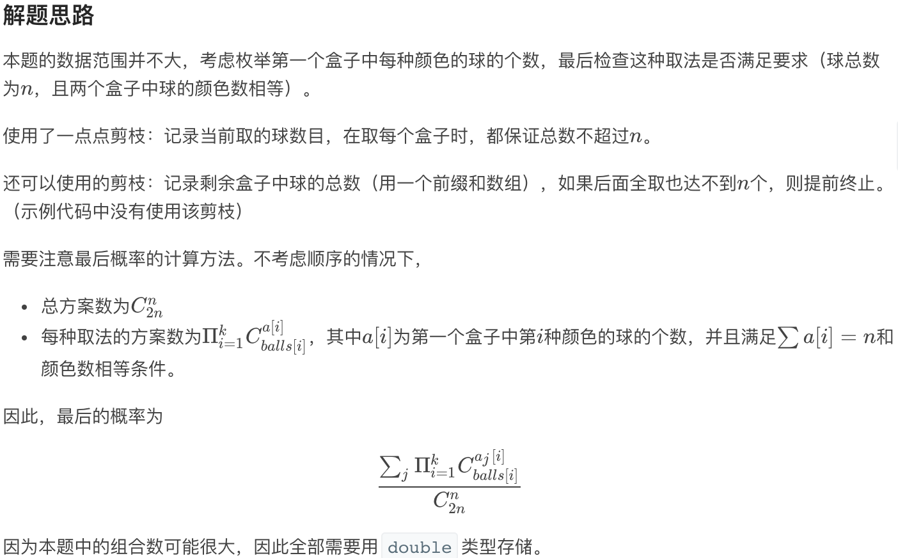

### 总结

1. 困难题审题出了点问题，导致之后没时间和心情做了、、、

### 1464. 数组中两元素的最大乘积（简单）

---

1. 题目描述

   给你一个整数数组 `nums`，请你选择数组的两个不同下标 `i` 和 `j`*，*使 `(nums[i]-1)*(nums[j]-1)` 取得最大值。

   请你计算并返回该式的最大值。

   **示例 1：**

   ```
   输入：nums = [3,4,5,2]
   输出：12 
   解释：如果选择下标 i=1 和 j=2（下标从 0 开始），则可以获得最大值，(nums[1]-1)*(nums[2]-1) = (4-1)*(5-1) = 3*4 = 12 。 
   ```

   **示例 2：**

   ```
   输入：nums = [1,5,4,5]
   输出：16
   解释：选择下标 i=1 和 j=3（下标从 0 开始），则可以获得最大值 (5-1)*(5-1) = 16 。
   ```

   **示例 3：**

   ```
   输入：nums = [3,7]
   输出：12
   ```

   **提示：**

   - `2 <= nums.length <= 500`
   - `1 <= nums[i] <= 10^3`

2. 比赛实现

   看数据量直接暴力

   ```c++
   class Solution {
   public:
       int maxProduct(vector<int>& nums) {
           int ans = 0;
           for(int i = 0; i < nums.size(); i++)
               for(int j = i + 1; j < nums.size(); j++)
                   ans = max(ans, (nums[i]-1)*(nums[j]-1));
           return ans;
       }
   };
   ```

### 1465. 切割后面积最大的蛋糕（中等）

---

1. 题目描述

   矩形蛋糕的高度为 `h` 且宽度为 `w`，给你两个整数数组 `horizontalCuts` 和 `verticalCuts`，其中 `horizontalCuts[i]` 是从矩形蛋糕顶部到第 `i` 个水平切口的距离，类似地， `verticalCuts[j]` 是从矩形蛋糕的左侧到第 `j` 个竖直切口的距离。

   请你按数组 *`horizontalCuts`* 和 *`verticalCuts`* 中提供的水平和竖直位置切割后，请你找出 **面积最大** 的那份蛋糕，并返回其 **面积** 。由于答案可能是一个很大的数字，因此需要将结果对 `10^9 + 7` 取余后返回。

    

   **示例 1：**

   

   ```
   输入：h = 5, w = 4, horizontalCuts = [1,2,4], verticalCuts = [1,3]
   输出：4 
   解释：上图所示的矩阵蛋糕中，红色线表示水平和竖直方向上的切口。切割蛋糕后，绿色的那份蛋糕面积最大。
   ```

   **示例 2：**

   ****

   ```
   输入：h = 5, w = 4, horizontalCuts = [3,1], verticalCuts = [1]
   输出：6
   解释：上图所示的矩阵蛋糕中，红色线表示水平和竖直方向上的切口。切割蛋糕后，绿色和黄色的两份蛋糕面积最大。
   ```

   **示例 3：**

   ```
   输入：h = 5, w = 4, horizontalCuts = [3], verticalCuts = [3]
   输出：9
   ```

   **提示：**

   - `2 <= h, w <= 10^9`
   - `1 <= horizontalCuts.length < min(h, 10^5)`
   - `1 <= verticalCuts.length < min(w, 10^5)`
   - `1 <= horizontalCuts[i] < h`
   - `1 <= verticalCuts[i] < w`
   - 题目数据保证 `horizontalCuts` 中的所有元素各不相同
   - 题目数据保证 `verticalCuts` 中的所有元素各不相同

2. 比赛实现

   实际上就是最大的相邻 水平/竖直 的切割距离的乘积

   ```c++
   class Solution {
   public:
       long long MOD = 1e9 + 7;
       int maxArea(int h, int w, vector<int>& horizontalCuts, vector<int>& verticalCuts) {
           sort(horizontalCuts.begin(), horizontalCuts.end());
           sort(verticalCuts.begin(), verticalCuts.end());
           long long ans = 0;//防止溢出
           int max_h = horizontalCuts[0], max_w = verticalCuts[0];
           for(int i = 1; i < horizontalCuts.size(); i++)
               max_h = max(max_h, horizontalCuts[i]-horizontalCuts[i-1]);
           max_h = max(max_h, h-horizontalCuts[horizontalCuts.size()-1]);
           for(int i = 1; i < verticalCuts.size(); i++)
               max_w = max(max_w, verticalCuts[i]-verticalCuts[i-1]);
           max_w = max(max_w, w-verticalCuts[verticalCuts.size()-1]);
           ans = ((long long)max_h * (long long)max_w) % MOD;
           return ans;
       }
   };
   ```

### 1466. 重新规划路线（中等）

---

1. 题目描述

   `n` 座城市，从 `0` 到 `n-1` 编号，其间共有 `n-1` 条路线。因此，要想在两座不同城市之间旅行只有唯一一条路线可供选择（路线网形成一颗树）。去年，交通运输部决定重新规划路线，以改变交通拥堵的状况。

   路线用 `connections` 表示，其中 `connections[i] = [a, b]` 表示从城市 `a` 到 `b` 的一条有向路线。

   今年，城市 0 将会举办一场大型比赛，很多游客都想前往城市 0 。

   请你帮助重新规划路线方向，使每个城市都可以访问城市 0 。返回需要变更方向的最小路线数。

   题目数据 **保证** 每个城市在重新规划路线方向后都能到达城市 0 。 

   **示例 1：**

   ****

   ```
   输入：n = 6, connections = [[0,1],[1,3],[2,3],[4,0],[4,5]]
   输出：3
   解释：更改以红色显示的路线的方向，使每个城市都可以到达城市 0 。
   ```

   **示例 2：**

   ****

   ```
   输入：n = 5, connections = [[1,0],[1,2],[3,2],[3,4]]
   输出：2
   解释：更改以红色显示的路线的方向，使每个城市都可以到达城市 0 。
   ```

   **示例 3：**

   ```
   输入：n = 3, connections = [[1,0],[2,0]]
   输出：0
   ```

   **提示：**

   - `2 <= n <= 5 * 10^4`
   - `connections.length == n-1`
   - `connections[i].length == 2`
   - `0 <= connections[i][0], connections[i][1] <= n-1`
   - `connections[i][0] != connections[i][1]`

2. 比赛实现

   从0开始bfs即可，能指向当前点的就能到达0，从当前点指出去的就不能到达0，需要反向

   ```c++
   class Solution {
   public:
       int minReorder(int n, vector<vector<int>>& connections) {
           unordered_map<int, vector<int>> ins;//记录指向每个点点各个点
           unordered_map<int, vector<int>> outs;//记录指出每个点点各个点
           for(int i = 0; i < n-1; i++){
               ins[connections[i][1]].push_back(connections[i][0]);
               outs[connections[i][0]].push_back(connections[i][1]);
           }
           queue<int> q;
           q.push(0);
           unordered_set<int> visited;
           visited.insert(0);
           int ans = 0;
           while(!q.empty()){
               int cur = q.front();
               q.pop();
               for(auto it = ins[cur].begin(); it != ins[cur].end(); it++){
                   if(visited.find(*it) == visited.end()){
                       visited.insert(*it);
                       q.push(*it);
                   }
               }
               for(auto it = outs[cur].begin(); it != outs[cur].end(); it++){
                   if(visited.find(*it) == visited.end()){
                       visited.insert(*it);
                       q.push(*it);
                       ans++;//反向
                   }
               }
           }
           return ans;
       }
   };
   ```

### 1467. 两个盒子中颜色不同的球数量相同的概率（困难）

---

1. 题目描述

   给你 `2n` 个有 `k` 种不同颜色的球，以及一个大小为 `k` 的整数数组 `balls` ，其中 `balls[i]` 是颜色为 `i` 的球的数量。

   所有的球都已经 **随机打乱顺序** ，前 `n` 个球放入第一个盒子，后 `n` 个球放入另一个盒子（请认真阅读示例 2 的解释部分）。

   **注意：**这两个盒子是不同的。例如，两个球颜色分别为 `a` 和 `b`，盒子分别为 `[]` 和 `()`，那么 `[a] (b)` 和 `[b] (a)` 这两种分配方式是不同的（请认真阅读示例 1 的解释部分）。

   请计算两个盒子中出现「颜色不同的球数量相同」的情况的概率。

   **示例 1：**

   ```
   输入：balls = [1,1]
   输出：1.00000
   解释：球平均分配的方式只有两种：
   - 颜色为 1 的球放入第一个盒子，颜色为 2 的球放入第二个盒子
   - 颜色为 2 的球放入第一个盒子，颜色为 1 的球放入第二个盒子
   这两种分配，每个盒子中颜色不同的球数量都相同。所以概率为 2/2 = 1 。
   ```

   **示例 2：**

   ```
   输入：balls = [2,1,1]
   输出：0.66667
   解释：球的列表为 [1, 1, 2, 3]
   随机打乱，得到 12 种等概率的不同打乱方案，每种方案概率为 1/12 ：
   [1,1 / 2,3], [1,1 / 3,2], [1,2 / 1,3], [1,2 / 3,1], [1,3 / 1,2], [1,3 / 2,1], [2,1 / 1,3], [2,1 / 3,1], [2,3 / 1,1], [3,1 / 1,2], [3,1 / 2,1], [3,2 / 1,1]
   然后，我们将前两个球放入第一个盒子，后两个球放入第二个盒子。
   这 12 种可能的随机打乱方式中的 8 种在每个盒子中颜色不同的球数量相同。
   概率 = 8/12 = 0.66667
   ```

   **示例 3：**

   ```
   输入：balls = [1,2,1,2]
   输出：0.60000
   解释：球的列表为 [1, 2, 2, 3, 4, 4]。要想显示所有 180 种随机打乱方案是很难的，但只检查颜色不同的球数量相同的 108 种情况是比较容易的。
   概率 = 108 / 180 = 0.6 。
   ```

   **示例 4：**

   ```
   输入：balls = [3,2,1]
   输出：0.30000
   解释：球的列表为 [1, 1, 1, 2, 2, 3]。要想显示所有 60 种随机打乱方案是很难的，但只检查颜色不同的球数量相同的 18 种情况是比较容易的。
   概率 = 18 / 60 = 0.3 。
   ```

   **示例 5：**

   ```
   输入：balls = [6,6,6,6,6,6]
   输出：0.90327
   ```

   **提示：**

   - `1 <= balls.length <= 8`
   - `1 <= balls[i] <= 6`
   - `sum(balls)` 是偶数
   - 答案与真实值误差在 `10^-5` 以内，则被视为正确答案

2. 正确解法

   这题意表述我服了，意思就是分别统计这两个盒子里含有几种颜色的球，然后让这两个数相同

   发现理解错了就懒得再改了，其实已经dfs做的差不多了

   

   ```c++
   class Solution {
     int n, k, half, curr;
     vector<double> fac;
     double tot, sum;
     vector<int> num, balls;
     double c(int n, int k) {
       return fac[n] / fac[k] / fac[n - k];
     }
     void dfs(int idx) {
       if (idx == k) {
         if (curr != half)
           return;
         int a = 0, b = 0;
         for (int i = 0; i < k; ++i) {
           a += num[i] > 0;
           b += (balls[i] - num[i] > 0);
         }
         if (a == b) {
           double contrib = 1;
           for (int i = 0; i < k; ++i)
             if (num[i] > 0)
               contrib *= c(balls[i], num[i]);
           sum += contrib;
         }
       } else {
         for (int i = 0; i <= min(balls[idx], half - curr); ++i) {
           num[idx] = i;
           curr += i;
           dfs(idx + 1);
           num[idx] = 0;
           curr -= i;
         }
       }
     }
   public:
     double getProbability(vector<int>& balls) {
       n = 0, k = balls.size(), this->balls = balls;
       for (int ball : balls)
         n += ball;
       half = n / 2;
       fac = vector<double>(n + 1);
       fac[0] = 1;
       for (int i = 1; i <= n; ++i)
         fac[i] = fac[i - 1] * i;
       tot = c(n, half);
       num = vector<int>(k);
       sum = 0;
       curr = 0;
       dfs(0);
       return sum / tot;
     }
   };
   ```

   