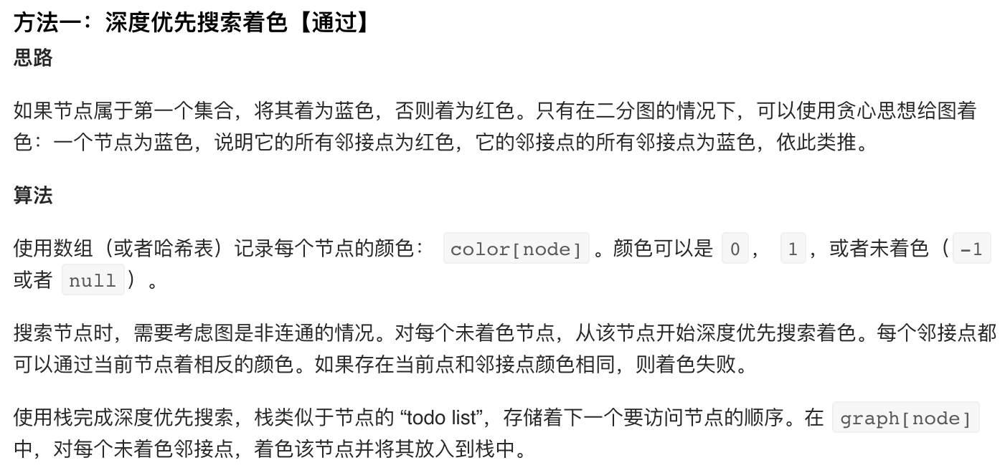
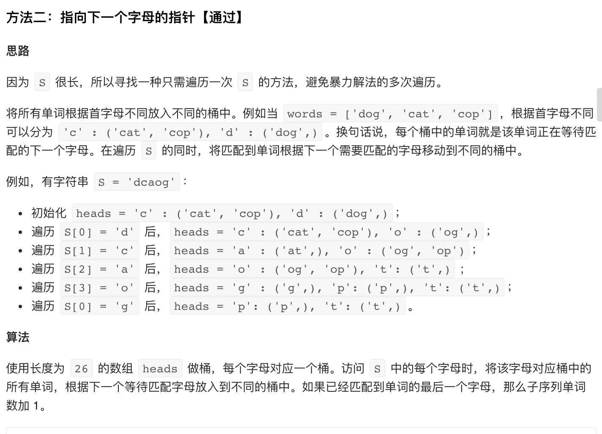
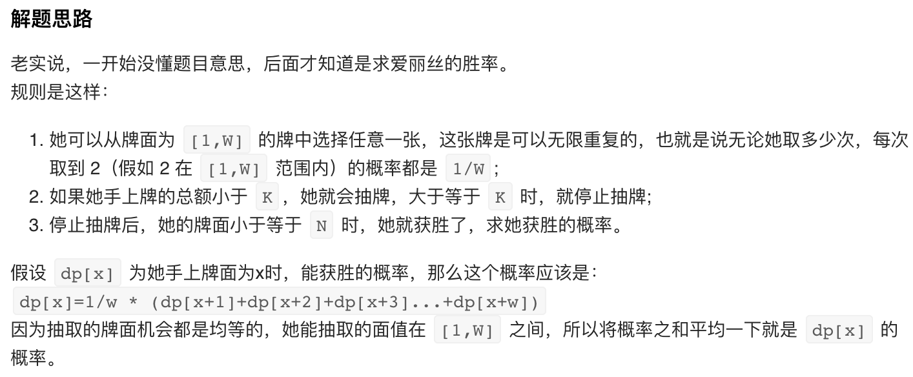
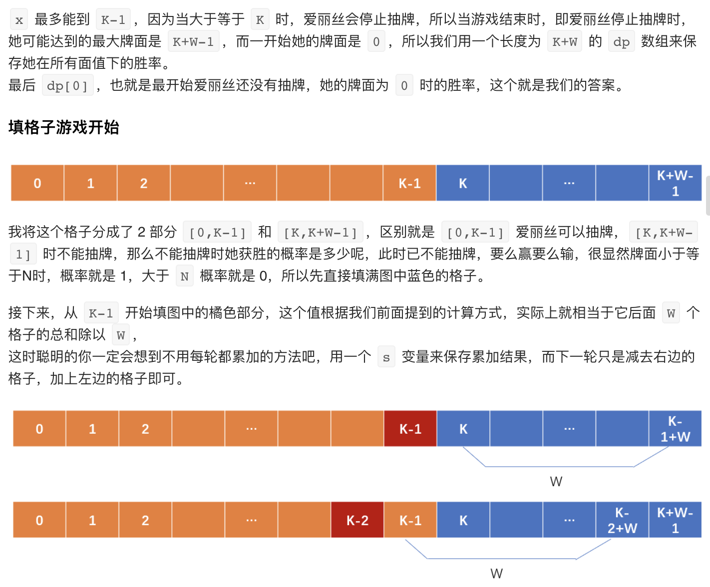
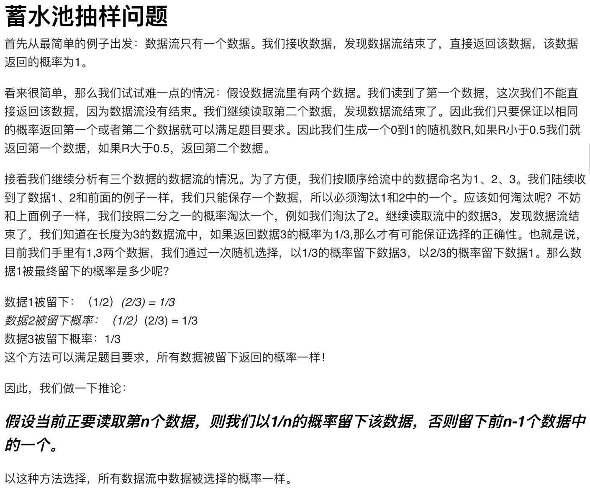
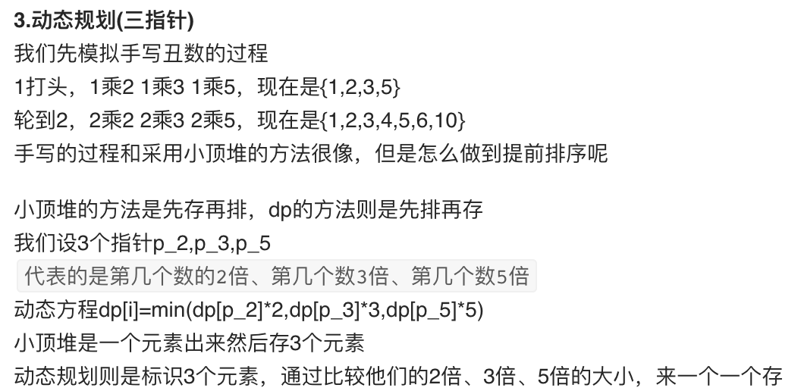

### 572. 另一个树的子树（简单）

---

1. 题目描述

   给定两个非空二叉树 s 和 t，检验 s 中是否包含和 t 具有相同结构和节点值的子树。s 的一个子树包括 s 的一个节点和这个节点的所有子孙。s 也可以看做它自身的一棵子树。

       示例 1:
       给定的树 s:
         3
        / \
       4   5
         / \
        1   2
       给定的树 t：
       
          4 
         / \
        1   2
       返回 true，因为 t 与 s 的一个子树拥有相同的结构和节点值。
       示例 2:
       给定的树 s：
         3
        / \
       4   5
         / \
        1   2
           /
          0
       给定的树 t：
       
          4
         / \
        1   2
       返回 false。


   ​    

2. 简单实现

   ```c++
   class Solution {
   public:
       bool checkequal(TreeNode* s, TreeNode* t){
           if(!s && !t) return true;
           else if(!s || !t) return false;
           else
               if(s->val != t->val) return false;
               else
                   return checkequal(s->left, t->left) && checkequal(s->right, t->right);
       }
       bool isSubtree(TreeNode* s, TreeNode* t) {
           if(!s) return false;
           if(s->val == t->val && checkequal(s, t)) 
               return true;
           else
               return isSubtree(s->left, t) || isSubtree(s->right, t);
       }
   };
   ```

### 772. 基本计算器III（困难）

---

要会员

### 785. 判断二分图（中等）

---

1. 题目描述

   给定一个无向图graph，当这个图为二分图时返回true。

   如果我们能将一个图的节点集合分割成两个独立的子集A和B，并使图中的每一条边的两个节点一个来自A集合，一个来自B集合，我们就将这个图称为二分图。

   graph将会以邻接表方式给出，graph[i]表示图中与节点i相连的所有节点。每个节点都是一个在0到graph.length-1之间的整数。这图中没有自环和平行边： graph[i] 中不存在i，并且graph[i]中没有重复的值。

   ```
   示例 1:
   输入: [[1,3], [0,2], [1,3], [0,2]]
   输出: true
   解释: 
   无向图如下:
   0----1
   |    |
   |    |
   3----2
   我们可以将节点分成两组: {0, 2} 和 {1, 3}。
   
   示例 2:
   输入: [[1,2,3], [0,2], [0,1,3], [0,2]]
   输出: false
   解释: 
   无向图如下:
   0----1
   | \  |
   |  \ |
   3----2
   我们不能将节点分割成两个独立的子集。
   ```

   注意:

   - graph 的长度范围为 [1, 100]。
   - graph[i] 中的元素的范围为 [0, graph.length - 1]。
   - graph[i] 不会包含 i 或者有重复的值。
   - 图是无向的: 如果j 在 graph[i]里边, 那么 i 也会在 graph[j]里边。

2. 简单实现

   利用并查集，和同一节点相连的节点必然属于同一个集合

   ```c++
   class UnionFind{
   private:
       vector<int> father;
       int size;
   public:
       UnionFind(int n){
           father = vector<int>(n);
           size = n;
           for(int i = 0; i < n; i++)
               father[i] = i;
       }
       int get(int x){
           if(father[x] == x)
               return x;
           return father[x] = get(father[x]);//路径压缩
       }
       void merge(int x, int y){
           x = get(x);
           y = get(y);
           if(x != y){
               father[y] = x;
               size--;            
           }
       }
       int getSize() {return size;}
   };
   
   class Solution {
   public:
       bool isBipartite(vector<vector<int>>& graph) {
           UnionFind u(graph.size());
           for(int i = 0; i < graph.size(); i++){
               for(int j = 1; j < graph[i].size(); j++){
                   u.merge(graph[i][j], graph[i][j-1]);
                   if(u.get(i) == u.get(graph[i][j])) //i不能与这些点同一个集合
                       return false;
                   if(u.getSize() <= 1) return false;
               }
           }
           return true;
       }
   };
   ```

3. 最优解法——图着色问题

   

### 132. 分割回文串II（困难）

---

1. 题目描述

   给定一个字符串 s，将 s 分割成一些子串，使每个子串都是回文串。

   返回符合要求的最少分割次数。

   ```
   示例:
   输入: "aab"
   输出: 1
   解释: 进行一次分割就可将 s 分割成 ["aa","b"] 这样两个回文子串。
   ```

2. 正确解法

   定义dp[i]为前缀子串 s[0:i] （包括索引 i 处的字符）符合要求的最少分割次数，则状态转移方程为

   `dp[i] = min(dp[j] + 1 if s[j + 1: i] 是回文 for j in range(i))`

   关键在于如果正常判断回文串需要o(n)时间，费时，看了题解提到了leetcode第五题的解法，真是需要记得以前的题

   ```c++
   class Solution {
   public:
       int minCut(string s) {
           int len = s.size();
           if (len < 2) return 0;
   
           vector<int> dp = vector<int>(len);
           // 2 个字符最多分割 1 次，3 个字符最多分割 2 次，初始化的时候，设置成为这个最多分割次数
           for (int i = 0; i < len; i++) 
               dp[i] = i;
   
           // 参考「力扣」第 5 题：最长回文子串 动态规划 的解法
           vector<vector<bool>> checkPalindrome = vector<vector<bool>>(len, vector<bool>(len));
           for (int right = 0; right < len; right++) {
               // 注意：left <= right 取等号表示 1 个字符的时候也需要判断
               for (int left = 0; left <= right; left++) {
                   if (s[left] == s[right] && (right - left <= 2 || checkPalindrome[left + 1][right - 1])) {
                       checkPalindrome[left][right] = true;
                   }
               }
           }
           // 1 个字符的时候，不用判断，因此 i 从 1 开始
           for (int i = 1; i < len; i++) {
               if (checkPalindrome[0][i]){
                   dp[i] = 0;
                   continue;
               }
               // 注意：这里是严格，要保证 s[j + 1:i] 至少得有一个字符串
               for (int j = 0; j < i; j++) {
                   if (checkPalindrome[j + 1][i]) 
                       dp[i] = min(dp[i], dp[j] + 1);
               }
           }
           return dp[len - 1];
       }
   };
   ```

### 384. 打乱数组（中等）

---

1. 题目描述

   打乱一个没有重复元素的数组。

    ```
   示例:
   
   // 以数字集合 1, 2 和 3 初始化数组。
   int[] nums = {1,2,3};
   Solution solution = new Solution(nums);
   
   // 打乱数组 [1,2,3] 并返回结果。任何 [1,2,3]的排列返回的概率应该相同。
   solution.shuffle();
   
   // 重设数组到它的初始状态[1,2,3]。
   solution.reset();
   
   // 随机返回数组[1,2,3]打乱后的结果。
   solution.shuffle();
    ```

2. 正确解法——洗牌算法

   ```c++
   class Solution {
   private:
       vector<int> data;
   public:
       Solution(vector<int>& nums) {
           data = nums;
       }
       
       /** Resets the array to its original configuration and return it. */
       vector<int> reset() {
           return data;
       }
       
       /** Returns a random shuffling of the array. */
       vector<int> shuffle() {
           vector<int> res(data);
           for(int i = 0; i < res.size(); i++)
               swap(res[i],res[i + rand() % (res.size()-i)]);
           return res;
       }
   };
   ```

### 51. N皇后（困难）

---

1. 题目描述

   n 皇后问题研究的是如何将 n 个皇后放置在 n×n 的棋盘上，并且使皇后彼此之间不能相互攻击。

   

   上图为 8 皇后问题的一种解法。

   给定一个整数 n，返回所有不同的 n 皇后问题的解决方案。

   每一种解法包含一个明确的 n 皇后问题的棋子放置方案，该方案中 'Q' 和 '.' 分别代表了皇后和空位。

   ```
   示例:
   
   输入: 4
   输出: [
    [".Q..",  // 解法 1
     "...Q",
     "Q...",
     "..Q."],
   
    ["..Q.",  // 解法 2
     "Q...",
     "...Q",
     ".Q.."]
   ]
   解释: 4 皇后问题存在两个不同的解法。
   ```


   提示：皇后，是国际象棋中的棋子，意味着国王的妻子。皇后只做一件事，那就是“吃子”。当她遇见可以吃的棋子时，就迅速冲上去吃掉棋子。当然，她横、竖、斜都可走一到七步，可进可退。（引用自 百度百科 - 皇后 ）

2. 简单实现

   ```c++
   class Solution {
   public:
       bool check(vector<string>& cur, int i, int j){
           for(int idx = 1; idx <= i; idx++){
               if(cur[i-idx][j] == 'Q')
                   return false;
               if(j-idx >= 0 && cur[i-idx][j-idx] == 'Q')
                   return false;
               if(j+idx < cur[0].size() && cur[i-idx][j+idx] == 'Q')
                   return false;
           }
           return true;
       }
       vector<vector<string>> solveNQueens(int n) {
           if(n == 1) return {{"Q"}};
           vector<vector<string>> ans;
           queue<vector<string>> q;
           string str(n, '.');
           vector<string> cur(n, str);
           for(int i = 0; i < n; i++){
               cur[0][i] = 'Q';
               q.push(cur);
               cur[0][i] = '.';
           }
           for(int i = 1; i < n; i++){
               int size = q.size();
               while(size--){
                   vector<string> cur = q.front();
                   q.pop();
                   for(int j = 0; j < n; j++){
                       if(check(cur, i, j)){
                           cur[i][j] = 'Q';
                           if(i == n-1)
                               ans.push_back(cur);
                           else
                               q.push(cur);
                           cur[i][j] = '.';
                       }
                   }
               }
           }
           return ans;
       }
   };
   ```

### 348. 判定井字棋胜负（中等）

---

要会员

### 369. 给单链表加一（中等）

---

要会员

### 486. 预测赢家（中等）

---

1. 题目描述

   给定一个表示分数的非负整数数组。 玩家1从数组任意一端拿取一个分数，随后玩家2继续从剩余数组任意一端拿取分数，然后玩家1拿，……。每次一个玩家只能拿取一个分数，分数被拿取之后不再可取。直到没有剩余分数可取时游戏结束。最终获得分数总和最多的玩家获胜。

   给定一个表示分数的数组，预测玩家1是否会成为赢家。你可以假设每个玩家的玩法都会使他的分数最大化。

   ```
   示例 1:
   输入: [1, 5, 2]
   输出: False
   解释: 一开始，玩家1可以从1和2中进行选择。
   如果他选择2（或者1），那么玩家2可以从1（或者2）和5中进行选择。如果玩家2选择了5，那么玩家1则只剩下1（或者2）可选。
   所以，玩家1的最终分数为 1 + 2 = 3，而玩家2为 5。
   因此，玩家1永远不会成为赢家，返回 False。
   
   示例 2:
   输入: [1, 5, 233, 7]
   输出: True
   解释: 玩家1一开始选择1。然后玩家2必须从5和7中进行选择。无论玩家2选择了哪个，玩家1都可以选择233。
   最终，玩家1（234分）比玩家2（12分）获得更多的分数，所以返回 True，表示玩家1可以成为赢家。
   ```

   注意:

   - 1 <= 给定的数组长度 <= 20.
   - 数组里所有分数都为非负数且不会大于10000000。
   - 如果最终两个玩家的分数相等，那么玩家1仍为赢家。

2. 简单实现

   和取石子的博弈问题类似，双人博弈就是单人精神分裂式博弈，设`dp[i][j]`表示从nums[i...j]开始取，第一个取的人的最大分数，则状态转移方程为`dp[i][j] = max(nums[i] + (sum[i..j]-dp[i+1][j]), nums[j] + (sum[i...j]-dp[i][j-1]));`，即从最左端拿或从最右端拿，找最优结果

   ```c++
   class Solution {
   public:
       bool PredictTheWinner(vector<int>& nums) {
           int size = nums.size();
           if(size <= 2) return true;//肯定先拿点分大
           vector<int> sum(size+1);//前缀和
           sum[0] = 0;
           for(int i = 0; i < size; i++)//计算前缀和
               sum[i+1] = sum[i] + nums[i];
           vector<vector<int>> dp(size, vector<int>(size));
           for(int i = 0; i < size; i++)//初始化，只有一个数时直接拿走
               dp[i][i] = nums[i];
           for(int k = 1; k < size; k++){//i与j的间隔
               for(int i = 0; i + k < size; i++){//j=i+k
                   dp[i][i+k] = max(nums[i] + (sum[i+k+1]-sum[i]-dp[i+1][i+k]),
                                   nums[i+k] + (sum[i+k+1]-sum[i]-dp[i][i+k-1]));
               }
           }
           return 2*dp[0][size-1] >= sum[size];//第一个人拿到的分数不少于总分的一半
       }
   };
   ```

3. 改进

   结合题解，可以观察到优化点

   - dp的状态转移方程中，sum[i...j]相互抵消，可以不算，则`dp[i][i+k] = max(nums[i]-dp[i+1][i+k], nums[i+k]-dp[i][i+k-1]);`，要注意`dp[i][j]`整体减少了sum[i..j]，返回时的答案判断要相应改变

   ```c++
   class Solution {
   public:
       bool PredictTheWinner(vector<int>& nums) {
           int size = nums.size();
           if(size <= 2) return true;//肯定先拿点分大
           vector<vector<int>> dp(size, vector<int>(size));
           for(int i = 0; i < size; i++)//初始化，只有一个数时直接拿走
               dp[i][i] = nums[i];
           for(int k = 1; k < size; k++){//i与j的间隔
               for(int i = 0; i + k < size; i++){//j=i+k
                   dp[i][i+k] = max(nums[i]-dp[i+1][i+k], nums[i+k]-dp[i][i+k-1]);
               }
           }
           return dp[0][size-1] >= 0;//第一个人拿到的分数不少于总分的一半
       }
   };
   ```

   此外，空间也可以优化，但是我这种写法上不太明显，可以看官方题解https://leetcode-cn.com/problems/predict-the-winner/solution/yu-ce-ying-jia-by-leetcode/

### 544. 输出比赛匹配对（中等）

---

要会员

### 769. 最多能完成排序的块（中等）

---

1. 题目描述

   数组arr是[0, 1, ..., arr.length - 1]的一种排列，我们将这个数组分割成几个“块”，并将这些块分别进行排序。之后再连接起来，使得连接的结果和按升序排序后的原数组相同。

   我们最多能将数组分成多少块？

   ```
   示例 1:
   输入: arr = [4,3,2,1,0]
   输出: 1
   解释:
   将数组分成2块或者更多块，都无法得到所需的结果。
   例如，分成 [4, 3], [2, 1, 0] 的结果是 [3, 4, 0, 1, 2]，这不是有序的数组。
   
   示例 2:
   输入: arr = [1,0,2,3,4]
   输出: 4
   解释:
   我们可以把它分成两块，例如 [1, 0], [2, 3, 4]。
   然而，分成 [1, 0], [2], [3], [4] 可以得到最多的块数。
   ```

   注意:

   - arr 的长度在 [1, 10] 之间。
   - arr[i]是 [0, 1, ..., arr.length - 1]的一种排列。

2. 简单实现

   观察就可以发现

   - 对于`arr[i]`，如果存在`arr[j] < arr[i]且j > i `，则`arr[i]`和`arr[j]`必须在同一个块内
   - 如果块a在块b前面，则块a内所有元素全都小于块b内所有元素，即块a内最大值小于块b内最小值

   看到题目条件里数组最长为10，所以直接用遍历，不做时间优化

   ```c++
   class Solution {
   public:
       int maxChunksToSorted(vector<int>& arr) {
           int size = arr.size();
           int ans = 0;
           int l = 0;//当前块左端点
           while(l < size){
               int r = l;//当前块右端点
               int cur_max = arr[l];//当前块内最大值
               for(int i = l; i < size; i++){
                   if(arr[i] < cur_max){//arr[l...i]必须属于同一块
                       while(r < i){//依次加入块中
                           cur_max = max(cur_max, arr[r]);
                           r++;
                       }
                   }
               }
               ans++;
               l = r+1;
           }
           return ans;
       }
   };
   ```

### 792. 匹配子序列的单词数（中等）

---

1. 题目描述

   给定字符串 S 和单词字典 words, 求 words[i] 中是 S 的子序列的单词个数。

   ```
   示例:
   输入: 
   S = "abcde"
   words = ["a", "bb", "acd", "ace"]
   输出: 3
   解释: 有三个是 S 的子序列的单词: "a", "acd", "ace"。
   ```

   注意:

   - 所有在words和 S 里的单词都只由小写字母组成。
   - S 的长度在 [1, 50000]。
   - words 的长度在 [1, 5000]。
   - words[i]的长度在[1, 50]。

2. 正确解法

   

   ```c++
   class Solution {
   public:
       int numMatchingSubseq(string S, vector<string>& words) {
           int ans = 0;
           unordered_map<char, vector<string>> m;
           for(int i = 0; i < words.size(); i++)
               m[words[i][0]].push_back(words[i]);
           int len = S.size();
           for(int i = 0; i < len && !m.empty(); i++){
               if(m.find(S[i]) != m.end()){
                   vector<string> cur;
                   for(auto it = m[S[i]].begin(); it != m[S[i]].end(); it++){
                       if((*it).size() == 1)
                           ans++;
                       else{
                           if((*it)[1] == S[i])
                               cur.push_back((*it).substr(1, (*it).size()-1));
                           else
                               m[(*it)[1]].push_back((*it).substr(1, (*it).size()-1));
                       }
                   }
                   m[S[i]] = cur;
               }
           }
           return ans;
       }
   };
   ```

### 837. 新21点（中等）

---

1. 题目描述

   爱丽丝参与一个大致基于纸牌游戏 “21点” 规则的游戏，描述如下：

   爱丽丝以 0 分开始，并在她的得分少于 K 分时抽取数字。 抽取时，她从 [1, W] 的范围中随机获得一个整数作为分数进行累计，其中 W 是整数。 每次抽取都是独立的，其结果具有相同的概率。

   当爱丽丝获得不少于 K 分时，她就停止抽取数字。 爱丽丝的分数不超过 N 的概率是多少？

    ```
   示例 1：
   输入：N = 10, K = 1, W = 10
   输出：1.00000
   说明：爱丽丝得到一张卡，然后停止。
   
   示例 2：
   输入：N = 6, K = 1, W = 10
   输出：0.60000
   说明：爱丽丝得到一张卡，然后停止。
   在 W = 10 的 6 种可能下，她的得分不超过 N = 6 分。
   
   示例 3：
   输入：N = 21, K = 17, W = 10
   输出：0.73278
    ```


   提示：

   - 0 <= K <= N <= 10000
   - 1 <= W <= 10000
   - 如果答案与正确答案的误差不超过 10^-5，则该答案将被视为正确答案通过。
   - 此问题的判断限制时间已经减少。

2. 简单实现

   普通dp会超时，附上代码，官方题解用数学化简的，懒得看https://leetcode-cn.com/problems/new-21-game/solution/xin-21dian-by-leetcode-solution/

   ```c++
   class Solution {
   public:
       double new21Game(int N, int K, int W) {
           if(K == 0) return 1; //0,0,1;
           if(N >= K+W)
               return 0.0;
           vector<double> dp(N+1);
           double step = 1.0 / W;
           dp[0] = 1.0;
           for(int i = 1; i <= K; i++){
               for(int j = i-1; j >= 0 && j+W >= i; j--){
                   dp[i] += dp[j] * step;
               }
           }
           double ans = dp[K];
           for(int i = K+1; i <= N; i++){
               for(int j = K-1; j >= 0 && j+W >= i; j--){
                   dp[i] += dp[j] * step;
               }
               ans += dp[i];
           }
           
           return ans;
       }
   };
   ```

3. 正确解法

   

   

   ```python
   class Solution:
       def new21Game(self, N: int, K: int, W: int) -> float:
           dp=[None]*(K+W)
           s=0
           for i in range(K,K+W):          # 填蓝色的格子
               dp[i] = 1 if i<=N else 0
               s+=dp[i]
           for i in range(K-1,-1,-1):      # 填橘黄色格子
               dp[i]=s/W
               s=s-dp[i+W]+dp[i]
           return dp[0]
   ```

   其实好像优化的关键在于维护累加和，我那个也可以的、、、

### 1197. 进击的骑士（中等）

---

要会员

### 81. 搜索旋转排序数组II（中等）

---

1. 题目描述

   假设按照升序排序的数组在预先未知的某个点上进行了旋转。

   ( 例如，数组 [0,0,1,2,2,5,6] 可能变为 [2,5,6,0,0,1,2] )。

   编写一个函数来判断给定的目标值是否存在于数组中。若存在返回 true，否则返回 false。

   ```
   示例 1:
   输入: nums = [2,5,6,0,0,1,2], target = 0
   输出: true
   
   示例 2:
   输入: nums = [2,5,6,0,0,1,2], target = 3
   输出: false
   ```

   进阶:

   - 这是 搜索旋转排序数组 的延伸题目，本题中的 nums  可能包含重复元素。
   - 这会影响到程序的时间复杂度吗？会有怎样的影响，为什么？

2. 简单实现

   与不含重复元素的相比，在nums[l]=nums[r]时会不知道怎么再次二分，因此l++一直到两者不相等即可，具体可以见代码，只加了一行

   ```c++
   class Solution {
   public:
       bool search(vector<int>& nums, int target) {
           int l = 0, r = nums.size() - 1;
           while(l <= r){
               while(l < r && nums[l] == nums[r]) l++;//令nums[l] != nums[r]
               int mid = l + (r - l) / 2;
               if(nums[mid] == target)
                   return true;
               else if(nums[mid] < target){
                   if(nums[l] < nums[r])
                       l = mid + 1;
                   else{
                       if((target > nums[r] && nums[mid] >= nums[l]) || (target <= nums[r] && nums[mid] < nums[l]))
                           l = mid + 1;
                       else
                           r = mid - 1;
                   }
               } 
               else{
                   if(nums[l] < nums[r])
                       r = mid - 1;
                   else{
                       if((target > nums[r] && nums[mid] >= nums[l]) || (target <= nums[r] && nums[mid] < nums[l]))
                           r = mid - 1;
                       else
                           l = mid + 1;
                   }
               }
           }
           return false;
       }
   };
   ```

### 109. 有序链表转换二叉搜索树（中等）

---

1. 题目描述

   给定一个单链表，其中的元素按升序排序，将其转换为高度平衡的二叉搜索树。

   本题中，一个高度平衡二叉树是指一个二叉树每个节点 的左右两个子树的高度差的绝对值不超过 1。

       示例:
       给定的有序链表： [-10, -3, 0, 5, 9],
       一个可能的答案是：[0, -3, 9, -10, null, 5], 它可以表示下面这个高度平衡二叉搜索树：
            0
           / \
         -3   9
          /   /
        -10  5

2. 简单实现

   把链表转成vector，就可以很方便地用递归去做，类似的，可以写成链表形式

   ```c++
   class Solution {
   public:
       TreeNode* sortedListToBST(ListNode* head) {
           return buildTree(head, nullptr);
       }
       TreeNode * buildTree(ListNode* head, ListNode * tail){
           if(head == tail) return nullptr;
           ListNode* slow = head, *fast = head;
           while(fast != tail && fast->next != tail){
               slow = slow->next;
               fast = fast->next->next;
           }
           TreeNode * root = new TreeNode(slow->val);
           root->left = buildTree(head, slow);
           root->right = buildTree(slow->next, tail);
           return root;
       }
   };
   ```

### 232. 用栈实现队列（简单）

---

1. 题目描述

   使用栈实现队列的下列操作：

   - push(x) -- 将一个元素放入队列的尾部。
   - pop() -- 从队列首部移除元素。
   - peek() -- 返回队列首部的元素。
   - empty() -- 返回队列是否为空。

   ```
   示例:
   MyQueue queue = new MyQueue();
   queue.push(1);
   queue.push(2);  
   queue.peek();  // 返回 1
   queue.pop();   // 返回 1
   queue.empty(); // 返回 false
   ```


   说明:

   - 你只能使用标准的栈操作 -- 也就是只有 push to top, peek/pop from top, size, 和 is empty 操作是合法的。
   - 你所使用的语言也许不支持栈。你可以使用 list 或者 deque（双端队列）来模拟一个栈，只要是标准的栈操作即可。
   - 假设所有操作都是有效的 （例如，一个空的队列不会调用 pop 或者 peek 操作）。

2. 简单实现

   ```c++
   class MyQueue {
   private:
       stack<int> s;
   public:
       /** Initialize your data structure here. */
       MyQueue() {
           
       }
       /** Push element x to the back of queue. */
       void push(int x) {
           stack<int> s2;
           while(!s.empty()){
               int temp = s.top();
               s.pop();
               s2.push(temp);
           }
           s.push(x);
           while(!s2.empty()){
               int temp = s2.top();
               s2.pop();
               s.push(temp);
           }
       }
       /** Removes the element from in front of queue and returns that element. */
       int pop() {
           int temp = s.top();
           s.pop();
           return temp;
       }
       /** Get the front element. */
       int peek() {
           return s.top();
       }
       /** Returns whether the queue is empty. */
       bool empty() {
           return s.empty();
       }
   };
   ```

### 398. 随机数索引（中等）

---

1. 题目描述

   给定一个可能含有重复元素的整数数组，要求随机输出给定的数字的索引。 您可以假设给定的数字一定存在于数组中。

   注意：数组大小可能非常大。 使用太多额外空间的解决方案将不会通过测试。

   ```
   示例:
   int[] nums = new int[] {1,2,3,3,3};
   Solution solution = new Solution(nums);
   // pick(3) 应该返回索引 2,3 或者 4。每个索引的返回概率应该相等。
   solution.pick(3);
   // pick(1) 应该返回 0。因为只有nums[0]等于1。
   solution.pick(1);
   ```

2. 正确解法

   

   ```c++
   class Solution {
   public:
       vector<int> nums;
       int size;
       Solution(vector<int>& nums) {
           this->nums = nums;
           size = nums.size();
           srand((unsigned)time(NULL)); 
       }
       int pick(int target) {
           int cnt = 0;
           int ans = -1;
           for(int i = 0; i < size; i++){
               if(nums[i] == target){
                   cnt++;
                   if (rand() % cnt == cnt-1)
                       ans = i;
               }
           }
           return ans;
       }
   };
   ```

### 836. 矩形重叠（简单）

---

1. 题目描述

   矩形以列表 [x1, y1, x2, y2] 的形式表示，其中 (x1, y1) 为左下角的坐标，(x2, y2) 是右上角的坐标。

   如果相交的面积为正，则称两矩形重叠。需要明确的是，只在角或边接触的两个矩形不构成重叠。

   给出两个矩形，判断它们是否重叠并返回结果。

   ```
   示例 1：
   输入：rec1 = [0,0,2,2], rec2 = [1,1,3,3]
   输出：true
   
   示例 2：
   输入：rec1 = [0,0,1,1], rec2 = [1,0,2,1]
   输出：false
   ```


   提示：

   - 两个矩形 rec1 和 rec2 都以含有四个整数的列表的形式给出。
   - 矩形中的所有坐标都处于 -10^9 和 10^9 之间。
   - x 轴默认指向右，y 轴默认指向上。
   - 你可以仅考虑矩形是正放的情况。

2. 简单实现

   ```c++
   class Solution {
   public:
       bool isRectangleOverlap(vector<int>& rec1, vector<int>& rec2) {
           int lx = max(rec1[0], rec2[0]);
           int ly = max(rec1[1], rec2[1]);
           int rx = min(rec1[2], rec2[2]);
           int ry = min(rec1[3], rec2[3]);
           return rx > lx && ry > ly;
       }
   };
   ```

### 89. 格雷编码（中等）

---

1. 题目描述

   格雷编码是一个二进制数字系统，在该系统中，两个连续的数值仅有一个位数的差异。

   给定一个代表编码总位数的非负整数 n，打印其格雷编码序列。即使有多个不同答案，你也只需要返回其中一种。

   格雷编码序列必须以 0 开头。

    ```
   示例 1:
   输入: 2
   输出: [0,1,3,2]
   解释:
   00 - 0
   01 - 1
   11 - 3
   10 - 2
   
   对于给定的 n，其格雷编码序列并不唯一。
   例如，[0,2,3,1] 也是一个有效的格雷编码序列。
   
   00 - 0
   10 - 2
   11 - 3
   01 - 1
   
   示例 2:
   输入: 0
   输出: [0]
   解释: 我们定义格雷编码序列必须以 0 开头。
        给定编码总位数为 n 的格雷编码序列，其长度为 2n。当 n = 0 时，长度为 20 = 1。
        因此，当 n = 0 时，其格雷编码序列为 [0]。
    ```

2. 简单实现

   用bitset可以轻松地在字符串和数字间转换

   ```c++
   class Solution {
   public:
       vector<int> grayCode(int n) {
           if(n == 0) return {0};
           bitset<32> cur(0);
           unordered_set<string> visited;
           visited.insert(cur.to_string());
           vector<int> ans = {int(cur.to_ulong())};
           int num = pow(2, n);
           while(--num){
               for(int i = 0; i < n; i++){
                   cur[i] = !cur[i];
                   if(visited.find(cur.to_string()) == visited.end()){
                       ans.push_back(int(cur.to_ulong()));
                       visited.insert(cur.to_string());
                       break;
                   }
                   cur[i] = !cur[i];
               }
           }
           return ans;
       }
   };
   ```

### 264. 丑数II（中等）

---

1. 题目描述

   编写一个程序，找出第 n 个丑数。

   丑数就是质因数只包含 2, 3, 5 的正整数。

   ```
   示例:
   输入: n = 10
   输出: 12
   解释: 1, 2, 3, 4, 5, 6, 8, 9, 10, 12 是前 10 个丑数。
   ```

   说明:  

   - 1 是丑数。
   - n 不超过1690。

2. 正确解法

   实际上就是集合`{2^n*3^n*5^n, n>=0}`里第n小的数，因此小顶堆+集合即可

   ```c++
   class Solution {
   public:
       int nthUglyNumber(int n) {
           priority_queue <long,vector<long>,greater<long>> q;
           set<long> s;
           s.insert(1);
           vector<int> mask({2,3,5});
           long answer = 1;
           for (int i=1;i<n;++i) {
               for (int &j:mask){
                   long cur = answer*j;
                   if (s.find(cur) == s.end()) {
                       q.push(cur);
                       s.insert(cur);
                   }
               }
               answer=q.top();
               q.pop();
           }
           return answer;
       }
   };
   ```

3. 动态规划法

   

   ```c++
   class Solution {
   public:
       int nthUglyNumber(int n) {
           vector<int> dp(n);
           dp[0]=1;
           int p_2,p_3,p_5;
           p_2 = p_3 = p_5 = 0;
           for (int i=1;i<n;++i){
               dp[i]=min(min(2*dp[p_2],3*dp[p_3]),5*dp[p_5]);
               if (dp[i]==2*dp[p_2])
                   ++p_2;
               if (dp[i]==3*dp[p_3])
                   ++p_3;
               if (dp[i]==5*dp[p_5])
                   ++p_5;
           }
           return dp[n-1];
       }
   };
   ```

### 97. 交错字符串（困难）

---

1. 题目描述

   给定三个字符串 s1, s2, s3, 验证 s3 是否是由 s1 和 s2 交错组成的。

    ```
   示例 1：
   输入：s1 = "aabcc", s2 = "dbbca", s3 = "aadbbcbcac"
   输出：true
   
   示例 2：
   输入：s1 = "aabcc", s2 = "dbbca", s3 = "aadbbbaccc"
   输出：false
    ```

2. 简单实现

### 214. 最短回文串（困难）

---

1. 题目描述
2. 简单实现

### 261. 以图判树（中等）

---

1. 题目描述
2. 简单实现

### 447. 回旋镖的数量（简单）

---

1. 题目描述
2. 简单实现

### 941. 有效的山脉数组（简单）

---

1. 题目描述
2. 简单实现

### 1145. 二叉树着色游戏（中等）

---

1. 题目描述
2. 简单实现

### 30. 串联所有单词的子串（困难）

---

1. 题目描述
2. 简单实现

### 148. 排序链表（中等）

---

1. 题目描述
2. 简单实现

### 219. 存在重复元素II（简单）

---

1. 题目描述
2. 简单实现

### 252. 会议室（简单）

---

1. 题目描述
2. 简单实现

### 343. 整数拆分（中等）

---

1. 题目描述
2. 简单实现

### 419. 甲板上的战舰（中等）

---

1. 题目描述
2. 简单实现

### 636. 函数的独占时间（中等）

---

1. 题目描述
2. 简单实现

### 647. 回文子串（中等）

---

1. 题目描述
2. 简单实现

### 736. Lisp语法解析（困难）

---

1. 题目描述
2. 简单实现

### 801. 是序列递增的最小交换次数（中等）

---

1. 题目描述
2. 简单实现

### 449. 序列化和反序列化二叉搜索树（中等）

---

1. 题目描述
2. 简单实现

### 450. 删除二叉搜索树中的节点（中等）

---

1. 题目描述
2. 简单实现

### 143. 重排链表（中等）

---

1. 题目描述
2. 简单实现

