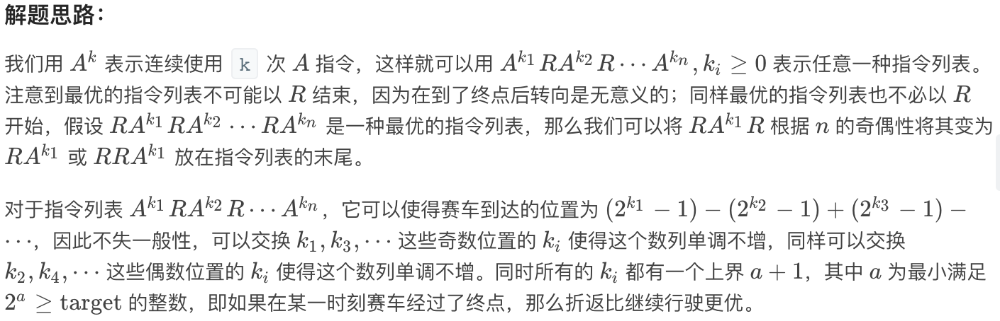
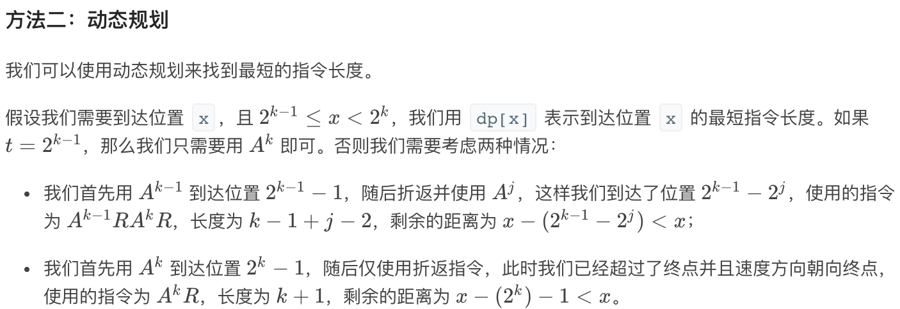
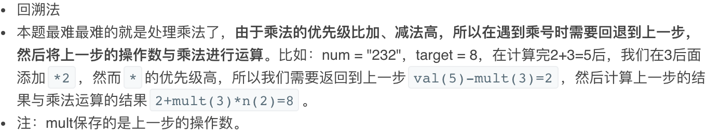
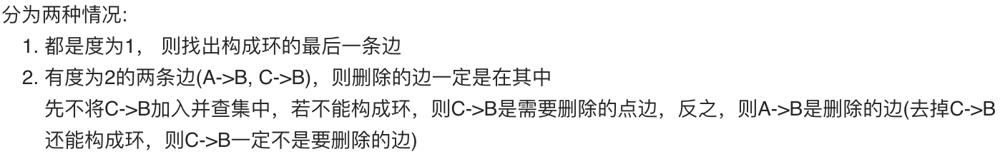

### 540. 有序数组中的单一元素（中等）

---

1. 题目描述

   给定一个只包含整数的有序数组，每个元素都会出现两次，唯有一个数只会出现一次，找出这个数。

   ```
   示例 1:
   输入: [1,1,2,3,3,4,4,8,8]
   输出: 2
   
   示例 2:
   输入: [3,3,7,7,10,11,11]
   输出: 10
   ```

   注意: 您的方案应该在 O(log n)时间复杂度和 O(1)空间复杂度中运行。

2. 简单实现

   ```c++
   class Solution {
   public:
       int singleNonDuplicate(vector<int>& nums) {
           int ans = 0;
           for(int i = 0; i < nums.size(); i++)
               ans ^= nums[i];
           return ans;
       }
   };
   ```

### 692. 前k个高频单词（中等）

---

1. 题目描述

   给一非空的单词列表，返回前 k 个出现次数最多的单词。

   返回的答案应该按单词出现频率由高到低排序。如果不同的单词有相同出现频率，按字母顺序排序。

   ```
   示例 1：
   输入: ["i", "love", "leetcode", "i", "love", "coding"], k = 2
   输出: ["i", "love"]
   解析: "i" 和 "love" 为出现次数最多的两个单词，均为2次。
       注意，按字母顺序 "i" 在 "love" 之前。
   
   
   示例 2：
   输入: ["the", "day", "is", "sunny", "the", "the", "the", "sunny", "is", "is"], k = 4
   输出: ["the", "is", "sunny", "day"]
   解析: "the", "is", "sunny" 和 "day" 是出现次数最多的四个单词，
       出现次数依次为 4, 3, 2 和 1 次。
   ```


   注意：

   - 假定 k 总为有效值， 1 ≤ k ≤ 集合元素数。
   - 输入的单词均由小写字母组成。


   扩展练习：尝试以 O(n log k) 时间复杂度和 O(n) 空间复杂度解决。

2. 简单实现

   ```c++
   struct cmp{//自定义排序
       bool operator () (pair<int, string>& a, pair<int, string>& b){
           if(a.first != b.first)
               return a.first > b.first;
           else
               return a.second < b.second;
       }
   };
   class Solution {
   public:
       vector<string> topKFrequent(vector<string>& words, int k) {
           unordered_map<string, int> cnt;//计数
           for(int i = 0; i < words.size(); i++)
               cnt[words[i]]++;
           priority_queue<pair<int, string>, vector<pair<int, string>>, cmp> q;//小顶堆排序
           for(auto it = cnt.begin(); it != cnt.end(); it++){
               q.push({it->second, it->first});
               if(q.size() > k)
                   q.pop();
           }
           int idx = q.size()-1;
           vector<string> ans(idx+1);
           while(!q.empty()){
               ans[idx--] = q.top().second;//倒序放入
               q.pop();
           }
           return ans;
       }
   };
   ```

### 191. 位1的个数（简单）

---

1. 题目描述

   编写一个函数，输入是一个无符号整数，返回其二进制表达式中数字位数为 ‘1’ 的个数（也被称为汉明重量）。

    ```
   示例 1：
   输入：00000000000000000000000000001011
   输出：3
   解释：输入的二进制串 00000000000000000000000000001011 中，共有三位为 '1'。
   
   示例 2：
   输入：00000000000000000000000010000000
   输出：1
   解释：输入的二进制串 00000000000000000000000010000000 中，共有一位为 '1'。
   
   示例 3：
   输入：11111111111111111111111111111101
   输出：31
   解释：输入的二进制串 11111111111111111111111111111101 中，共有 31 位为 '1'。
    ```


   提示：

   - 请注意，在某些语言（如 Java）中，没有无符号整数类型。在这种情况下，输入和输出都将被指定为有符号整数类型，并且不应影响您的实现，因为无论整数是有符号的还是无符号的，其内部的二进制表示形式都是相同的。
   - 在 Java 中，编译器使用二进制补码记法来表示有符号整数。因此，在上面的 示例 3 中，输入表示有符号整数 -3。


   进阶: 如果多次调用这个函数，你将如何优化你的算法？

2. 简单实现

   ```c++
   class Solution {
   public:
       int hammingWeight(uint32_t n) {
           int ans = 0;
           while(n){
               if(n & 1)
                   ans++;
               n = n >> 1;
           }
           return ans;
       }
   };
   ```

3. trick方法

   每次直接将最后一个1反转为0，计数加一

   ```c++
   class Solution {
   public:
       int hammingWeight(uint32_t n) {
           int ans = 0;
           while(n){
               ans++;
               n &= n - 1;//反转最后一个1
           }
           return ans;
       }
   };
   ```

### 115. 不同的子序列（困难）

---

1. 题目描述

   给定一个字符串 S 和一个字符串 T，计算在 S 的子序列中 T 出现的个数。

   一个字符串的一个子序列是指，通过删除一些（也可以不删除）字符且不干扰剩余字符相对位置所组成的新字符串。（例如，"ACE" 是 "ABCDE" 的一个子序列，而 "AEC" 不是）

   题目数据保证答案符合 32 位带符号整数范围。

    ```
   示例 1：
   输入：S = "rabbbit", T = "rabbit"
   输出：3
   解释：
   如下图所示, 有 3 种可以从 S 中得到 "rabbit" 的方案。
   (上箭头符号 ^ 表示选取的字母)
   rabbbit
   ^^^^ ^^
   rabbbit
   ^^ ^^^^
   rabbbit
   ^^^ ^^^
   
   示例 2：
   输入：S = "babgbag", T = "bag"
   输出：5
   解释：
   如下图所示, 有 5 种可以从 S 中得到 "bag" 的方案。 
   (上箭头符号 ^ 表示选取的字母)
   babgbag
   ^^ ^
   babgbag
   ^^    ^
   babgbag
   ^    ^^
   babgbag
     ^  ^^
   babgbag
       ^^^
    ```

2. 简单实现

   动态规划，`dp[i][j]`表示s[0...i]的以s[i]结尾的子序列中t[0...j]出现的次数，则状态转移方程为`dp[i][j]=dp[i-1][j-1] if s[i]==t[j]`，最终答案为`sum(dp[0...len(s)][j])`

   可以看到dp[i]只与dp[i-1]有关，所以一维dp即可，修改后的一维dp[i]代表的是遍历s到目前为止，所有可能的子序列中t[0...i]出现的次数，则遍历完s后，答案就是dp[len(t)]，具体过程见代码

   ```c++
   class Solution {
   public:
       int numDistinct(string s, string t) {
           int l1 = s.size();
           int l2 = t.size();
           unordered_map<char, vector<int>> idxs;//记录t中各个字符出现的位置，方便查找
           for(int i = l2-1; i >= 0; i--)//倒序记录，因为是一维dp，从前向后修改会导致状态转移所需数据的提前修改
               idxs[t[i]].push_back(i);
           vector<long> dp(t.size()+1, 0);//方便处理t[0]的情况
           dp[0] = 1;
           for(int i = 0; i < l1; i++)//从前向后遍历s
               for(auto it = idxs[s[i]].begin(); it != idxs[s[i]].end(); it++)//相当于从后向前遍历满足t[j]=s[i]的j们，从前向后修改会导致状态转移所需数据的提前修改
                   dp[*it+1] += dp[*it];//累加和
           return dp[l2];
       }
   };
   ```

### 223. 矩形面积（中等）

---

1. 题目描述

   在二维平面上计算出两个由直线构成的矩形重叠后形成的总面积。

   

   每个矩形由其左下顶点和右上顶点坐标表示，如图所示。

   ```
   示例:
   输入: -3, 0, 3, 4, 0, -1, 9, 2
   输出: 45
   说明: 假设矩形面积不会超出 int 的范围。
   ```

2. 简单实现

   就是求iou的方法

   ```c++
   class Solution {
   public:
       int computeArea(int A, int B, int C, int D, int E, int F, int G, int H) {
           int l = max(A, E);
           int r = min(C, G);
           int u = min(D, H);
           int d = max(B, F);
           long ans = long((C-A)*(D-B)) + long((G-E)*(H-F));//防止相加越界
           if(l >= r || u <= d) return ans;
           return ans - (r-l)*(u-d);
       }
   };
   ```

### 373. 查找和最小的k对数字（中等）

---

1. 题目描述

   给定两个以升序排列的整形数组 nums1 和 nums2, 以及一个整数 k。

   定义一对值 (u,v)，其中第一个元素来自 nums1，第二个元素来自 nums2。

   找到和最小的 k 对数字 (u1,v1), (u2,v2) ... (uk,vk)。

   ```c++
   示例 1:
   输入: nums1 = [1,7,11], nums2 = [2,4,6], k = 3
   输出: [1,2],[1,4],[1,6]
   解释: 返回序列中的前 3 对数：
        [1,2],[1,4],[1,6],[7,2],[7,4],[11,2],[7,6],[11,4],[11,6]
   
   示例 2:
   输入: nums1 = [1,1,2], nums2 = [1,2,3], k = 2
   输出: [1,1],[1,1]
   解释: 返回序列中的前 2 对数：
        [1,1],[1,1],[1,2],[2,1],[1,2],[2,2],[1,3],[1,3],[2,3]
   
   示例 3:
   输入: nums1 = [1,2], nums2 = [3], k = 3 
   输出: [1,3],[2,3]
   解释: 也可能序列中所有的数对都被返回:[1,3],[2,3]
   ```

2. 简单实现

   从周赛题`1439. 有序矩阵中的第K个最小数组和`改写代码

   ```c++
   class Solution {
   public:
       vector<vector<int>> kSmallestPairs(vector<int>& nums1, vector<int>& nums2, int k) {
           int l1 = nums1.size();
           int l2 = nums2.size();
           if(l1 == 0 || l2 == 0) return {};
           priority_queue<pair<int, int>, vector<pair<int, int>>, greater<pair<int, int>>> q;
           q.push(make_pair(nums1[0]+nums2[0], 0));//初始状态
           unordered_set<int> visited;//记录访问过的状态
           visited.insert(0);
           vector<vector<int>> ans;
           while(k-- && !q.empty()){//k次循环，每次找到下一个最小的数组和
               int cur = q.top().second;//当前状态对应的选择choice
               int i = cur / l2;
               int j = cur % l2;
               ans.push_back({nums1[i], nums2[j]});
               if(k == 0) return ans;//找到第k小数组和
               int tmp = q.top().first;
               q.pop();            
               //状态转移
               if(i < l1-1){
                   int sum = tmp - nums1[i] + nums1[i+1];
                   int choice = (i+1)*l2 + j;
           
                   if(visited.find(choice) == visited.end()){//状态未访问过
                       q.push(make_pair(sum, choice));
                       visited.insert(choice);
                   }
               }
               if(j < l2-1){
                   int sum = tmp - nums2[j] + nums2[j+1];
                   int choice = i*l2 + j+1;
                   if(visited.find(choice) == visited.end()){//状态未访问过
                       q.push(make_pair(sum, choice));
                       visited.insert(choice);
                   }
               }
           }
           return ans;
       }
   };
   ```

### 336. 回文对（困难）

---

1. 题目描述

   给定一组唯一的单词， 找出所有不同 的索引对(i, j)，使得列表中的两个单词， words[i] + words[j] ，可拼接成回文串。

   ```
   示例 1:
   输入: ["abcd","dcba","lls","s","sssll"]
   输出: [[0,1],[1,0],[3,2],[2,4]] 
   解释: 可拼接成的回文串为 ["dcbaabcd","abcddcba","slls","llssssll"]
   
   示例 2:
   输入: ["bat","tab","cat"]
   输出: [[0,1],[1,0]] 
   解释: 可拼接成的回文串为 ["battab","tabbat"]
   ```

2. 简单实现

   前缀树

   ```c++
   bool judge(string s){//判断是否回文
       int l = 0, r = s.size()-1;
       while(l < r){
           if(s[l] != s[r]) return false;
           l++;
           r--;
       }
       return true;
   }
   
   class Trie {
   public:
       unordered_map<char, Trie*> children;
       int idx;//节点对应字符串在words中的idx
       Trie() {
           idx = -1;
       }
       void insert(string word, int idx) {
           Trie* cur = this;
           for(int i = 0; i < word.size(); i++){
               if(cur->children.count(word[i]) <= 0)
                   cur->children[word[i]] = new Trie();
               cur = cur->children[word[i]];
           }
           cur->idx = idx;
       }
       //找到所有以root为起点的字符串，保存其idx于ans中
       void find(Trie* root, vector<int>& ans){
           if(root->idx >= 0) ans.push_back(root->idx);
           for(auto it = root->children.begin(); it != root->children.end(); it++)
               find(it->second, ans);
       }
       //寻找与reverse(word)相对应的回文对，idx为word在words中的idx
       void search(string word, int idx, vector<string>& words, vector<vector<int>>& ans) {
           Trie* cur = this;
           for(int i = 0; i < word.size(); i++){
               if(cur->idx >= 0){//word[0..i-1]已经匹配某个单词，检查剩余部分是否构成回文
                   string temp = word.substr(i, word.size()-i);
                   if(cur->idx!=idx && judge(temp)) ans.push_back({cur->idx, idx});
               }
               if(cur->children.count(word[i]) <= 0)//至此无匹配了，返回
                   return;
               cur = cur->children[word[i]];
           }
           if(cur->idx!=idx && cur->idx >= 0) //有单词正好和word互逆，就像示例中的0、1一样
               ans.push_back({cur->idx, idx}); //为防止重复添加，这里只加入其中一种情况
           if(cur->children.size() > 0){//word已经匹配，但前缀树之后还有字符
               vector<int> idxs;
               for(auto it = cur->children.begin(); it != cur->children.end(); it++)
                   find(it->second, idxs);
               for(int i = 0; i < idxs.size(); i++){
                   string temp = words[idxs[i]];
                   temp = temp.substr(word.size(), temp.size()-word.size());
                   if(idxs[i]!=idx && judge(temp)) ans.push_back({idxs[i], idx});
               }
           }
       }
   };
   
   class Solution {
   public:
       vector<vector<int>> palindromePairs(vector<string>& words) {
           vector<vector<int>> ans;
           if(words.size() <= 1) return ans;
           Trie* root = new Trie();
           int null = -1;
           for(int i = 0; i < words.size(); i++){//构造前缀树
               if(words[i] != "")
                   root->insert(words[i], i);
               else{//为空字符串
                   for(int j = 0; j < words.size(); j++){
                       if(j != i && judge(words[j])){//自身构成回文
                           ans.push_back({i, j});
                           ans.push_back({j, i});
                       }
                   }
                   null = i; //记录空字符串idx，不再遍历
               }
           }
           for(int i = 0; i < words.size(); i++){
               if(i == null) continue;//跳过空字符串
               string cur = words[i];
               reverse(cur.begin(), cur.end());
               root->search(cur, i, words, ans);
           }
           return ans;
       }
   };                                                      
   ```

### 407. 接雨水II（困难）

---

1. 题目描述

   给你一个 m x n 的矩阵，其中的值均为非负整数，代表二维高度图每个单元的高度，请计算图中形状最多能接多少体积的雨水。

    ```
   示例：
   给出如下 3x6 的高度图:
   [
     [1,4,3,1,3,2],
     [3,2,1,3,2,4],
     [2,3,3,2,3,1]
   ]
   返回 4 。
    ```

   


   如上图所示，这是下雨前的高度图[[1,4,3,1,3,2],[3,2,1,3,2,4],[2,3,3,2,3,1]] 的状态。

   

   下雨后，雨水将会被存储在这些方块中。总的接雨水量是4。

   提示：

   - 1 <= m, n <= 110
   - 0 <= heightMap[i][j] <= 20000

2. 简单实现

   从高度最低的块开始填充，每次填充策略为：

   - 若四周存在高度比自身矮的，则不填充
   - 若四周的高度全都比自身高，则填充为其中最矮的高度
   - 若四周存在高度与自身相同的，则将其与自身连通，视为同一个连通域，继续执行上述策略
   - 填充完毕后，将该块的当前水面高度视为新的块高度

   ```c++
   class Solution {
   public:
       vector<vector<int>> dirs = {{-1,0}, {1,0}, {0,-1}, {0,1}};
       int m,n;
     	//填充[x,y]处，s记录与[x,y]处高度相同的连通域，返回填充后的高度
       int dfs(vector<vector<int>>& heightMap, int x, int y, unordered_set<int>& s){
           int h = INT_MAX;
           for(int i = 0; i < 4; i++){//探查四周
               int xx = x + dirs[i][0];
               int yy = y + dirs[i][1];
               if(s.find(xx*n+yy) == s.end()){
                   if(heightMap[xx][yy] > heightMap[x][y])
                       h = min(h, heightMap[xx][yy]);
                   else if(heightMap[xx][yy] < heightMap[x][y] || xx==0 || xx==m-1 || yy==0 || yy==n-1)
                       return -1;//有矮的或与边界连通，无法填充
                   else if(heightMap[xx][yy] == heightMap[x][y]){
                       s.insert(xx*n+yy);
                       int tmp = dfs(heightMap, xx, yy, s);
                       if(tmp < 0) return -1;
                       else h = min(h, tmp);
                   }  
               }
           }
           return h;
       }
       int trapRainWater(vector<vector<int>>& heightMap) {
           m = heightMap.size();
           n = heightMap[0].size();
           priority_queue<pair<int, int>, vector<pair<int, int>>, greater<pair<int, int>>> q;//小顶堆
           for(int i = 1; i < m-1; i++)
               for(int j = 1; j < n-1; j++)
                   q.push({heightMap[i][j], i*n+j});
           int ans = 0;
           while(!q.empty()){
               int cur = q.top().first;
               int x = q.top().second/n;
               int y = q.top().second%n;
               q.pop();
               if(heightMap[x][y] != cur)//作为某块的连通域被修改过，无需再处理旧的高度
                   continue;
               unordered_set<int> s;
               s.insert(x*n+y);
               int h = dfs(heightMap, x, y, s);
               if(h > cur){//可以填充
                   ans += (h-cur)*s.size();
                 	for(auto it = s.begin(); it != s.end(); it++)//更新连通域内各块高度
                       heightMap[(*it)/n][(*it)%n] = h;
                   q.push({h, x*n+y});//因为同属一个连通域，只将一块加入队列即可
               }
           }
           return ans;
       }
   };
   ```

### 818. 赛车（困难）

---

1. 题目描述

   你的赛车起始停留在位置 0，速度为 +1，正行驶在一个无限长的数轴上。（车也可以向负数方向行驶。）

   你的车会根据一系列由 A（加速）和 R（倒车）组成的指令进行自动驾驶 。

   当车得到指令 "A" 时, 将会做出以下操作： position += speed, speed *= 2。

   当车得到指令 "R" 时, 将会做出以下操作：如果当前速度是正数，则将车速调整为 speed = -1 ；否则将车速调整为 speed = 1。  (当前所处位置不变。)

   例如，当得到一系列指令 "AAR" 后, 你的车将会走过位置 0->1->3->3，并且速度变化为 1->2->4->-1。

   现在给定一个目标位置，请给出能够到达目标位置的最短指令列表的长度。

   ```
   示例 1:
   输入: 
   target = 3
   输出: 2
   解释: 
   最短指令列表为 "AA"
   位置变化为 0->1->3
   
   示例 2:
   输入: 
   target = 6
   输出: 5
   解释: 
   最短指令列表为 "AAARA"
   位置变化为 0->1->3->7->7->6
   ```

   说明: 1 <= target（目标位置） <= 10000。

2. 正确解法

   

   

   这种抽象的形式当初想到了，但是没有进一步简化问题，反而想的复杂了，以至于没做出来

   ```c++
   class Solution {
   public:
       int racecar(int target) {
           vector<int> dp(target+3, INT_MAX);
           dp[0] = 0;
           dp[1] = 1; 
           dp[2] = 4;
           int k = 0;
           int cur = 1;
           for (int t = 3; t <= target; ++t) {
               while(cur <= t){
                   k++;
                   cur = cur << 1;
               }
               if (t == cur - 1) {
                   dp[t] = k;
                   continue;
               }
               for (int j = 0; j < k-1; ++j)//情况1
                   dp[t] = min(dp[t], dp[t - (1<<(k-1)) + (1<<j)] + k-1 + j + 2);
               if (cur - 1 - t < t)//情况2
                   dp[t] = min(dp[t], dp[cur - 1 - t] + k + 1);
           }
           return dp[target]; 
       }
   };
   ```

### 18. 四数之和（中等）

---

1. 题目描述

   给定一个包含 n 个整数的数组 nums 和一个目标值 target，判断 nums 中是否存在四个元素 a，b，c 和 d ，使得 a + b + c + d 的值与 target 相等？找出所有满足条件且不重复的四元组。

   注意：答案中不可以包含重复的四元组。

   ```
   示例：
   给定数组 nums = [1, 0, -1, 0, -2, 2]，和 target = 0。
   满足要求的四元组集合为：
   [
     [-1,  0, 0, 1],
     [-2, -1, 1, 2],
     [-2,  0, 0, 2]
   ]
   ```

2. 简单实现

   双指针+去重，固定前两个，后两个用双指针

   ```c++
   class Solution {
   public:
       vector<vector<int>> fourSum(vector<int>& nums, int target) {
           int size = nums.size();
           sort(nums.begin(), nums.end());//排序
           vector<vector<int>> ans;
           for(int i = 0; i < size-3; i++){
               if(i > 0 && nums[i] == nums[i-1]) continue;//去重
               for(int j = i+1; j < size-2; j++){
                   if(j > i+1 && nums[j] == nums[j-1]) continue;//去重
                   int l = j+1, r = size-1;//双指针
                   while(l < r){
                       int sum = nums[i] + nums[j] + nums[l] + nums[r];
                       if(sum == target){
                           ans.push_back({nums[i], nums[j], nums[l], nums[r]});
                           l++;
                           while(l<r && nums[l] == nums[l-1]) l++;//去重
                           r--;
                           while(l<r && nums[r] == nums[r+1]) r--;//去重
                       }
                       else if(sum < target){
                           l++;
                           while(l<r && nums[l] == nums[l-1]) l++;//去重
                       }
                       else{
                           r--;
                           while(l<r && nums[r] == nums[r+1]) r--;//去重
                       }
                   }
               }
           }
           return ans;  
       }
   };
   ```

### 29. 两数相除（中等）

---

1. 题目描述

   给定两个整数，被除数 dividend 和除数 divisor。将两数相除，要求不使用乘法、除法和 mod 运算符。

   返回被除数 dividend 除以除数 divisor 得到的商。

   整数除法的结果应当截去（truncate）其小数部分，例如：truncate(8.345) = 8 以及 truncate(-2.7335) = -2

    ```
   示例 1:
   输入: dividend = 10, divisor = 3
   输出: 3
   解释: 10/3 = truncate(3.33333..) = truncate(3) = 3
   
   示例 2:
   输入: dividend = 7, divisor = -3
   输出: -2
   解释: 7/-3 = truncate(-2.33333..) = -2
    ```


   提示：

   - 被除数和除数均为 32 位有符号整数。
   - 除数不为 0。
   - 假设我们的环境只能存储 32 位有符号整数，其数值范围是 [−231,  231 − 1]。本题中，如果除法结果溢出，则返回 231 − 1。

2. 简单实现

   ```c++
   class Solution {
   public:
       int divide(int dividend, int divisor) {
           if(dividend == 0) return 0;
           if(divisor == 1) return dividend;
           if(divisor == -1){
               if(dividend>INT_MIN) return -dividend;// 只要不是最小的那个整数，都是直接返回相反数就好啦
               return INT_MAX;// 是最小的那个，那就返回最大的整数啦
           }
           long a = dividend;
           long b = divisor;
           int sign = 1; 
           if((a>0&&b<0) || (a<0&&b>0)){
               sign = -1;
           }
           a = a>0?a:-a;
           b = b>0?b:-b;
           long res = div(a,b);
           if(sign>0)return res>INT_MAX?INT_MAX:res;
           return -res;
       }
       int div(long a, long b){  // 似乎精髓和难点就在于下面这几句
           if(a<b) return 0;
           long count = 1;
           long tb = b; // 在后面的代码中不更新b
           while((tb+tb)<=a){
               count = count + count; // 最小解翻倍
               tb = tb+tb; // 当前测试的值也翻倍
           }
           return count + div(a-tb,b);
       }
   };
   
   ```

### 65. 有效数字（困难）

---

1. 题目描述

   验证给定的字符串是否可以解释为十进制数字。

   例如:

   ```
   "0" => true
   " 0.1 " => true
   "abc" => false
   "1 a" => false
   "2e10" => true
   " -90e3   " => true
   " 1e" => false
   "e3" => false
   " 6e-1" => true
   " 99e2.5 " => false
   "53.5e93" => true
   " --6 " => false
   "-+3" => false
   "95a54e53" => false
   ```

   说明: 我们有意将问题陈述地比较模糊。在实现代码之前，你应当事先思考所有可能的情况。这里给出一份可能存在于有效十进制数字中的字符列表：

   - 数字 0-9
   - 指数 - "e"
   - 正/负号 - "+"/"-"
   - 小数点 - "."

   当然，在输入中，这些字符的上下文也很重要。

2. 正确解法

   

   

   ```java
   class Solution {
       public int make(char c) {
           switch(c) {
               case ' ': return 0;
               case '+':
               case '-': return 1;
               case '.': return 3;
               case 'e': return 4;
               default:
                   if(c >= 48 && c <= 57) return 2;
           }
           return -1;
       }
       
       public boolean isNumber(String s) {
           int state = 0;
           int finals = 0b101101000;
           int[][] transfer = new int[][]{{ 0, 1, 6, 2,-1},
                                          {-1,-1, 6, 2,-1},
                                          {-1,-1, 3,-1,-1},
                                          { 8,-1, 3,-1, 4},
                                          {-1, 7, 5,-1,-1},
                                          { 8,-1, 5,-1,-1},
                                          { 8,-1, 6, 3, 4},
                                          {-1,-1, 5,-1,-1},
                                          { 8,-1,-1,-1,-1}};
           char[] ss = s.toCharArray();
           for(int i=0; i < ss.length; ++i) {
               int id = make(ss[i]);
               if (id < 0) return false;
               state = transfer[state][id];
               if (state < 0) return false;
           }
           return (finals & (1 << state)) > 0;
       }
   }
   ```

### 125. 验证回文串（简单）

---

1. 题目描述

   给定一个字符串，验证它是否是回文串，只考虑字母和数字字符，可以忽略字母的大小写。

   说明：本题中，我们将空字符串定义为有效的回文串。

   ```
   示例 1:
   输入: "A man, a plan, a canal: Panama"
   输出: true
   
   示例 2:
   输入: "race a car"
   输出: false
   ```

2. 简单实现

   ```c++
   class Solution {
   public:
       bool skip(char c){
           if(c >= '0' && c <= '9') return false;
           if(c >= 'a' && c <= 'z') return false;
           if(c >= 'A' && c <= 'Z') return false;
           return true;
       }
       bool isPalindrome(string s) {
           int l = 0, r = s.size()-1;
           while(l < r){
               while(l < r && skip(s[l])) l++;
               while(l < r && skip(s[r])) r--;
               if(tolower(s[l]) != tolower(s[r]))
                   return false;
               l++;
               r--;
           }
           return true;
       }
   };
   ```

### 160. 相交链表（简单）

---

1. 题目描述

   编写一个程序，找到两个单链表相交的起始节点。

   如下面的两个链表：

   

   在节点 c1 开始相交。

    

   示例 1：

   

   输入：intersectVal = 8, listA = [4,1,8,4,5], listB = [5,0,1,8,4,5], skipA = 2, skipB = 3
   输出：Reference of the node with value = 8
   输入解释：相交节点的值为 8 （注意，如果两个链表相交则不能为 0）。从各自的表头开始算起，链表 A 为 [4,1,8,4,5]，链表 B 为 [5,0,1,8,4,5]。在 A 中，相交节点前有 2 个节点；在 B 中，相交节点前有 3 个节点。

   

   示例 2：

   

   输入：intersectVal = 2, listA = [0,9,1,2,4], listB = [3,2,4], skipA = 3, skipB = 1
   输出：Reference of the node with value = 2
   输入解释：相交节点的值为 2 （注意，如果两个链表相交则不能为 0）。从各自的表头开始算起，链表 A 为 [0,9,1,2,4]，链表 B 为 [3,2,4]。在 A 中，相交节点前有 3 个节点；在 B 中，相交节点前有 1 个节点。

   

   示例 3：

   

   输入：intersectVal = 0, listA = [2,6,4], listB = [1,5], skipA = 3, skipB = 2
   输出：null
   输入解释：从各自的表头开始算起，链表 A 为 [2,6,4]，链表 B 为 [1,5]。由于这两个链表不相交，所以 intersectVal 必须为 0，而 skipA 和 skipB 可以是任意值。
   解释：这两个链表不相交，因此返回 null。


   注意：

   - 如果两个链表没有交点，返回 null.
   - 在返回结果后，两个链表仍须保持原有的结构。
   - 可假定整个链表结构中没有循环。
   - 程序尽量满足 O(n) 时间复杂度，且仅用 O(1) 内存。

2. 简单实现

   ```c++
   class Solution {
   public:
       ListNode *getIntersectionNode(ListNode *headA, ListNode *headB) {
           if(!headA || !headB)
               return NULL;
           int lena=0;
           int lenb=0;
           ListNode *cur_A = headA;
           ListNode *cur_B = headB;
           ListNode *result = NULL;
           while(cur_A){
               lena++;
               cur_A=cur_A->next;
           }
           while(cur_B){
               lenb++;
               cur_B=cur_B->next;
           }
           while(lena>lenb){
               headA = headA->next;
               lena--;
           }
           while(lena<lenb){
               headB = headB->next;
               lenb--;
           }
           while(headA && headB && headA != headB){
               headA = headA->next;
               headB = headB->next;
           }
           return headA;
       }
   };
   ```

### 213. 打家劫舍II（中等）

---

1. 题目描述

   你是一个专业的小偷，计划偷窃沿街的房屋，每间房内都藏有一定的现金。这个地方所有的房屋都围成一圈，这意味着第一个房屋和最后一个房屋是紧挨着的。同时，相邻的房屋装有相互连通的防盗系统，如果两间相邻的房屋在同一晚上被小偷闯入，系统会自动报警。

   给定一个代表每个房屋存放金额的非负整数数组，计算你在不触动警报装置的情况下，能够偷窃到的最高金额。

   ```
   示例 1:
   输入: [2,3,2]
   输出: 3
   解释: 你不能先偷窃 1 号房屋（金额 = 2），然后偷窃 3 号房屋（金额 = 2）, 因为他们是相邻的。
   
   示例 2:
   输入: [1,2,3,1]
   输出: 4
   解释: 你可以先偷窃 1 号房屋（金额 = 1），然后偷窃 3 号房屋（金额 = 3）。
        偷窃到的最高金额 = 1 + 3 = 4 。
   ```

2. 简单实现

   动态规划，由于首尾相连，所以需要额外记录nums[0]是否会取

   ```c++
   class Solution {
   public:
       int rob(vector<int>& nums) {
           int size = nums.size();
           if(size == 0) return 0;
           if(size == 1) return nums[0];
           if(size == 2) return max(nums[0], nums[1]);
           vector<vector<vector<int>>> dp(2, vector<vector<int>>(size, vector<int>(2, 0)));
           dp[0][1][1] = nums[1];
           dp[1][1][0] = nums[0];
           for(int i = 2; i < size-1; i++){
               for(int k = 0; k < 2; k++){
                   dp[k][i][0] = max(dp[k][i-1][0], dp[k][i-1][1]);
                   dp[k][i][1] = dp[k][i-1][0] + nums[i];
               }
           }
           int ans = max(max(dp[1][size-2][0], dp[1][size-2][1]), 
                         max(dp[0][size-2][0]+nums[size-1], dp[0][size-2][1]));
           return ans;
       }
   };
   ```

### 349. 两个数组的交集（简单）

---

1. 题目描述

   给定两个数组，编写一个函数来计算它们的交集。

   ```
   示例 1:
   输入: nums1 = [1,2,2,1], nums2 = [2,2]
   输出: [2]
   
   示例 2:
   输入: nums1 = [4,9,5], nums2 = [9,4,9,8,4]
   输出: [9,4]
   ```

   说明:

   - 输出结果中的每个元素一定是唯一的。
   - 我们可以不考虑输出结果的顺序。

2. 简单实现

   ```c++
   class Solution {
   public:
       vector<int> intersection(vector<int>& nums1, vector<int>& nums2) {
           vector<int> ans;
           int len1 = nums1.size();
           if(len1 <= 0) return ans;
           int len2 = nums2.size();
           if(len2 <= 0) return ans;
           unordered_set<int> s1;
           unordered_set<int> s2;
           for(int i = 0; i < len1; i++)
               s1.insert(nums1[i]);
           for(int i = 0; i < len2; i++){
               if(s1.find(nums2[i]) != s1.end() && s2.find(nums2[i]) == s2.end()){
                   ans.push_back(nums2[i]);
                   s2.insert(nums2[i]);                    
               }
           }
           return ans;
       }
   };
   ```

### 529. 扫雷游戏（中等）

---

1. 题目描述

   让我们一起来玩扫雷游戏！

   给定一个代表游戏板的二维字符矩阵。 'M' 代表一个未挖出的地雷，'E' 代表一个未挖出的空方块，'B' 代表没有相邻（上，下，左，右，和所有4个对角线）地雷的已挖出的空白方块，数字（'1' 到 '8'）表示有多少地雷与这块已挖出的方块相邻，'X' 则表示一个已挖出的地雷。

   现在给出在所有未挖出的方块中（'M'或者'E'）的下一个点击位置（行和列索引），根据以下规则，返回相应位置被点击后对应的面板：

   1. 如果一个地雷（'M'）被挖出，游戏就结束了- 把它改为 'X'。
   2. 如果一个没有相邻地雷的空方块（'E'）被挖出，修改它为（'B'），并且所有和其相邻的方块都应该被递归地揭露。
   3. 如果一个至少与一个地雷相邻的空方块（'E'）被挖出，修改它为数字（'1'到'8'），表示相邻地雷的数量。
   4. 如果在此次点击中，若无更多方块可被揭露，则返回面板。

   ```
   示例 1：
   
   输入: 
   
   [['E', 'E', 'E', 'E', 'E'],
    ['E', 'E', 'M', 'E', 'E'],
    ['E', 'E', 'E', 'E', 'E'],
    ['E', 'E', 'E', 'E', 'E']]
   
   Click : [3,0]
   
   输出: 
   
   [['B', '1', 'E', '1', 'B'],
    ['B', '1', 'M', '1', 'B'],
    ['B', '1', '1', '1', 'B'],
    ['B', 'B', 'B', 'B', 'B']]
   ```

   解释:

   ```
   示例 2：
   
   输入: 
   
   [['B', '1', 'E', '1', 'B'],
    ['B', '1', 'M', '1', 'B'],
    ['B', '1', '1', '1', 'B'],
    ['B', 'B', 'B', 'B', 'B']]
   
   Click : [1,2]
   
   输出: 
   
   [['B', '1', 'E', '1', 'B'],
    ['B', '1', 'X', '1', 'B'],
    ['B', '1', '1', '1', 'B'],
    ['B', 'B', 'B', 'B', 'B']]
   ```

   解释:

    

   注意：

   - 输入矩阵的宽和高的范围为 [1,50]。
   - 点击的位置只能是未被挖出的方块 ('M' 或者 'E')，这也意味着面板至少包含一个可点击的方块。
   - 输入面板不会是游戏结束的状态（即有地雷已被挖出）。
   - 简单起见，未提及的规则在这个问题中可被忽略。例如，当游戏结束时你不需要挖出所有地雷，考虑所有你可能赢得游戏或标记方块的情况。

2. 简单实现

   ```c++
   class Solution {
   public:
       int m,n;
       int cal(vector<vector<char>>& board, int x, int y){//计算[x, y]处周围未挖出来的地雷数
           int ans = 0;
           for(int i = max(x-1, 0); i <= x+1 && i < m; i++){
               for(int j = max(y-1, 0); j <= y+1 && j < n; j++){
                   if(i == x && j == y) continue;
                   if(board[i][j] == 'M')
                       ans++;
               }
           }
           return ans;
       }
       vector<vector<char>> updateBoard(vector<vector<char>>& board, vector<int>& click) {
           m = board.size();
           n = board[0].size();
           int x = click[0];
           int y = click[1];
           if(board[x][y] == 'M')//地雷
               board[x][y] = 'X';
           else{//非地雷
               int cnt = cal(board, x, y);
               if(cnt > 0)//周围有地雷，不要再扩充
                   board[x][y] = cnt + '0';
               else{//周围无地雷
                   board[x][y] = 'B';
                   for(int i = max(x-1, 0); i <= x+1 && i < m; i++){//扩充周围
                       for(int j = max(y-1, 0); j <= y+1 && j < n; j++){
                           if((i == x && j == y) || board[i][j] != 'E') continue;//跳过已处理的
                           vector<int> tmp = {i,j};
                           updateBoard(board, tmp);
                       }
                   }
               }
           }
           return board;
       }
   };
   ```

### 621. 任务调度器（中等）

---

1. 题目描述

   给定一个用字符数组表示的 CPU 需要执行的任务列表。其中包含使用大写的 A - Z 字母表示的26 种不同种类的任务。任务可以以任意顺序执行，并且每个任务都可以在 1 个单位时间内执行完。CPU 在任何一个单位时间内都可以执行一个任务，或者在待命状态。

   然而，两个相同种类的任务之间必须有长度为 n 的冷却时间，因此至少有连续 n 个单位时间内 CPU 在执行不同的任务，或者在待命状态。

   你需要计算完成所有任务所需要的最短时间。

    ```
   示例 ：
   输入：tasks = ["A","A","A","B","B","B"], n = 2
   输出：8
   解释：A -> B -> (待命) -> A -> B -> (待命) -> A -> B.
        在本示例中，两个相同类型任务之间必须间隔长度为 n = 2 的冷却时间，而执行一个任务只需要一个单位时间，所以中间出现了（待命）状态。 
    ```


   提示：

   - 任务的总个数为 [1, 10000]。
   - n 的取值范围为 [0, 100]。

2. 简单实现

   ```c++
   class Solution {
   public:
       int leastInterval(vector<char>& tasks, int n) {
           if(n == 0) return tasks.size();
           vector<int> cnt = vector<int>(26, 0);
           for(int i = 0; i < tasks.size(); i++)
               cnt[tasks[i]-'A']++;
           sort(cnt.begin(), cnt.end());
           int max_val = cnt[25] - 1, idle_slots = max_val * n;
           for (int i = 24; i >= 0 && cnt[i] > 0; i--) 
               idle_slots -= min(cnt[i], max_val);
           return idle_slots > 0 ? idle_slots + tasks.size() : tasks.size();
       }
   };
   ```

### 752. 打开转盘锁（中等）

---

1. 题目描述

   你有一个带有四个圆形拨轮的转盘锁。每个拨轮都有10个数字： '0', '1', '2', '3', '4', '5', '6', '7', '8', '9' 。每个拨轮可以自由旋转：例如把 '9' 变为  '0'，'0' 变为 '9' 。每次旋转都只能旋转一个拨轮的一位数字。

   锁的初始数字为 '0000' ，一个代表四个拨轮的数字的字符串。

   列表 deadends 包含了一组死亡数字，一旦拨轮的数字和列表里的任何一个元素相同，这个锁将会被永久锁定，无法再被旋转。

   字符串 target 代表可以解锁的数字，你需要给出最小的旋转次数，如果无论如何不能解锁，返回 -1。

    ```
   示例 1:
   输入：deadends = ["0201","0101","0102","1212","2002"], target = "0202"
   输出：6
   解释：
   可能的移动序列为 "0000" -> "1000" -> "1100" -> "1200" -> "1201" -> "1202" -> "0202"。
   注意 "0000" -> "0001" -> "0002" -> "0102" -> "0202" 这样的序列是不能解锁的，
   因为当拨动到 "0102" 时这个锁就会被锁定。
   
   示例 2:
   输入: deadends = ["8888"], target = "0009"
   输出：1
   解释：
   把最后一位反向旋转一次即可 "0000" -> "0009"。
   
   示例 3:
   输入: deadends = ["8887","8889","8878","8898","8788","8988","7888","9888"], target = "8888"
   输出：-1
   解释：
   无法旋转到目标数字且不被锁定。
   
   示例 4:
   输入: deadends = ["0000"], target = "8888"
   输出：-1
    ```


   提示：

   - 死亡列表 deadends 的长度范围为 [1, 500]。
   - 目标数字 target 不会在 deadends 之中。
   - 每个 deadends 和 target 中的字符串的数字会在 10,000 个可能的情况 '0000' 到 '9999' 中产生。

2. 简单实现

   ```c++
   class Solution {
   public:
       int openLock(vector<string>& deadends, string target) {
           bool visited[10000] = {false};
           for(int i = 0; i < deadends.size(); i++){//将死亡数设置成已访问
               string str = deadends[i];
               if(str == "0000")
                   return -1;
               visited[stoi(str)] = true;
           }
           int count = -1;
           string str = "0000";
           queue<string> q;
           q.push(str);
           visited[stoi(str)] = true;
           while(!q.empty()){
               count++;
               int size = q.size();
               for(int i = 0; i < size; i++){
                   string cur = q.front();
                   q.pop();
                   if(cur == target)
                       return count;
                   else{
                       for(int idx = 0; idx < 4; idx++){
                           string temp = cur;
                           char x = temp[idx] + 1;
                           if(x > '9') x = '0';
                           temp[idx] = x;
                           if(!visited[stoi(temp)]) q.push(temp);
                           visited[stoi(temp)] = true;
                           
                           temp = cur;
                           x = temp[idx] - 1;
                           if(x < '0') x = '9';
                           temp[idx] = x;
                           if(!visited[stoi(temp)]) q.push(temp);
                           visited[stoi(temp)] = true;
                       }
                   }
               }
           }
           return -1;
       }
   };
   ```

### 977. 有序数组的平方（简单）

---

1. 题目描述

   给定一个按非递减顺序排序的整数数组 A，返回每个数字的平方组成的新数组，要求也按非递减顺序排序。

    ```
   示例 1：
   输入：[-4,-1,0,3,10]
   输出：[0,1,9,16,100]
   
   示例 2：
   输入：[-7,-3,2,3,11]
   输出：[4,9,9,49,121]
    ```


   提示：

   - 1 <= A.length <= 10000
   - -10000 <= A[i] <= 10000
   - A 已按非递减顺序排序。

2. 简单实现

   ```c++
   class Solution {
   public:
       vector<int> sortedSquares(vector<int>& A) {
           int l = 0;
           int r = A.size() - 1;
           vector<int> ans = vector<int>(A.size());
           int idx = r;
           while(idx >= 0){
               int l2 = A[l]*A[l];
               int r2 = A[r]*A[r];
               if(l2 >= r2){
                   ans[idx--] = l2;
                   l++;
               }
               else{
                   ans[idx--] = r2;
                   r--;
               }
           }
           return ans;
       }
   };
   ```


### 986. 区间列表的交集（中等）

---

1. 题目描述

   给定两个由一些 闭区间 组成的列表，每个区间列表都是成对不相交的，并且已经排序。

   返回这两个区间列表的交集。

   （形式上，闭区间 [a, b]（其中 a <= b）表示实数 x 的集合，而 a <= x <= b。两个闭区间的交集是一组实数，要么为空集，要么为闭区间。例如，[1, 3] 和 [2, 4] 的交集为 [2, 3]。）

   示例：

   

   ```
   输入：A = [[0,2],[5,10],[13,23],[24,25]], B = [[1,5],[8,12],[15,24],[25,26]]
   输出：[[1,2],[5,5],[8,10],[15,23],[24,24],[25,25]]
   ```


   提示：

   - 0 <= A.length < 1000
   - 0 <= B.length < 1000
   - 0 <= A[i].start, A[i].end, B[i].start, B[i].end < 10^9

2. 简单实现

   一维版本的求iou的算法里求交集部分的算法

   ```c++
   class Solution {
   public:
       vector<vector<int>> intervalIntersection(vector<vector<int>>& A, vector<vector<int>>& B) {
           int l1 = A.size();
           int l2 = B.size();
           vector<vector<int>> ans;
           int idx1 = 0, idx2 = 0;
           while(idx1 < l1 && idx2 < l2){
               int l = max(A[idx1][0], B[idx2][0]);
               int r = min(A[idx1][1], B[idx2][1]);
               if(l <= r) ans.push_back({l,r});//有交集
               if(A[idx1][1] < B[idx2][1])
                   idx1++;
               else if(A[idx1][1] > B[idx2][1])
                   idx2++;
               else{
                   idx1++;
                   idx2++;
               }
           }
           return ans;
       }
   };
   ```

### 190. 颠倒二进制位（简单）

---

1. 题目描述

   颠倒给定的 32 位无符号整数的二进制位。

    ```
   示例 1：
   输入: 00000010100101000001111010011100
   输出: 00111001011110000010100101000000
   解释: 输入的二进制串 00000010100101000001111010011100 表示无符号整数 43261596，
        因此返回 964176192，其二进制表示形式为 00111001011110000010100101000000。
   
   示例 2：
   输入：11111111111111111111111111111101
   输出：10111111111111111111111111111111
   解释：输入的二进制串 11111111111111111111111111111101 表示无符号整数 4294967293，
        因此返回 3221225471 其二进制表示形式为 10111111111111111111111111111111 。
    ```


   提示：

   - 请注意，在某些语言（如 Java）中，没有无符号整数类型。在这种情况下，输入和输出都将被指定为有符号整数类型，并且不应影响您的实现，因为无论整数是有符号的还是无符号的，其内部的二进制表示形式都是相同的。
   - 在 Java 中，编译器使用二进制补码记法来表示有符号整数。因此，在上面的 示例 2 中，输入表示有符号整数 -3，输出表示有符号整数 -1073741825。


   进阶: 如果多次调用这个函数，你将如何优化你的算法？

2. 简单实现

   ```c++
   class Solution {
   public:
       uint32_t reverseBits(uint32_t n) {
           if(n == 0) return 0;//必须判断，因为ans<<32是违法的
           uint32_t ans = 0;
           int cnt = 32;
           while(n && cnt){
               ans = (ans<<1) | (n&1);//必须用｜，不能用+
               n = n>>1;
               cnt--;
           }
           ans = ans << cnt;
           return ans;
       }
   };
   ```

### 460. LFU缓存（困难）

---

1. 题目描述

   请你为 最不经常使用（LFU）缓存算法设计并实现数据结构。它应该支持以下操作：get 和 put。

   - get(key) - 如果键存在于缓存中，则获取键的值（总是正数），否则返回 -1。
   - put(key, value) - 如果键已存在，则变更其值；如果键不存在，请插入键值对。当缓存达到其容量时，则应该在插入新项之前，使

   最不经常使用的项无效。在此问题中，当存在平局（即两个或更多个键具有相同使用频率）时，应该去除最久未使用的键。
   「项的使用次数」就是自插入该项以来对其调用 get 和 put 函数的次数之和。使用次数会在对应项被移除后置为 0 。

   进阶：你是否可以在 O(1) 时间复杂度内执行两项操作？

    ```
   示例：
   LFUCache cache = new LFUCache( 2 /* capacity (缓存容量) */ );
   cache.put(1, 1);
   cache.put(2, 2);
   cache.get(1);       // 返回 1
   cache.put(3, 3);    // 去除 key 2
   cache.get(2);       // 返回 -1 (未找到key 2)
   cache.get(3);       // 返回 3
   cache.put(4, 4);    // 去除 key 1
   cache.get(1);       // 返回 -1 (未找到 key 1)
   cache.get(3);       // 返回 3
   cache.get(4);       // 返回 4
    ```

2. 简单实现

   使用链表记录各个次数下的key值们，且从表头到表尾是从旧到新的顺序，即可在O(1)时间内put

   ```c++
   class LFUCache {
   public:
       int capacity;
       unordered_map<int, int> data;//<key, value>
       map<int, list<int>> cnt;//<次数，链表>
       unordered_map<int, pair<int, list<int>::iterator>> dic;//<key, <次数，在链表的位置>>
       LFUCache(int capacity) {
           this->capacity = capacity;
       }
       
       int get(int key) {
           if(data.find(key) == data.end() || capacity==0)//注意容量为0的处理
               return -1;
   				//在原本位置删除
           int tmp_cnt = dic[key].first;
           auto cur = dic[key].second;
           cnt[tmp_cnt].erase(cur);
           if(cnt[tmp_cnt].size() == 0)
               cnt.erase(tmp_cnt);
        		//插入新的表尾
           tmp_cnt++;
           cnt[tmp_cnt].push_back(key);
           auto it = cnt[tmp_cnt].end();
           it--;
           dic[key] = {tmp_cnt, it};
           return data[key];
       }
       
       void put(int key, int value) {
           if(capacity == 0) return;//注意容量为0的处理
           if(data.find(key) != data.end()){
               data[key] = value;
               get(key);//为了增加一次计数
           }
           else if(data.size() < capacity){//直接插入
               data[key] = value;
               cnt[1].push_back(key);
               auto it = cnt[1].end();
               it--;
               dic[key] = {1, it};
           }
           else{//需要替换
             	//删除替换掉的值
               int tmp_key = cnt.begin()->second.front();
               data.erase(tmp_key);
               dic.erase(tmp_key);
               if(cnt.begin()->second.size() == 1)
                   cnt.erase(cnt.begin());
               else 
                   cnt.begin()->second.pop_front();
             	//插入新的值
               data[key] = value;
               cnt[1].push_back(key);
               auto it = cnt[1].end();
               it--;
               dic[key] = {1, it};
           }
       }
   };
   ```

### 475. 供暖器（简单）

---

1. 题目描述

   冬季已经来临。 你的任务是设计一个有固定加热半径的供暖器向所有房屋供暖。

   现在，给出位于一条水平线上的房屋和供暖器的位置，找到可以覆盖所有房屋的最小加热半径。

   所以，你的输入将会是房屋和供暖器的位置。你将输出供暖器的最小加热半径。

   说明:

   1. 给出的房屋和供暖器的数目是非负数且不会超过 25000。
   2. 给出的房屋和供暖器的位置均是非负数且不会超过10^9。
   3. 只要房屋位于供暖器的半径内(包括在边缘上)，它就可以得到供暖。
   4. 所有供暖器都遵循你的半径标准，加热的半径也一样。

   ```
   示例 1:
   输入: [1,2,3],[2]
   输出: 1
   解释: 仅在位置2上有一个供暖器。如果我们将加热半径设为1，那么所有房屋就都能得到供暖。
   
   示例 2:
   输入: [1,2,3,4],[1,4]
   输出: 1
   解释: 在位置1, 4上有两个供暖器。我们需要将加热半径设为1，这样所有房屋就都能得到供暖。
   ```

2. 简单实现

   ```c++
   class Solution {
   public:
       int findRadius(vector<int>& houses, vector<int>& heaters) {
           if(houses.size() == 0) return 0;
           sort(heaters.begin(), heaters.end());
           int ans = 0;
           for(int i = 0; i < houses.size(); i++){
               auto it = upper_bound(heaters.begin(), heaters.end(), houses[i]);
               int tmp = INT_MAX;
               if(it != heaters.end())
                   tmp = min(tmp, (*it)-houses[i]);
               if(it != heaters.begin()){
                   it--;
                   tmp = min(tmp, houses[i] - (*it));
               }
               ans = max(tmp, ans);
           }
           return ans;
       }
   };
   ```

### 552. 学生出勤记录II（困难）

---

1. 题目描述

   给定一个正整数 n，返回长度为 n 的所有可被视为可奖励的出勤记录的数量。 答案可能非常大，你只需返回结果mod 109 + 7的值。

   学生出勤记录是只包含以下三个字符的字符串：

   - 'A' : Absent，缺勤
   - 'L' : Late，迟到
   - 'P' : Present，到场

   如果记录不包含多于一个'A'（缺勤）或超过两个连续的'L'（迟到），则该记录被视为可奖励的。

   ```
   示例 1:
   输入: n = 2
   输出: 8 
   解释：
   有8个长度为2的记录将被视为可奖励：
   "PP" , "AP", "PA", "LP", "PL", "AL", "LA", "LL"
   只有"AA"不会被视为可奖励，因为缺勤次数超过一次。
   ```

   注意：n 的值不会超过100000。

2. 简单实现

   动态规划,`dp[i][j][k],0<=i<=n-1,j=0/1,k=0/1/2`表示长为i的、里面不包含/包含‘A‘的、以k个‘L‘结尾的、可奖励的出勤数量，则状态转移方程为：

   ```
   dp[i][0][0] = dp[i-1][0][0] + dp[i-1][0][1] + dp[i-1][0][2];
   dp[i][0][1] = dp[i-1][0][0];
   dp[i][0][2] = dp[i-1][0][1];
   dp[i][1][0] = dp[i-1][0][0] + dp[i-1][0][1] + dp[i-1][0][2] + dp[i-1][1][0] + dp[i-1][1][1] + dp[i-1][1][2];
   dp[i][1][1] = dp[i-1][1][0];
   dp[i][1][2] = dp[i-1][1][1];
   ```

   可见，dp[i]只与dp[i-1]有关，因此去掉维度i即可

   ```c++
   class Solution {
   public:
       long mod = 1e9 + 7;
       int checkRecord(int n) {
           if(n == 1) return 3;
           vector<vector<long>> dp(2, vector<long>(3, 0));
           dp[0][0] = 1;
           dp[0][1] = 1;
           dp[0][2] = 0;
           dp[1][0] = 1;
           dp[1][1] = 0;
           dp[1][2] = 0;
           vector<vector<long>> cur(2, vector<long>(3, 0));
           for(long i = 2; i <= n; i++){
               cur[0][0] = (dp[0][0] + dp[0][1] + dp[0][2]) % mod;
               cur[0][1] = dp[0][0];
               cur[0][2] = dp[0][1];
               cur[1][0] = (dp[0][0] + dp[0][1] + dp[0][2] + dp[1][0] + dp[1][1] + dp[1][2]) % mod;
               cur[1][1] = dp[1][0];
               cur[1][2] = dp[1][1];
               dp = cur;
           }
           int ans = (dp[0][0] + dp[0][1] + dp[0][2] + dp[1][0] + dp[1][1] + dp[1][2]) % mod;
           return ans;
       }
   };
   ```

### 188. 买卖股票的最佳时机IV（困难）

---

1. 题目描述

   给定一个数组，它的第 i 个元素是一支给定的股票在第 i 天的价格。

   设计一个算法来计算你所能获取的最大利润。你最多可以完成 k 笔交易。

   注意: 你不能同时参与多笔交易（你必须在再次购买前出售掉之前的股票）。

   ```
   示例 1:
   输入: [2,4,1], k = 2
   输出: 2
   解释: 在第 1 天 (股票价格 = 2) 的时候买入，在第 2 天 (股票价格 = 4) 的时候卖出，这笔交易所能获得利润 = 4-2 = 2 。
   
   示例 2:
   输入: [3,2,6,5,0,3], k = 2
   输出: 7
   解释: 在第 2 天 (股票价格 = 2) 的时候买入，在第 3 天 (股票价格 = 6) 的时候卖出, 这笔交易所能获得利润 = 6-2 = 4 。
        随后，在第 5 天 (股票价格 = 0) 的时候买入，在第 6 天 (股票价格 = 3) 的时候卖出, 这笔交易所能获得利润 = 3-0 = 3 。
   ```

2. 正确解法

   dp的状态和转移方程都写出来了，唯一的问题在于特殊情况的优化：对`k>prices.size()/2`的情况，k其实并没有限制到买卖操作，因此无需三维DP

   ```c++
   class Solution {
   public:
       int maxProfit(int k, vector<int>& prices) {
           int size = prices.size();
           if(size <= 1) return 0; 
           if(k <= size/2){//三维DP
               //dp[i][j][0/1]，第i天，已完成j次交易，当前不持有/持有股票，所能取得的最大利润
               vector<vector<vector<int>>> dp(size, vector<vector<int>>(k+1, vector<int>(2, -1e9)));
               dp[0][0][0] = 0;
               dp[0][0][1] = -prices[0];
               int ans = 0;
               for(int i = 1; i < size; i++){
                   dp[i][0][1] = max(dp[i-1][0][1], -prices[i]);
                   for(int j = 1; j <= k; j++){
                       if(dp[i-1][j][0] != -1e9 || dp[i-1][j-1][1] != -1e9){
                           dp[i][j][0] = max(dp[i-1][j][0], dp[i-1][j-1][1]+prices[i]);
                           dp[i][j][1] = max(dp[i-1][j][0]-prices[i], dp[i-1][j][1]);
                           ans = max(ans, dp[i][j][0]);
                       }
                       else break;//提前终止循环
                   }
               }
               return ans;
           }
           else{//二维DP
                //dp[i][0/1]，第i天，当前不持有/持有股票，所能取得的最大利润
               vector<vector<int>> dp(size, vector<int>(2, 0));
               dp[0][1] = -prices[0];
               int ans = 0;
               for(int i = 1; i < size; i++){
                   dp[i][0] = max(dp[i-1][0], dp[i-1][1]+prices[i]);
                   dp[i][1] = max(dp[i-1][1], dp[i-1][0]-prices[i]);
               }
               return dp[size-1][0];
           }
       }
   };
   ```

### 722. 删除注释（中等）

---

1. 题目描述

   给一个 C++ 程序，删除程序中的注释。这个程序source是一个数组，其中source[i]表示第i行源码。 这表示每行源码由\n分隔。

   在 C++ 中有两种注释风格，行内注释和块注释。

   字符串// 表示行注释，表示//和其右侧的其余字符应该被忽略。

   字符串/* 表示一个块注释，它表示直到*/的下一个（非重叠）出现的所有字符都应该被忽略。（阅读顺序为从左到右）非重叠是指，字符串/*/并没有结束块注释，因为注释的结尾与开头相重叠。

   第一个有效注释优先于其他注释：如果字符串//出现在块注释中会被忽略。 同样，如果字符串/*出现在行或块注释中也会被忽略。

   如果一行在删除注释之后变为空字符串，那么不要输出该行。即，答案列表中的每个字符串都是非空的。

   样例中没有控制字符，单引号或双引号字符。比如，source = "string s = "/* Not a comment. */";" 不会出现在测试样例里。（此外，没有其他内容（如定义或宏）会干扰注释。）

   我们保证每一个块注释最终都会被闭合， 所以在行或块注释之外的/*总是开始新的注释。

   最后，隐式换行符可以通过块注释删除。 有关详细信息，请参阅下面的示例。

   从源代码中删除注释后，需要以相同的格式返回源代码。

   ```
   示例 1:
   输入: 
   source = ["/*Test program */", "int main()", "{ ", "  // variable declaration ", "int a, b, c;", "/* This is a test", "   multiline  ", "   comment for ", "   testing */", "a = b + c;", "}"]
   
   示例代码可以编排成这样:
   /*Test program */
   int main()
   { 
     // variable declaration 
   int a, b, c;
   /* This is a test
      multiline  
      comment for 
      testing */
   a = b + c;
   }
   
   输出: ["int main()","{ ","  ","int a, b, c;","a = b + c;","}"]
   
   编排后:
   int main()
   { 
   
   int a, b, c;
   a = b + c;
   }
   
   解释: 
   第 1 行和第 6-9 行的字符串 /* 表示块注释。第 4 行的字符串 // 表示行注释。
   
   示例 2:
   输入: 
   source = ["a/*comment", "line", "more_comment*/b"]
   输出: ["ab"]
   解释: 原始的 source 字符串是 "a/*comment\nline\nmore_comment*/b", 其中我们用粗体显示了换行符。删除注释后，隐含的换行符被删除，留下字符串 "ab" 用换行符分隔成数组时就是 ["ab"].
   ```

   注意:

   - source的长度范围为[1, 100].
   - source[i]的长度范围为[0, 80].
   - 每个块注释都会被闭合。
   - 给定的源码中不会有单引号、双引号或其他控制字符。

2. 简单实现

   ```c++
   class Solution {
   public:
       vector<string> removeComments(vector<string>& source) {
           int size = source.size();
           vector<string> ans;
           bool inBlock = false;//在/**/内
           string pre = "";//在/*之前的部分
           for(int i = 0; i < size; i++){
               int idx = 0;
               int len = source[i].size();
               if(!inBlock){
                   while(idx < len-1){
                       if(source[i][idx] == '/'){
                           if(source[i][idx+1] == '/'){
                               idx--;
                               break;
                           }
                           else if(source[i][idx+1] == '*'){
                               idx--;
                               inBlock = true;
                               break;
                           }
                       }
                       idx++;
                   }
                   if(idx >= 0){
                       if(inBlock)//记录之前的
                           pre = source[i].substr(0, idx+1);
                       else//直接去掉本行剩余部分
                           ans.push_back(source[i].substr(0, idx+1));
                   }
                   if(inBlock && idx+3 < len){//继续处理剩余部分
                       source[i] = source[i].substr(idx+3, len-idx-3);
                       i--;
                   }
               }
               else{
                   while(idx < len){
                       if(source[i][idx] == '*'){
                           if(idx < len-1 && source[i][idx+1] == '/'){
                               inBlock = false;//*/结束
                               idx += 2;
                               break;
                           }
                       }
                       idx++;
                   }
                   if(!inBlock){
                       if(idx < len){//本行结尾还有字符
                           source[i] = pre + source[i].substr(idx, len-idx);
                           i--;
                           pre = "";
                       }
                       else if(pre != ""){
                           ans.push_back(pre);
                           pre = "";
                       }
                   }
               }
           }
           return ans;
       }
   };
   ```

### 724. 寻找数组的中心索引（简单）

---

1. 题目描述

   给定一个整数类型的数组 nums，请编写一个能够返回数组“中心索引”的方法。

   我们是这样定义数组中心索引的：数组中心索引的左侧所有元素相加的和等于右侧所有元素相加的和。

   如果数组不存在中心索引，那么我们应该返回 -1。如果数组有多个中心索引，那么我们应该返回最靠近左边的那一个。

   ```
   示例 1:
   输入: 
   nums = [1, 7, 3, 6, 5, 6]
   输出: 3
   解释: 
   索引3 (nums[3] = 6) 的左侧数之和(1 + 7 + 3 = 11)，与右侧数之和(5 + 6 = 11)相等。
   同时, 3 也是第一个符合要求的中心索引。
   
   示例 2:
   输入: 
   nums = [1, 2, 3]
   输出: -1
   解释: 
   数组中不存在满足此条件的中心索引。
   ```

   说明:

   - nums 的长度范围为 [0, 10000]。
   - 任何一个 nums[i] 将会是一个范围在 [-1000, 1000]的整数。

2. 简单实现

   ```c++
   class Solution {
   public:
       int pivotIndex(vector<int>& nums) {
           int size = nums.size();
           if(size == 0) return -1;
           if(size == 1) return 0;
           vector<int> sum(size);
           sum[0] = nums[0];
           for(int i = 1; i < size; i++)
               sum[i] = sum[i-1] + nums[i];
           if(sum[size-1]-sum[0] == 0) return 0;
           for(int i = 1; i < size; i++){
               if(sum[i-1] == sum[size-1]-sum[i])
                   return i;
           }
           return -1;
       }
   };
   ```

### 151. 翻转字符串里的单词（中等）

---

1. 题目描述

   给定一个字符串，逐个翻转字符串中的每个单词。

    ```
   示例 1：
   输入: "the sky is blue"
   输出: "blue is sky the"
   
   示例 2：
   输入: "  hello world!  "
   输出: "world! hello"
   解释: 输入字符串可以在前面或者后面包含多余的空格，但是反转后的字符不能包括。
   
   示例 3：
   输入: "a good   example"
   输出: "example good a"
   解释: 如果两个单词间有多余的空格，将反转后单词间的空格减少到只含一个。
    ```


   说明：

   - 无空格字符构成一个单词。
   - 输入字符串可以在前面或者后面包含多余的空格，但是反转后的字符不能包括。
   - 如果两个单词间有多余的空格，将反转后单词间的空格减少到只含一个。


   进阶：请选用 C 语言的用户尝试使用 O(1) 额外空间复杂度的原地解法。

2. 简单实现

   ```c++
   class Solution {
   public:
       string reverseWords(string s) {
           reverse(s.begin(), s.end());
           string ans = "";
           string temp = "";
           for(int i = 0; i < s.size(); i++){
               if(s[i] == ' '){
                   if(temp != ""){
                       reverse(temp.begin(), temp.end());
                       if(ans == "")
                           ans += temp;
                       else
                           ans += ' ' + temp;
                       temp = "";
                   }
               }
               else{
                   temp += s[i];
               }
           }
           if(temp != ""){
               reverse(temp.begin(), temp.end());
               if(ans == "")
                   ans += temp;
               else
                   ans += ' ' + temp;
           }
           return ans;
       }
   };
   ```

### 518. 零钱兑换II（中等）

---

1. 题目描述

   给定不同面额的硬币和一个总金额。写出函数来计算可以凑成总金额的硬币组合数。假设每一种面额的硬币有无限个。 

    ```
   示例 1:
   输入: amount = 5, coins = [1, 2, 5]
   输出: 4
   解释: 有四种方式可以凑成总金额:
   5=5
   5=2+2+1
   5=2+1+1+1
   5=1+1+1+1+1
   
   示例 2:
   输入: amount = 3, coins = [2]
   输出: 0
   解释: 只用面额2的硬币不能凑成总金额3。
   
   示例 3:
   输入: amount = 10, coins = [10] 
   输出: 1
    ```


   注意: 你可以假设：

   - 0 <= amount (总金额) <= 5000
   - 1 <= coin (硬币面额) <= 5000
   - 硬币种类不超过 500 种
   - 结果符合 32 位符号整数

2. 简单实现

   `dp[i][j]`表示用前i个硬币，拼凑j元，有多少种方案

   ```c++
   class Solution {
   public:
       int change(int amount, vector<int>& coins) {
           int size = coins.size();
           vector<vector<int>> dp(size+1, vector<int>(amount+1, 0));
           dp[0][0] = 1;
           for(int i = 1; i <= size; i++){
               dp[i][0] = dp[i-1][0];
               for(int j = 1; j <= amount; j++){
                   int cnt = j / coins[i-1];
                   for(int k = 0; k <= cnt; k++){
                       dp[i][j] += dp[i-1][j-k*coins[i-1]];
                   }
               }
           }
           return dp[size][amount];
       }
   };
   ```

### 303. 区域检索-数组不可变（简单）

---

1. 题目描述

   给定一个整数数组  nums，求出数组从索引 i 到 j  (i ≤ j) 范围内元素的总和，包含 i,  j 两点。

   ```
   示例：
   给定 nums = [-2, 0, 3, -5, 2, -1]，求和函数为 sumRange()
   sumRange(0, 2) -> 1
   sumRange(2, 5) -> -1
   sumRange(0, 5) -> -3
   ```

   说明:

   - 你可以假设数组不可变。
   - 会多次调用 sumRange 方法。

2. 简单实现

   ```c++
   class NumArray {
   public:
       vector<int> data;
       NumArray(vector<int>& nums) {
           data = nums;
           for(int i = 1; i < nums.size(); i++)
               data[i] += data[i-1];
       }
       
       int sumRange(int i, int j) {
           if(i == 0) return data[j];
           return data[j]-data[i-1];
       }
   };
   ```

### 189. 旋转数组（简单）

---

1. 题目描述

   给定一个数组，将数组中的元素向右移动 k 个位置，其中 k 是非负数。

   ```
   示例 1:
   输入: [1,2,3,4,5,6,7] 和 k = 3
   输出: [5,6,7,1,2,3,4]
   解释:
   向右旋转 1 步: [7,1,2,3,4,5,6]
   向右旋转 2 步: [6,7,1,2,3,4,5]
   向右旋转 3 步: [5,6,7,1,2,3,4]
   
   示例 2:
   输入: [-1,-100,3,99] 和 k = 2
   输出: [3,99,-1,-100]
   解释: 
   向右旋转 1 步: [99,-1,-100,3]
   向右旋转 2 步: [3,99,-1,-100]
   ```

   说明:

   - 尽可能想出更多的解决方案，至少有三种不同的方法可以解决这个问题。
   - 要求使用空间复杂度为 O(1) 的 原地 算法。

2. 简单实现

   ```c++
   class Solution {
   public:
       void rotate(vector<int>& nums, int k) {
           int size = nums.size();
           k %= size;
           if(k == 0) return;
           reverse(nums.begin(), nums.begin()+size-k);
           reverse(nums.begin()+size-k, nums.end());
           reverse(nums.begin(), nums.end());
       }
   };
   ```

### 282. 给表达式添加运算符（困难）

---

1. 题目描述

   给定一个仅包含数字 0-9 的字符串和一个目标值，在数字之间添加二元运算符（不是一元）+、- 或 * ，返回所有能够得到目标值的表达式。

   ```
   示例 1:
   输入: num = "123", target = 6
   输出: ["1+2+3", "1*2*3"] 
   
   示例 2:
   输入: num = "232", target = 8
   输出: ["2*3+2", "2+3*2"]
   
   示例 3:
   输入: num = "105", target = 5
   输出: ["1*0+5","10-5"]
   
   示例 4:
   输入: num = "00", target = 0
   输出: ["0+0", "0-0", "0*0"]
   
   示例 5:
   输入: num = "3456237490", target = 9191
   输出: []
   ```

2. 正确解法

   

   ```c++
   class Solution {
   public:
       vector<string> addOperators(string num, int target) {
           vector<string> result;
           string track="";
           backtrack(num,target,0,0,1,result,track);
           return result;
       }
       //当前遍历到num[index]，表达式值为val,上一步的操作数为mult，当前表达式为track
       void backtrack(string num,int target,int index,long val,long mult,vector<string>& result,string& track) {
           if(index == num.size()) {
               if(val == target)
                   result.push_back(track);
               return;
           }
           int len = track.size();
           string sVal = "";
           long n = 0;
   	    for (int i = index; i < num.length(); i++) {
               //转换数字
               sVal += num[i];
               n = n*10 + int(num[i]-'0');
   		    if (index == 0) {//第一个数字，不需要加符号
   			    track += sVal;
   			    backtrack(num,target,i+1,n,n,result,track);
   			    track.resize(len);
   		    } 
               else {
   			    // +
   			    track += "+" + sVal;
   			    backtrack(num,target,i+1,val+n,n,result,track);
   			    track.resize(len);
   			    // -
   			    track += "-" + sVal;
                   backtrack(num,target,i+1,val-n,-n,result,track);
   			    track.resize(len);
   			    // *
   			    track += "*" + sVal;
                   //由于乘法的优先级比加、减法高，所以需要回退到上一步，即把上一步的操作数与乘法进行运算
                   //比如2+3*2，我们在3后面添加*，然而*的优先级高，所以val(5)-mult(3)返回上一步，然后2+3*2=8
   			    backtrack(num,target,i+1,val-mult+mult*n,mult*n,result,track);
   			    track.resize(len);
   		    }
   		    if (n==0) return;
           }
       }
   };
   ```

### 294. 翻转游戏II（中等）

---

要会员

### 310. 最小高度树（中等）

---

1. 题目描述

   对于一个具有树特征的无向图，我们可选择任何一个节点作为根。图因此可以成为树，在所有可能的树中，具有最小高度的树被称为最小高度树。给出这样的一个图，写出一个函数找到所有的最小高度树并返回他们的根节点。

   格式：

   - 该图包含 n 个节点，标记为 0 到 n - 1。给定数字 n 和一个无向边 edges 列表（每一个边都是一对标签）。
   - 你可以假设没有重复的边会出现在 edges 中。由于所有的边都是无向边， [0, 1]和 [1, 0] 是相同的，因此不会同时出现在 edges 里。

   ```
   示例 1:
     输入: n = 4, edges = [[1, 0], [1, 2], [1, 3]]
         0
         |
         1
        / \
       2   3 
      输出: [1]
   
   示例 2:
     输入: n = 6, edges = [[0, 3], [1, 3], [2, 3], [4, 3], [5, 4]]
      0  1  2
       \ | /
         3
         |
         4
         |
         5 
      输出: [3, 4]
   ```

   说明:

   - 根据树的定义，树是一个无向图，其中任何两个顶点只通过一条路径连接。 换句话说，一个任何没有简单环路的连通图都是一棵树。
   - 树的高度是指根节点和叶子节点之间最长向下路径上边的数量。

2. 正确解法

   

   ```c++
   class Solution {
   public:
       vector<int> findMinHeightTrees(int n, vector<vector<int>>& edges) {
           if(n == 1) return {0};
           unordered_map<int, vector<int>> g;//图
           unordered_map<int, int> outs;//处度
           for(int i = 0; i < edges.size(); i++){
               g[edges[i][0]].push_back(edges[i][1]);
               outs[edges[i][0]]++;
               g[edges[i][1]].push_back(edges[i][0]);
               outs[edges[i][1]]++;
           }
           queue<int> q;
           unordered_set<int> s;
           for(int i = 0; i < n; i++){
               if(outs[i] == 1){
                   q.push(i);
                   s.insert(i);
               }
           }
           vector<int> ans;
           while(!q.empty()){
               int size = q.size();
               ans.clear();
               while(size--){
                   int cur = q.front();
                   ans.push_back(cur);
                   q.pop();
                   for(int i = 0; i < g[cur].size(); i++){
                       if(s.find(g[cur][i]) == s.end() && --outs[g[cur][i]] == 1){//只有度为1才能入队列
                           q.push(g[cur][i]);
                           s.insert(g[cur][i]);
                       }
                   }
               }
           }
           return ans;
       }
   };
   ```

### 320. 列举单词的全部缩写（中等）

---

要会员

### 505. 迷宫II（中等）

---

要会员

### 685. 冗余连接II（困难）

---

1. 题目描述

   在本问题中，有根树指满足以下条件的有向图。该树只有一个根节点，所有其他节点都是该根节点的后继。每一个节点只有一个父节点，除了根节点没有父节点。

   输入一个有向图，该图由一个有着N个节点 (节点值不重复1, 2, ..., N) 的树及一条附加的边构成。附加的边的两个顶点包含在1到N中间，这条附加的边不属于树中已存在的边。

   结果图是一个以边组成的二维数组。 每一个边 的元素是一对 [u, v]，用以表示有向图中连接顶点 u 和顶点 v 的边，其中 u 是 v 的一个父节点。

   返回一条能删除的边，使得剩下的图是有N个节点的有根树。若有多个答案，返回最后出现在给定二维数组的答案。

   ```
   示例 1:
   输入: [[1,2], [1,3], [2,3]]
   输出: [2,3]
   解释: 给定的有向图如下:
     1
    / \
   v   v
   2-->3
   
   示例 2:
   输入: [[1,2], [2,3], [3,4], [4,1], [1,5]]
   输出: [4,1]
   解释: 给定的有向图如下:
   5 <- 1 -> 2
        ^    |
        |    v
        4 <- 3
   ```

   注意:

   - 二维数组大小的在3到1000范围内。
   - 二维数组中的每个整数在1到N之间，其中 N 是二维数组的大小。

2. 简单实现

   先考虑怎么判断给定的一组有向边是否能构成有根树：

   - 利用并查集，a->b意味着a为b的父节点，且两者所在根集合相同
   - 因此，依次添加一条有向边，当出现a->b且a,b所在集合本身已经相同，则说明出现了环，一定不能构成有跟树
   - 若全部有向边添加完成后仍旧无环，也不能直接判断构成有根树，还要考虑是否有唯一根：利用set记录有父节点的点，无父节点的就是根

   因此，依次从后往前去除一条边，判断剩下的边能否构成有根树即可

   ```c++
   class UnionFind{//并查集
   private:
       vector<int> father;
   public:
       UnionFind(int n){
           father = vector<int>(n);
           for(int i = 0; i < n; i++)
               father[i] = i;
       }
       int get(int x){
           if(father[x] == x)
               return x;
           return father[x] = get(father[x]);//路径压缩
       }
       bool merge(int x, int y){
           x = get(x);
           y = get(y);
           if(x != y){
               father[y] = x;
               return true;
           }
           else
               return false;
       }
   };
   
   class Solution {
   public:
       vector<int> findRedundantDirectedConnection(vector<vector<int>>& edges) {
           int n = edges.size();
           for(int idx = n-1; idx>=0; idx--){
               UnionFind u(n);//并查集
               unordered_set<int> s;//记录非根节点
               for(int i = 0; i < n; i++){
                   if(i == idx) continue;
                   if(!u.merge(edges[i][0]-1, edges[i][1]-1))//有环
                       break;
                   s.insert(edges[i][1]);//有向边的入点不可能是根节点
               }
               if(s.size() == n-1) return edges[idx];//只有一个根节点
           }
           return {};
       }
   };
   ```

3. 最优解法

   

   按照这个筛选之后跑我的算法，会更节省时间

### 788. 旋转数字（简单）

---

1. 题目描述

   我们称一个数 X 为好数, 如果它的每位数字逐个地被旋转 180 度后，我们仍可以得到一个有效的，且和 X 不同的数。要求每位数字都要被旋转。

   如果一个数的每位数字被旋转以后仍然还是一个数字， 则这个数是有效的。0, 1, 和 8 被旋转后仍然是它们自己；2 和 5 可以互相旋转成对方（在这种情况下，它们以不同的方向旋转，换句话说，2 和 5 互为镜像）；6 和 9 同理，除了这些以外其他的数字旋转以后都不再是有效的数字。

   现在我们有一个正整数 N, 计算从 1 到 N 中有多少个数 X 是好数？

    ```
   示例：
   输入: 10
   输出: 4
   解释: 
   在[1, 10]中有四个好数： 2, 5, 6, 9。
   注意 1 和 10 不是好数, 因为他们在旋转之后不变。
    ```


   提示：N 的取值范围是 [1, 10000]。

2. 简单实现

   好数：不含3，4，7且含2或5或6或9，暴力判断即可

   ```c++
   class Solution {
   public:
       bool judge(int n){
           bool ans = false;
           while(n){
               int c = n % 10;
               if(c == 3 || c == 4 || c == 7) return false;
               if(c == 2 || c == 5 || c == 6 || c == 9) ans = true;
               n /= 10;
           }
           return ans;
       }
       int rotatedDigits(int N) {
           int ans = 0;
           for(int i = 1; i <= N; i++){
               if(judge(i))
                   ans++;
           }
           return ans;
       }
   };
   ```

3. 动态规划

   9以后的每个数n可以拆成a = n % 10（最后一位）和a = n / 10（前面r - 1位）

   若a和b中均不含有3、4、7且至少有一个含有2、5、6、9，那么n就是好数

   dp数组存储3种值，0：不包含3、4、7的坏数，1：含有3、4、7的坏数，2：好数

   通过dp数组可以知晓a和b是否含有3、4、7或2、5、6、9，直接判断出n是否是好数

   ```c++
   class Solution {
   public:
       int rotatedDigits(int N) {
           int count = 0;
           vector<int> dp(N + 1, 0);
           for (int i = 1; i <= N; i++) {
               if (i == 3 || i == 4 || i == 7 || dp[i % 10] == 1 || dp[i / 10] == 1) {
                   dp[i] = 1;
               } else if (i == 2 || i == 5 || i == 6 || i == 9 || dp[i % 10] == 2 || dp[i / 10] == 2) {
                   dp[i] = 2;
                   count++;
               }
           }
           return count;
       }
   };
   ```


### 815. 公交路线（困难）

---

1. 题目描述

   我们有一系列公交路线。每一条路线 routes[i] 上都有一辆公交车在上面循环行驶。例如，有一条路线 routes[0] = [1, 5, 7]，表示第一辆 (下标为0) 公交车会一直按照 1->5->7->1->5->7->1->... 的车站路线行驶。

   假设我们从 S 车站开始（初始时不在公交车上），要去往 T 站。 期间仅可乘坐公交车，求出最少乘坐的公交车数量。返回 -1 表示不可能到达终点车站。

   ```
   示例：
   输入：
   routes = [[1, 2, 7], [3, 6, 7]]
   S = 1
   T = 6
   输出：2
   解释：
   最优策略是先乘坐第一辆公交车到达车站 7, 然后换乘第二辆公交车到车站 6。
   ```


   提示：

   - 1 <= routes.length <= 500.
   - 1 <= routes[i].length <= 10^5.
   - 0 <= routes[i][j] < 10 ^ 6.

2. 简单实现

   抽象成图的bfs，图里的每个节点表示一条公交循环路线，两节点相连表示这两条公交循环路线有交点（即可换乘），求最少换乘即bfs

   ```c++
   class Solution {
   public:
       bool hasInerset(unordered_set<int>& a, unordered_set<int>& b){//判断集合是否有交集
           if(a.size() < b.size()){
               for(auto it = a.begin(); it != a.end(); it++){
                   if(b.find(*it) != b.end()){
                       return true;
                   }
               }
           }
           else{
               for(auto it = b.begin(); it != b.end(); it++){
                   if(a.find(*it) != a.end()){
                       return true;
                   }
               }
           }
           return false;
       }
   
       int numBusesToDestination(vector<vector<int>>& routes, int S, int T) {
           if(S == T) return 0;
           vector<unordered_set<int>> buses;//用集合记录所有公交循环路线
           for(int i = 0; i < routes.size(); i++){
               buses.push_back({});
               for(int j = 0; j < routes[i].size(); j++)
                   buses[i].insert(routes[i][j]);
           }
           unordered_map<int, unordered_set<int>> g;//图
           for(int i = 0; i < buses.size(); i++){
               for(int j = i+1; j < buses.size(); j++){
                   if(hasInerset(buses[i], buses[j])){//有交集，相连
                       g[i].insert(j);
                       g[j].insert(i);
                   }
               }
           }
           queue<int> q;
           unordered_set<int> visited;
           for(int i = 0; i < buses.size(); i++){
               if(buses[i].find(S) != buses[i].end()){//包含起点
                   if(buses[i].find(T) != buses[i].end())//且包含终点
                       return 1;
                   q.push(i);
                   visited.insert(i);
               }
           }
           int ans = 0;
           while(!q.empty()){
               ans++;
               int size = q.size();
               for(int i = 0; i < size; i++){
                   int cur = q.front();
                   q.pop();
                   for(auto it = g[cur].begin(); it != g[cur].end(); it++){
                       if(buses[*it].find(T) != buses[*it].end())
                           return ans+1;
                       if(visited.find(*it) == visited.end()){
                           visited.insert(*it);
                           q.push(*it);
                       }
                   }
               }
           }
           return -1;
       }
   };
   ```

3. 最简代码

   简化版代码，整体思路一样，实现上更省时

   ```c++
   class Solution {
   public:
       int numBusesToDestination(vector<vector<int>>& routes, int S, int T) {
           if (S == T) return 0;
           int N = routes.size();
           map<int, set<int> > m; // 存储车站能通到哪些路线
           for (int i = 0; i < N; ++i) {
               for (auto j : routes[i]) {
                   m[j].insert(i);
               }
           }
           vector<bool> visited(N, false); // 哪些路线被遍历过了
           queue<int> q; // 存储已经遍历过的路线
           for (auto x : m[S]) {
               q.push(x);
               visited[x] = true;
           }
           int step = 0;
           while (!q.empty()) {
               ++step;
               int s = q.size();
               for (int i = 0; i < s; ++i) {
                   int t = q.front();
                   q.pop();
                   for (auto j : routes[t]) {
                       if (j == T) return step;
                       for (auto x : m[j]) {
                           if (!visited[x]) {
                               q.push(x);
                               visited[x] = true;
                           }
                       }
                   }
               }
           }
           return -1;
       }
   };
   ```
