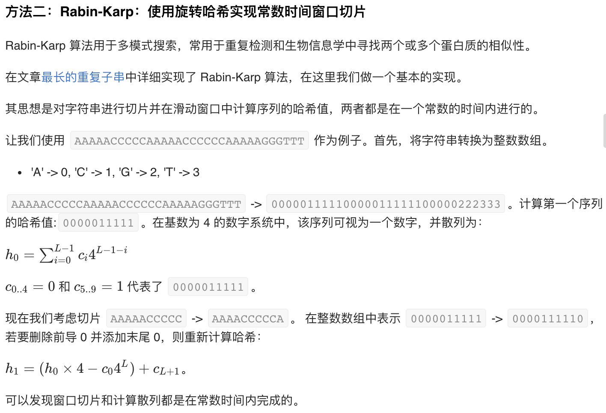
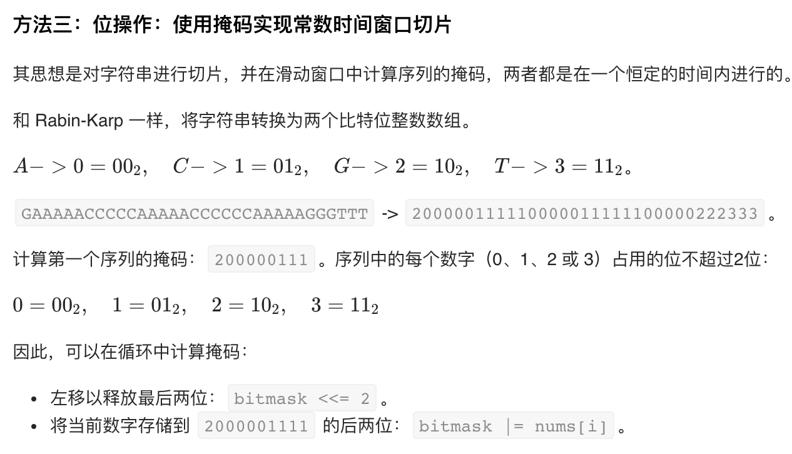
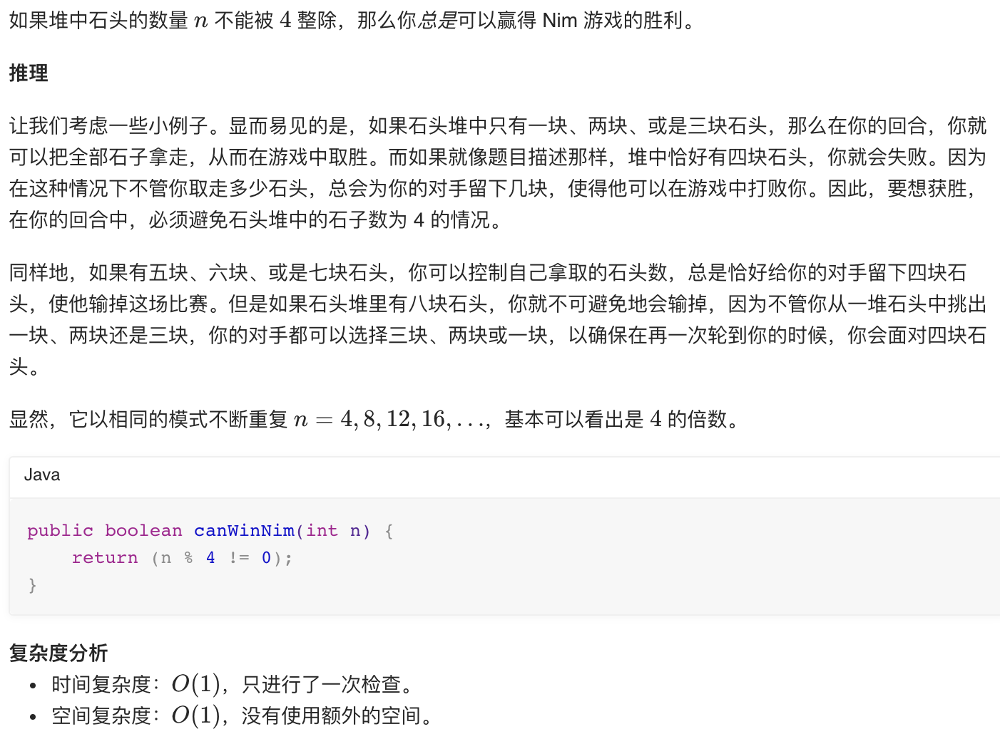
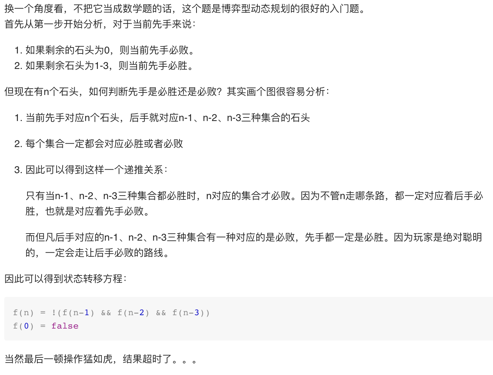

### 817. 链表组件（中等）

---

1. 题目描述

   给定链表头结点 head，该链表上的每个结点都有一个 唯一的整型值 。

   同时给定列表 G，该列表是上述链表中整型值的一个子集。

   返回列表 G 中组件的个数，这里对组件的定义为：链表中一段最长连续结点的值（该值必须在列表 G 中）构成的集合。

    ```
   示例 1：
   输入: 
   head: 0->1->2->3
   G = [0, 1, 3]
   输出: 2
   解释: 
   链表中,0 和 1 是相连接的，且 G 中不包含 2，所以 [0, 1] 是 G 的一个组件，同理 [3] 也是一个组件，故返回 2。
   
   示例 2：
   输入: 
   head: 0->1->2->3->4
   G = [0, 3, 1, 4]
   输出: 2
   解释: 
   链表中，0 和 1 是相连接的，3 和 4 是相连接的，所以 [0, 1] 和 [3, 4] 是两个组件，故返回 2。
    ```


   提示：

   - 如果 N 是给定链表 head 的长度，1 <= N <= 10000。
   - 链表中每个结点的值所在范围为 [0, N - 1]。
   - 1 <= G.length <= 10000
   - G 是链表中所有结点的值的一个子集.

2. 简单实现

   遍历head，判断值是否在G中，判断是否连续

   ```c++
   class Solution {
   public:
       int numComponents(ListNode* head, vector<int>& G) {
           unordered_set<int> nums;//G中值的集合
           for(int i = 0; i < G.size(); i++)
               nums.insert(G[i]);
           int ans = 0;
           bool constant = false;//当前是否连续
           while(head){
               if(nums.find(head->val) == nums.end())
                   constant = false;
               else{
                   if(!constant){//新的开始
                       constant = true;
                       ans++;
                   }
               }
               head = head->next;
           }
           return ans;
       }
   };
   ```

### 911. 在线选举（中等）

---

1. 题目描述

   在选举中，第 i 张票是在时间为 times[i] 时投给 persons[i] 的。

   现在，我们想要实现下面的查询函数： TopVotedCandidate.q(int t) 将返回在 t 时刻主导选举的候选人的编号。

   在 t 时刻投出的选票也将被计入我们的查询之中。在平局的情况下，最近获得投票的候选人将会获胜。

   ```
   示例：
   
   输入：["TopVotedCandidate","q","q","q","q","q","q"], [[[0,1,1,0,0,1,0],[0,5,10,15,20,25,30]],[3],[12],[25],[15],[24],[8]]
   输出：[null,0,1,1,0,0,1]
   解释：
   时间为 3，票数分布情况是 [0]，编号为 0 的候选人领先。
   时间为 12，票数分布情况是 [0,1,1]，编号为 1 的候选人领先。
   时间为 25，票数分布情况是 [0,1,1,0,0,1]，编号为 1 的候选人领先（因为最近的投票结果是平局）。
   在时间 15、24 和 8 处继续执行 3 个查询。
   ```


   提示：

   - 1 <= persons.length = times.length <= 5000
   - 0 <= persons[i] <= persons.length
   - times 是严格递增的数组，所有元素都在 [0, 10^9] 范围中。
   - 每个测试用例最多调用 10000 次 TopVotedCandidate.q。
   - TopVotedCandidate.q(int t) 被调用时总是满足 t >= times[0]。

2. 简单实现

   在初始化时记录各个时间的领先的人，然后直接二分法查

   ```c++
   class TopVotedCandidate {
   public:
       unordered_map<int, int> votes;//记录每个人的得票数
       map<int, int> data;//记录各个时间点的领先的人
       TopVotedCandidate(vector<int>& persons, vector<int>& times) {
           int maxNum = 0;//当前得票最多的票数
           for(int i = 0; i < persons.size(); i++){
               if(++votes[persons[i]] >= maxNum){//出现新的领先者了，更新
                   maxNum = votes[persons[i]];
                   data[times[i]] = persons[i];
               }
           }
       }
       
       int q(int t) {
           auto it = data.upper_bound(t);
           it--;
           return it->second;
       }
   };
   ```

### 1011. 在D天内送达包裹的能力（中等）

---

1. 题目描述

   传送带上的包裹必须在 D 天内从一个港口运送到另一个港口。

   传送带上的第 i 个包裹的重量为 weights[i]。每一天，我们都会按给出重量的顺序往传送带上装载包裹。我们装载的重量不会超过船的最大运载重量。

   返回能在 D 天内将传送带上的所有包裹送达的船的最低运载能力。

   ```
   示例 1：
   输入：weights = [1,2,3,4,5,6,7,8,9,10], D = 5
   输出：15
   解释：
   船舶最低载重 15 就能够在 5 天内送达所有包裹，如下所示：
   第 1 天：1, 2, 3, 4, 5
   第 2 天：6, 7
   第 3 天：8
   第 4 天：9
   第 5 天：10
   请注意，货物必须按照给定的顺序装运，因此使用载重能力为 14 的船舶并将包装分成 (2, 3, 4, 5), (1, 6, 7), (8), (9), (10) 是不允许的。 
   
   示例 2：
   输入：weights = [3,2,2,4,1,4], D = 3
   输出：6
   解释：
   船舶最低载重 6 就能够在 3 天内送达所有包裹，如下所示：
   第 1 天：3, 2
   第 2 天：2, 4
   第 3 天：1, 4
   
   示例 3：
   输入：weights = [1,2,3,1,1], D = 4
   输出：3
   解释：
   第 1 天：1
   第 2 天：2
   第 3 天：3
   第 4 天：1, 1
   ```


   提示：

   - 1 <= D <= weights.length <= 50000
   - 1 <= weights[i] <= 500

2. 简单实现

   二分法，`l=min(weights), r=sum(weights)`，根据计算的最低所需天数做二分

   ```c++
   class Solution {
   public:
       int cal(vector<int>& weights, int w){//计算载重为w时，运输货物所需最低天数
           int ans = 0;
           int cur = 0;
           for(int i = 0; i < weights.size(); i++){
               cur += weights[i];
               if(cur > w){
                   ans++;
                   cur = weights[i];
               }
           }
           return ans+1;
       }
       int shipWithinDays(vector<int>& weights, int D) {
           int l = 0, r = 0;
           for(int i = 0; i < weights.size(); i++){
               l = max(l, weights[i]);
               r += weights[i];
           }
           while(l <= r){
               int mid = l + (r - l) / 2;
               int d = cal(weights, mid);
               if(d > D)
                   l = mid + 1;
               else
                   r = mid - 1;
           }
           return l;
       }
   };
   ```

### 1096. 花括号展开II（困难）

---

1. 题目描述

   如果你熟悉 Shell 编程，那么一定了解过花括号展开，它可以用来生成任意字符串。

   花括号展开的表达式可以看作一个由 花括号、逗号 和 小写英文字母 组成的字符串，定义下面几条语法规则：

   - 如果只给出单一的元素 x，那么表达式表示的字符串就只有 "x"。 
     - 例如，表达式 {a} 表示字符串 "a"。
     - 而表达式 {ab} 就表示字符串 "ab"。
   - 当两个或多个表达式并列，以逗号分隔时，我们取这些表达式中元素的并集。
     - 例如，表达式 {a,b,c} 表示字符串 "a","b","c"。
     - 而表达式 {a,b},{b,c} 也可以表示字符串 "a","b","c"。
   - 要是两个或多个表达式相接，中间没有隔开时，我们从这些表达式中各取一个元素依次连接形成字符串。
     - 例如，表达式 {a,b}{c,d} 表示字符串 "ac","ad","bc","bd"。
   - 表达式之间允许嵌套，单一元素与表达式的连接也是允许的。
     - 例如，表达式 a{b,c,d} 表示字符串 "ab","ac","ad"。
     - 例如，表达式 {a{b,c}}{{d,e}f{g,h}} 可以代换为 {ab,ac}{dfg,dfh,efg,efh}，表示字符串 "abdfg", "abdfh", "abefg", "abefh", "acdfg", "acdfh", "acefg", "acefh"。

   给出表示基于给定语法规则的表达式 expression，返回它所表示的所有字符串组成的有序列表。

   假如你希望以「集合」的概念了解此题，也可以通过点击 “显示英文描述” 获取详情。

   ```
   示例 1：
   输入："{a,b}{c{d,e}}"
   输出：["acd","ace","bcd","bce"]
   
   示例 2：
   输入："{{a,z}, a{b,c}, {ab,z}}"
   输出：["a","ab","ac","z"]
   解释：输出中 不应 出现重复的组合结果。
   ```


   提示：

   - 1 <= expression.length <= 50
   - expression[i] 由 '{'，'}'，',' 或小写英文字母组成
   - 给出的表达式 expression 用以表示一组基于题目描述中语法构造的字符串

2. 正确解法

   用栈搞吐了，递归看上去也不咋方便系列

   ```c++
   class Solution {
   public:
       void ADD(set<string>&s, set<string>& s1) {//并集
           for (auto x : s1) 
               s.insert(x);
           s1.clear();
       }
       void MUL(set<string>&s, const set<string>& s1) {//笛卡尔积
           if (s1.empty()) return;
           if (s.empty()) {
               s = s1;
               return;
           };
           set<string> s2;
           for (auto t : s) 
               for (auto t1 : s1) 
                   s2.insert(t + t1);
           swap(s, s2);
       }
       void MUL(set<string>& s, string& t) {//笛卡尔积
           if (t.empty()) return;
           if (s.empty()) {
               s = {t};
               t.clear();
               return;
           }
           set<string> s1;
           for (auto x : s) 
               s1.insert(x + t);
           t.clear();
           swap(s, s1);
       }
       set<string> parse(const string& exp, int l, int r) {
           set<string> res;//结果集合，','在本集合处理
           set<string> s;//当前阶段的字符串集合，笛卡尔积在本集合处理
           string t;//当前阶段字符串集合的当前字符串
           int i = l;
           while (i <= r) {
               if (exp[i] == ',') {
                   MUL(s, t);//没有','之前全是笛卡尔积
                   ADD(res, s);//逗号，合并到结果集合中
               } else if (exp[i] == '{') {//需要递归parse了
                   int l = i;//记录左端点
                   int brace = 1;//记录括号级数
                   while (brace > 0 && ++i <= r) {//找到匹配的括号
                       brace += exp[i] == '{';
                       brace -= exp[i] == '}';
                   }
                   MUL(s, t);//没有','全是笛卡尔积
                   MUL(s, parse(exp, l + 1, i - 1));//没有','全是笛卡尔积
               } else {
                   t += exp[i];
               }
               ++i;
           }
           MUL(s, t);
           ADD(res, s);
           return res;
       }
       vector<string> braceExpansionII(string expression) {
           auto s = parse(expression, 0, expression.size() - 1);
           return vector<string>(s.begin(), s.end());
       }
   };
   ```

### 165. 比较版本号（中等）

---

1. 题目描述

   比较两个版本号 version1 和 version2。
   如果 version1 > version2 返回 1，如果 version1 < version2 返回 -1， 除此之外返回 0。

   你可以假设版本字符串非空，并且只包含数字和 . 字符。

    . 字符不代表小数点，而是用于分隔数字序列。

   例如，2.5 不是“两个半”，也不是“差一半到三”，而是第二版中的第五个小版本。

   你可以假设版本号的每一级的默认修订版号为 0。例如，版本号 3.4 的第一级（大版本）和第二级（小版本）修订号分别为 3 和 4。其第三级和第四级修订号均为 0。

   ```
   示例 1:
   输入: version1 = "0.1", version2 = "1.1"
   输出: -1
   
   示例 2:
   输入: version1 = "1.0.1", version2 = "1"
   输出: 1
   
   示例 3:
   输入: version1 = "7.5.2.4", version2 = "7.5.3"
   输出: -1
   
   示例 4：
   输入：version1 = "1.01", version2 = "1.001"
   输出：0
   解释：忽略前导零，“01” 和 “001” 表示相同的数字 “1”。
   
   示例 5：
   输入：version1 = "1.0", version2 = "1.0.0"
   输出：0
   解释：version1 没有第三级修订号，这意味着它的第三级修订号默认为 “0”。
   ```


   提示：

   - 版本字符串由以点 （.） 分隔的数字字符串组成。这个数字字符串可能有前导零。
   - 版本字符串不以点开始或结束，并且其中不会有两个连续的点。

2. 简单实现

   ```c++
   class Solution {
   public:
       vector<int> parse(string s){//对版本号字符串s解析出各段数字
           vector<int> ans;
           int l = 0, r = 0;
           while(r < s.size()){
               if(s[r] == '.'){
                   int cur = stoi(s.substr(l, r-l));
                   ans.push_back(cur);
                   l = r+1;
               }
               r++;
           }
           int cur = stoi(s.substr(l, r-l));
           ans.push_back(cur);
           return ans;
       }
       int compareVersion(string version1, string version2) {
           vector<int> v1 = parse(version1);
           vector<int> v2 = parse(version2);
           int l1 = v1.size(), l2 = v2.size();
           int idx = 0;
           while(idx < l1 && idx < l2){
               if(v1[idx] < v2[idx])
                   return -1;
               else if (v1[idx] > v2[idx])
                   return 1;
               idx++;
           }
           if(idx == l1 && idx == l2) return 0;
           while(idx < l1){//应对1.0与1的情况
               if(v1[idx] > 0) return 1;
               idx++;
           }
           while(idx < l2){
               if(v2[idx] > 0) return -1;
               idx++;
           }
           return 0;
       }
   };
   ```

### 209. 长度最小的子数组（中等）

---

1. 题目描述

   给定一个含有 n 个正整数的数组和一个正整数 s ，找出该数组中满足其和 ≥ s 的长度最小的连续子数组，并返回其长度。如果不存在符合条件的连续子数组，返回 0。

   ```
   示例: 
   
   输入: s = 7, nums = [2,3,1,2,4,3]
   输出: 2
   解释: 子数组 [4,3] 是该条件下的长度最小的连续子数组。
   ```

   进阶: 如果你已经完成了O(n) 时间复杂度的解法, 请尝试 O(n log n) 时间复杂度的解法。

2. 简单实现

   双指针o(n)算法

   ```c++
   class Solution {
   public:
       int minSubArrayLen(int s, vector<int>& nums) {
           int size = nums.size();
           int l = 0, r = 0;
           int cur = 0;
           int len = size+1;
           while(r < size){
               cur += nums[r];
               if(cur >= s){
                   while(l <= r && cur >= s)
                       cur -= nums[l++];
                   len = min(len, r-l+2);
               }
               r++;
           }
           if(len > size) return 0;
           return len;
       }
   };
   ```

### 227. 基本计算器II（中等）

---

1. 题目描述

   实现一个基本的计算器来计算一个简单的字符串表达式的值。

   字符串表达式仅包含非负整数，+， - ，*，/ 四种运算符和空格  。 整数除法仅保留整数部分。

   ```
   示例 1:
   输入: "3+2*2"
   输出: 7
   
   示例 2:
   输入: " 3/2 "
   输出: 1
   
   示例 3:
   输入: " 3+5 / 2 "
   输出: 5
   ```

   说明：

   - 你可以假设所给定的表达式都是有效的。
   - 请不要使用内置的库函数 eval。

2. 简单实现

   ```c++
   class Solution {
   public:
       int calculate(string s)  
   {
   	stack<int> nums;
   	stack<char> op;
   	int val = 0;
   
   	s.append("+");
   	for (auto c : s)
   	{
   		if (isspace(c)) continue;
   		if (isdigit(c))
   		{
   			val = val * 10 + (c - '0');
   			continue;
   		}
   
   		if (!nums.empty() && !op.empty() && (op.top() == '*' || op.top() == '/'))
   		{
   			val = (op.top() == '*') ? nums.top() * val: nums.top() / val;
   			nums.pop();
   			op.pop();
   		}
   		if (nums.empty() || op.empty() || c == '*' || c == '/')
   		{
   			nums.push(val);
   			op.push(c);
   		}
   		else
   		{
   			nums.top() = (op.top() == '+') ? nums.top() + val : nums.top() - val;
   			op.top() = c;
   		}
   		val = 0;
   	}
   
   	return nums.top();
   }
   };
   ```

### 241. 为运算表达式设计优先级（中等）

---

1. 题目描述

   给定一个含有数字和运算符的字符串，为表达式添加括号，改变其运算优先级以求出不同的结果。你需要给出所有可能的组合的结果。有效的运算符号包含 +, - 以及 * 。

   ```
   示例 1:
   输入: "2-1-1"
   输出: [0, 2]
   解释: 
   ((2-1)-1) = 0 
   (2-(1-1)) = 2
   
   示例 2:
   输入: "2*3-4*5"
   输出: [-34, -14, -10, -10, 10]
   解释: 
   (2*(3-(4*5))) = -34 
   ((2*3)-(4*5)) = -14 
   ((2*(3-4))*5) = -10 
   (2*((3-4)*5)) = -10 
   (((2*3)-4)*5) = 10
   ```

2. 正确解法

   ```c++
   /*
   动态规划
       首先将字符串中的数字和操作符分别存储下来
       第i个操作符对应的数字是i和i+1，同理第i个数的前面的操作符是i-1，后面的一个是i（i表示在数组中的序号）
       dp[i][j]表示从第i个数字到第j个数字的所有情况
           （1）i==j
               等于数字本身的值
           （2）i != j(j肯定是大于i的) 
               将i-j分成两个式子来看，[i,i]op[i+1,j],[i,i+1]op[i+2,j]...[[i,j-1]]op[j,j]
               将上面的所有情况全部组合起来
               现在需要考虑一个问题是[i,i+k]op[i+k+1,j]的op应该是ops数组里面的哪一个，应该是ops[i+k]
       有了以上，我们就可以写出动态规划了，还有一个需要注意的地方是，（2）情况也就是一个遍历，但是遍历的顺序需要注意，不应该是[0,j]->[j-1,j]而应该是[j-1,j]->[0->j]。如果是从[0,j]开始，你会发现[1,j]..[j-1,j]这些你需要的都还没算
   */
   class Solution {
   public:
       vector<int> diffWaysToCompute(string input) {
           vector<int> nums;
           vector<char> ops;
           int num = 0;
           for(int i = 0; i < input.size(); i++){
               if(isOp(input[i])){
                   nums.push_back(num);
                   ops.push_back(input[i]);
                   num = 0;
               }
               else
                   num = num * 10 + input[i] - '0';
           }
           nums.push_back(num);
           int n = nums.size();
           vector<vector<vector<int>>> dp(n,vector<vector<int>>(n));
           for(int i = 0; i < n; i++)
               dp[i][i].push_back(nums[i]);
           for(int j = 1; j < n; j++){
               for(int i = j-1; i >= 0; i--){
                   for(int k = i; k < j; k++){
                       for(int r1 : dp[i][k]){
                           for(int r2 : dp[k+1][j]){
                               dp[i][j].push_back(calculate(r1,ops[k],r2));
                           }
                       }
                   }
               }
           }
           return dp[0][n-1];
       }
   
       bool isOp(const char& c){
           return c == '+' || c == '-' || c == '*';
       }
   
       int calculate(const int& num1, const char& op, const int& num2){
           if(op == '+')
               return num1 + num2;
           else if(op == '-')
               return num1 - num2;
           else
               return num1 * num2;
       }
   };
   ```

### 250. 统计同值子树（中等）

---

要会员

### 277. 搜寻名人（中等）

---

要会员

### 278. 第一个错误版本（简单）

---

1. 题目描述

   你是产品经理，目前正在带领一个团队开发新的产品。不幸的是，你的产品的最新版本没有通过质量检测。由于每个版本都是基于之前的版本开发的，所以错误的版本之后的所有版本都是错的。

   假设你有 n 个版本 [1, 2, ..., n]，你想找出导致之后所有版本出错的第一个错误的版本。

   你可以通过调用 bool isBadVersion(version) 接口来判断版本号 version 是否在单元测试中出错。实现一个函数来查找第一个错误的版本。你应该尽量减少对调用 API 的次数。

   ```
   示例:
   给定 n = 5，并且 version = 4 是第一个错误的版本。
   调用 isBadVersion(3) -> false
   调用 isBadVersion(5) -> true
   调用 isBadVersion(4) -> true
   所以，4 是第一个错误的版本。 
   ```

2. 简单实现

   ```c++
   class Solution {
   public:
       int firstBadVersion(int n) {
           int l = 1, r = n;
           while(l < r){
               int mid = l + (r - l) / 2;
               if(isBadVersion(mid))
                   r = mid;
               else
                   l = mid + 1;
           }
           return l;
       }
   };
   ```

### 416. 分割等和子集（中等）

---

1. 题目描述

   给定一个只包含正整数的非空数组。是否可以将这个数组分割成两个子集，使得两个子集的元素和相等。

   注意:

   - 每个数组中的元素不会超过 100
   - 数组的大小不会超过 200

   ```
   示例 1:
   输入: [1, 5, 11, 5]
   输出: true
   解释: 数组可以分割成 [1, 5, 5] 和 [11].
   
   示例 2:
   输入: [1, 2, 3, 5]
   输出: false
   解释: 数组不能分割成两个元素和相等的子集.
   ```

2. 简单实现

   数组总和为奇数时是不可能分成相等的两份的，为偶数时，从数组里找子数组使其和为整体和的一半即可，可以用类似动态规划的方法

   ```c++
   class Solution {
   public:
       bool canPartition(vector<int>& nums) {
           int size = nums.size();
           int sum = 0;
           for(int i = 0; i < size; i++)
               sum += nums[i];
           if(sum % 2 == 1) return false;
           sum /= 2;
           unordered_set<int> s;//记录当前遍历过的数字所有可能的和值
           s.insert(0);
           for(int i = 0; i < size; i++){
               unordered_set<int> cur;
               for(auto it = s.begin(); it != s.end(); it++){
                   if(*it + nums[i] == sum) return true;
                   cur.insert(*it + nums[i]);//加入当前数字
                   cur.insert(*it);//不加
               }
               swap(s, cur);
           }
           return false;
       }
   };
   ```

3. 最优解法

   用0-1背包找和的一半，节省了空间，间接节省时间，因为相当于约束了背包容量最大为和的一半 

   https://leetcode-cn.com/problems/partition-equal-subset-sum/solution/0-1-bei-bao-wen-ti-xiang-jie-zhen-dui-ben-ti-de-yo/

### 438. 找到字符串中所有字母异位词（中等）

---

1. 题目描述

   给定一个字符串 s 和一个非空字符串 p，找到 s 中所有是 p 的字母异位词的子串，返回这些子串的起始索引。

   字符串只包含小写英文字母，并且字符串 s 和 p 的长度都不超过 20100。

   说明：

   - 字母异位词指字母相同，但排列不同的字符串。
   - 不考虑答案输出的顺序。

   ```
   示例 1:
   输入:
   s: "cbaebabacd" p: "abc"
   输出:
   [0, 6]
   解释:
   起始索引等于 0 的子串是 "cba", 它是 "abc" 的字母异位词。
   起始索引等于 6 的子串是 "bac", 它是 "abc" 的字母异位词。
   
   示例 2:
   输入:
   s: "abab" p: "ab"
   输出:
   [0, 1, 2]
   解释:
   起始索引等于 0 的子串是 "ab", 它是 "ab" 的字母异位词。
   起始索引等于 1 的子串是 "ba", 它是 "ab" 的字母异位词。
   起始索引等于 2 的子串是 "ab", 它是 "ab" 的字母异位词。
   ```

2. 简单实现

   滑动窗口法，动态统计

   ```c++
   class Solution {
   public:
       vector<int> findAnagrams(string s, string p) {
           int l1 = s.size(), l2 = p.size();
           unordered_map<int, int> cnt;//动态统计p内各字符的情况
           for(int i = 0; i < l2; i++)
               cnt[p[i]]++;
           vector<int> ans;
           int l = 0;//窗口左端
           while(l < l1 && cnt.find(s[l]) == cnt.end())
               l++;
           int r = l;//窗口右端
           while(r < l1){
               if(cnt.find(s[r]) != cnt.end()){//字符在p中
                   if(cnt[s[r]] > 0){//数量够
                       cnt[s[r]]--;
                       if(r - l + 1 == l2){//长度够
                           ans.push_back(l);
                           cnt[s[l]]++;
                           l++;
                       }
                   }
                   else{//数量不够，多了，从左到右收缩窗口到第一个出现该字符的地方
                       while(s[l] != s[r]){
                           cnt[s[l]]++;
                           l++;
                       }
                       l++;
                   }
               }
               else{//字符不在p中，从左到右收缩窗口到当前右端点
                   while(l < r){
                       cnt[s[l]]++;
                       l++;
                   }
                   l++;
               }
               r++;
           }
           return ans;
       }
   };
   ```

### 723. 粉碎糖果（中等）

---

要会员

### 187. 重复的DNA序列（中等）

---

1. 题目描述

   所有 DNA 都由一系列缩写为 A，C，G 和 T 的核苷酸组成，例如：“ACGAATTCCG”。在研究 DNA 时，识别 DNA 中的重复序列有时会对研究非常有帮助。

   编写一个函数来查找目标子串，目标子串的长度为 10，且在 DNA 字符串 s 中出现次数超过一次。

    ```
   示例：
   输入：s = "AAAAACCCCCAAAAACCCCCCAAAAAGGGTTT"
   输出：["AAAAACCCCC", "CCCCCAAAAA"]
    ```

2. 简单实现

   ```c++
   class Solution {
   public:
       vector<string> findRepeatedDnaSequences(string s) {
           vector<string> ans;
           int len = s.size();
           if(len < 10) return ans;
           unordered_map<string, int> exist;
           string cur = s.substr(0, 10);
           exist[cur]++;
           for(int i = 10; i < s.size(); i++){
               cur = cur.substr(1, 9);
               cur += s[i];
               if(exist.find(cur) != exist.end()){
                   if(exist[cur] == 1)
                       ans.push_back(cur);
               }
               exist[cur]++;
           }
           return ans;
       }
   };
   ```

3. 最优解法

   本题主要优化点在滑动窗口上，简单实现里因为string的首字符操作，每次滑窗改变的时间复杂度都是O(n)而不是O(1)

   

   

### 6. Z字形变换（中等）

---

1. 题目描述

   将一个给定字符串根据给定的行数，以从上往下、从左到右进行 Z 字形排列。

   比如输入字符串为 "LEETCODEISHIRING" 行数为 3 时，排列如下：

   ```
   L   C   I   R
   E T O E S I I G
   E   D   H   N
   ```

   之后，你的输出需要从左往右逐行读取，产生出一个新的字符串，比如："LCIRETOESIIGEDHN"。

   请你实现这个将字符串进行指定行数变换的函数：

   `string convert(string s, int numRows);`

   ```
   示例 1:
   输入: s = "LEETCODEISHIRING", numRows = 3
   输出: "LCIRETOESIIGEDHN"
   
   示例 2:
   输入: s = "LEETCODEISHIRING", numRows = 4
   输出: "LDREOEIIECIHNTSG"
   解释:
   L     D     R
   E   O E   I I
   E C   I H   N
   T     S     G
   ```

2. 简单实现

   不要去理会排版和空格之类的障眼法，实际上分别存储每行的字符串，其实就是在从上到下再从下到上地添加s中的字符而已

   ```c++
   class Solution {
   public:
       string convert(string s, int numRows) {
           if(numRows == 1) return s;
           vector<string> cur(numRows, "");
           int idx = 0, row = 0;
           int direction = 1;//row的改变方向
           while(idx < s.size()){
               cur[row] += s[idx];
               idx++;
               row += direction;
               if(row == numRows){
                   row -= 2;
                   direction = -1;
               }
               else if(row == -1){
                   row += 2;
                   direction = 1;
               }
           }
           string ans = "";
           for(int i = 0; i < numRows; i++)
               ans += cur[i];
           return ans;
       }
   };
   ```

### 27. 移除元素（简单）

---

1. 题目描述

   给你一个数组 nums 和一个值 val，你需要 原地 移除所有数值等于 val 的元素，并返回移除后数组的新长度。

   不要使用额外的数组空间，你必须仅使用 O(1) 额外空间并 原地 修改输入数组。

   元素的顺序可以改变。你不需要考虑数组中超出新长度后面的元素。

    ```
   示例 1:
   给定 nums = [3,2,2,3], val = 3,
   函数应该返回新的长度 2, 并且 nums 中的前两个元素均为 2。
   你不需要考虑数组中超出新长度后面的元素。
   
   示例 2:
   给定 nums = [0,1,2,2,3,0,4,2], val = 2,
   函数应该返回新的长度 5, 并且 nums 中的前五个元素为 0, 1, 3, 0, 4。
   注意这五个元素可为任意顺序。
   你不需要考虑数组中超出新长度后面的元素。
    ```

   说明:

   为什么返回数值是整数，但输出的答案是数组呢?

   请注意，输入数组是以「引用」方式传递的，这意味着在函数里修改输入数组对于调用者是可见的。

   你可以想象内部操作如下:

   ```
   // nums 是以“引用”方式传递的。也就是说，不对实参作任何拷贝
   int len = removeElement(nums, val);
   
   // 在函数里修改输入数组对于调用者是可见的。
   // 根据你的函数返回的长度, 它会打印出数组中 该长度范围内 的所有元素。
   for (int i = 0; i < len; i++) {
       print(nums[i]);
   }
   ```

2. 简单实现

   ```c++
   class Solution {
   public:
       int removeElement(vector<int>& nums, int val) {
           if(nums.size()==0)
               return 0;
           
           int l = 0, r = nums.size()-1;
           while(l < r){
               while(l < r && nums[l] == val)
                   swap(nums[l], nums[r--]);
               if(l >= r)
                   if(nums[l] == val)
                       return l;
                   else
                       return l+1;
               l++;
           }
           if(nums[l] == val)
               return l;
           else
               return l+1;
       }
   };
   ```

### 67. 二进制求和（简单）

---

1. 题目描述

   给你两个二进制字符串，返回它们的和（用二进制表示）。

   输入为 非空 字符串且只包含数字 1 和 0。

    ```
   示例 1:
   输入: a = "11", b = "1"
   输出: "100"
   
   示例 2:
   输入: a = "1010", b = "1011"
   输出: "10101"
    ```


   提示：

   - 每个字符串仅由字符 '0' 或 '1' 组成。
   - 1 <= a.length, b.length <= 10^4
   - 字符串如果不是 "0" ，就都不含前导零。

2. 简单实现

   ```c++
   class Solution {
   public:
       string addBinary(string a, string b) {
           string num = "";
           int a_len = a.length()-1;
           int b_len = b.length()-1;
           int c = 0;
           while(a_len>=0 && b_len>=0){
               int temp = a[a_len--] - '0' + b[b_len--] - '0' + c;
               if(temp >= 2){
                   temp = temp % 2;
                   c = 1;
               }
               else
                   c = 0;
               num = char(temp + '0') + num;
           }
           while(a_len>=0){
               int temp = a[a_len--] - '0' + c;
               if(temp >= 2){
                   temp = temp % 2;
                   c = 1;
               }
               else
                   c = 0;
               num = char(temp + '0') + num;
           }  
           while(b_len>=0){
               int temp = b[b_len--] - '0' + c;
               if(temp >= 2){
                   temp = temp % 2;
                   c = 1;
               }
               else
                   c = 0;
               num = char(temp + '0') + num;
           }
           if(c == 1)
               num = "1" + num;
           return num;      
       }
   };
   ```

### 88. 合并两个有序数组（简单）

---

1. 题目描述

   给你两个有序整数数组 nums1 和 nums2，请你将 nums2 合并到 nums1 中，使 nums1 成为一个有序数组。

   说明:

   - 初始化 nums1 和 nums2 的元素数量分别为 m 和 n 。
   - 你可以假设 nums1 有足够的空间（空间大小大于或等于 m + n）来保存 nums2 中的元素。

   ```
   示例:
   输入:
   nums1 = [1,2,3,0,0,0], m = 3
   nums2 = [2,5,6],       n = 3
   输出: [1,2,2,3,5,6]
   ```

2. 简单实现

   ```c++
   class Solution {
   public:
       void merge(vector<int>& nums1, int m, vector<int>& nums2, int n) {
           int i=m-1,j=n-1;
           while(i>=0 && j>=0) {
               if(nums1[i]>=nums2[j]) {
                   nums1[i+j+1]=nums1[i];
                   i--;
               }
               else {
                   nums1[i+j+1]=nums2[j];
                   j--;
               }  
           }
           while(j>=0) {
               nums1[j]=nums2[j];
               j--;
           }
       }
   };
   ```

### 237. 删除链表中的节点（简单）

---

1. 题目描述

   请编写一个函数，使其可以删除某个链表中给定的（非末尾）节点，你将只被给定要求被删除的节点。

   现有一个链表 -- head = [4,5,1,9]，它可以表示为:

   

   ```
   示例 1:
   输入: head = [4,5,1,9], node = 5
   输出: [4,1,9]
   解释: 给定你链表中值为 5 的第二个节点，那么在调用了你的函数之后，该链表应变为 4 -> 1 -> 9.
   
   示例 2:
   输入: head = [4,5,1,9], node = 1
   输出: [4,5,9]
   解释: 给定你链表中值为 1 的第三个节点，那么在调用了你的函数之后，该链表应变为 4 -> 5 -> 9.
   ```


   说明:

   - 链表至少包含两个节点。
   - 链表中所有节点的值都是唯一的。
   - 给定的节点为非末尾节点并且一定是链表中的一个有效节点。
   - 不要从你的函数中返回任何结果。

2. 简单实现

   ```c++
   class Solution {
   public:
       void deleteNode(ListNode* node) {
           node->val = node->next->val;
           node->next = node->next->next;
       }
   };
   ```

### 266. 回文排列（简单）

---

要会员

### 391. 完美矩形（困难）

---

1. 题目描述

   我们有 N 个与坐标轴对齐的矩形, 其中 N > 0, 判断它们是否能精确地覆盖一个矩形区域。

   每个矩形用左下角的点和右上角的点的坐标来表示。例如， 一个单位正方形可以表示为 [1,1,2,2]。 ( 左下角的点的坐标为 (1, 1) 以及右上角的点的坐标为 (2, 2) )。

   

   示例 1:

   rectangles = [
     [1,1,3,3],
     [3,1,4,2],
     [3,2,4,4],
     [1,3,2,4],
     [2,3,3,4]
   ]

   返回 true。5个矩形一起可以精确地覆盖一个矩形区域。

   


   示例 2:

   rectangles = [
     [1,1,2,3],
     [1,3,2,4],
     [3,1,4,2],
     [3,2,4,4]
   ]

   返回 false。两个矩形之间有间隔，无法覆盖成一个矩形。

   


   示例 3:

   rectangles = [
     [1,1,3,3],
     [3,1,4,2],
     [1,3,2,4],
     [3,2,4,4]
   ]

   返回 false。图形顶端留有间隔，无法覆盖成一个矩形。

   


   示例 4:

   rectangles = [
     [1,1,3,3],
     [3,1,4,2],
     [1,3,2,4],
     [2,2,4,4]
   ]

   返回 false。因为中间有相交区域，虽然形成了矩形，但不是精确覆盖。

2. 正确解法

   观察可以想到，形成完美矩形的条件为：

   - `所有矩形的面积和 = (max(x)-min(x))*(max(y)-min(y))`
   - 各个矩形两两不相交

   一开始想直接两个for循环判断两不相交，但是会超时，看到题解真牛逼啊

   

   实际上就是外围四个顶点只会出现一次，中间点出现2次或4次；

   ```c++
   class Solution {
   public:
       int area(vector<int>& a){
           return (a[2]-a[0])*(a[3]-a[1]);
       }
       bool isRectangleCover(vector<vector<int>>& rectangles) {
           int x1 = INT_MAX, y1 = INT_MAX;
           int x2 = INT_MIN, y2 = INT_MIN;
           int sum = 0;
           set<pair<int, int>> s;
           for(int i = 0; i < rectangles.size(); i++){
               x1 = min(x1, rectangles[i][0]);
               y1 = min(y1, rectangles[i][1]);
               x2 = max(x2, rectangles[i][2]);
               y2 = max(y2, rectangles[i][3]);
               sum += area(rectangles[i]);
               pair<int, int> cur = {rectangles[i][0], rectangles[i][1]};
               if(s.find(cur) == s.end())
                   s.insert(cur);
               else
                   s.erase(cur);
               cur = {rectangles[i][0], rectangles[i][3]};
               if(s.find(cur) == s.end())
                   s.insert(cur);
               else
                   s.erase(cur);
               cur = {rectangles[i][2], rectangles[i][1]};
               if(s.find(cur) == s.end())
                   s.insert(cur);
               else
                   s.erase(cur);
               cur = {rectangles[i][2], rectangles[i][3]};
               if(s.find(cur) == s.end())
                   s.insert(cur);
               else
                   s.erase(cur);
           }
           if(sum != (x2-x1)*(y2-y1))
               return false;
           if(s.find({x1, y1}) != s.end() &&
               s.find({x1, y2}) != s.end() &&
               s.find({x2, y1}) != s.end() &&
               s.find({x2, y2}) != s.end() &&
               s.size() == 4)
               return true;
           return false;
       }
   };
   ```

### 471. 编码最短长度的字符串（困难）

---

要会员

### 900. RLE迭代器（中等）

---

1. 题目描述

   编写一个遍历游程编码序列的迭代器。

   迭代器由 RLEIterator(int[] A) 初始化，其中 A 是某个序列的游程编码。更具体地，对于所有偶数 i，A[i] 告诉我们在序列中重复非负整数值 A[i + 1] 的次数。

   迭代器支持一个函数：next(int n)，它耗尽接下来的  n 个元素（n >= 1）并返回以这种方式耗去的最后一个元素。如果没有剩余的元素可供耗尽，则  next 返回 -1 。

   例如，我们以 A = [3,8,0,9,2,5] 开始，这是序列 [8,8,8,5,5] 的游程编码。这是因为该序列可以读作 “三个八，零个九，两个五”。

    ```
   示例：
   输入：["RLEIterator","next","next","next","next"], [[[3,8,0,9,2,5]],[2],[1],[1],[2]]
   输出：[null,8,8,5,-1]
   解释：
   RLEIterator 由 RLEIterator([3,8,0,9,2,5]) 初始化。
   这映射到序列 [8,8,8,5,5]。
   然后调用 RLEIterator.next 4次。
   .next(2) 耗去序列的 2 个项，返回 8。现在剩下的序列是 [8, 5, 5]。
   .next(1) 耗去序列的 1 个项，返回 8。现在剩下的序列是 [5, 5]。
   .next(1) 耗去序列的 1 个项，返回 5。现在剩下的序列是 [5]。
   .next(2) 耗去序列的 2 个项，返回 -1。 这是由于第一个被耗去的项是 5，
   但第二个项并不存在。由于最后一个要耗去的项不存在，我们返回 -1。
    ```


   提示：

   - 0 <= A.length <= 1000
   - A.length 是偶数。
   - 0 <= A[i] <= 10^9
   - 每个测试用例最多调用 1000 次 RLEIterator.next(int n)。
   - 每次调用 RLEIterator.next(int n) 都有 1 <= n <= 10^9 。

2. 简单实现

   ```c++
   class RLEIterator {
   public:
       vector<int> data;//游标编码序列
       int idx;//当前迭代到的游标编码序列下标
       int cur;//data[idx+1]已经迭代过的数量
       int len;//data长度
       RLEIterator(vector<int>& A) {
           data = A;
           idx = 0;
           cur = 0;
           len = A.size();
       }   
       int next(int n) {
           if(idx >= len) return -1;//没有数字了
           if(cur + n <= data[idx]){//当前数字剩余数量够
               cur += n;
               return data[idx+1];
           }
           else{//当前数字剩余数量不够
               n -= (data[idx] - cur);
               idx += 2;
               cur = 0;
               while(idx < len){
                   if(cur + n <= data[idx]){
                       cur += n;
                       return data[idx+1];
                   }
                   n -= (data[idx] - cur);
                   idx += 2;
                   cur = 0;
               }
               return -1;
           }
       }
   };
   ```

### 1066. 校园自行车分配II（中等）

---

要会员

### 1032. 字符流（困难）

---

1. 题目描述

   按下述要求实现 StreamChecker 类：

   - StreamChecker(words)：构造函数，用给定的字词初始化数据结构。
   - query(letter)：如果存在某些 k >= 1，可以用查询的最后 k个字符（按从旧到新顺序，包括刚刚查询的字母）拼写出给定字词表中的某一字词时，返回 true。否则，返回 false。

   ```
   示例:
   StreamChecker streamChecker = new StreamChecker(["cd","f","kl"]); // 初始化字典
   streamChecker.query('a');          // 返回 false
   streamChecker.query('b');          // 返回 false
   streamChecker.query('c');          // 返回 false
   streamChecker.query('d');          // 返回 true，因为 'cd' 在字词表中
   streamChecker.query('e');          // 返回 false
   streamChecker.query('f');          // 返回 true，因为 'f' 在字词表中
   streamChecker.query('g');          // 返回 false
   streamChecker.query('h');          // 返回 false
   streamChecker.query('i');          // 返回 false
   streamChecker.query('j');          // 返回 false
   streamChecker.query('k');          // 返回 false
   streamChecker.query('l');          // 返回 true，因为 'kl' 在字词表中。
   ```


   提示：

   - 1 <= words.length <= 2000
   - 1 <= words[i].length <= 2000
   - 字词只包含小写英文字母。
   - 待查项只包含小写英文字母。
   - 待查项最多 40000 个。

2. 正确解法

   想到了用前缀树，但需要保存很多种前缀情况，不够高效，看了题解，可以变通，改用后缀树

   ```c++
   class Trie {
   public:
       unordered_map<char, Trie*> children;
       bool isWord;
       /** Initialize your data structure here. */
       Trie() {
           isWord = false;
       }
       /** Inserts a word into the trie. */
       void insert(const string& word) {
           Trie* cur = this;
           for(int i = word.size()-1; i >= 0; i--){//从后向前，后缀
               if(cur->children.count(word[i]) <= 0)
                   cur->children[word[i]] = new Trie();
               cur = cur->children[word[i]];
           }
           cur->isWord = true;
       }
   };
   
   class StreamChecker {
   public:
       Trie* root;
       string s = "";
       StreamChecker(vector<string>& words) {
           root = new Trie();
           for(int i = 0; i < words.size(); i++)
               root->insert(words[i]);
       }
       bool query(char letter) {
           s += letter;
           Trie* cur = root;
           for(int i = s.size()-1; i >= 0; i--){//从后向前，后缀
               if(cur->children.count(s[i]) > 0){
                   cur = cur->children[s[i]];
                   if(cur->isWord) return true;
               }
               else
                   return false;
           }
           return false;
       }
   };
   ```

### 35. 搜索插入位置（简单）

---

1. 题目描述

   给定一个排序数组和一个目标值，在数组中找到目标值，并返回其索引。如果目标值不存在于数组中，返回它将会被按顺序插入的位置。

   你可以假设数组中无重复元素。

   ```
   示例 1:
   输入: [1,3,5,6], 5
   输出: 2
   
   示例 2:
   输入: [1,3,5,6], 2
   输出: 1
   
   示例 3:
   输入: [1,3,5,6], 7
   输出: 4
   
   示例 4:
   输入: [1,3,5,6], 0
   输出: 0
   ```

2. 简单实现

   ```c++
   class Solution {
   public:
       int searchInsert(vector<int>& nums, int target) {
           int l = 0;
           int r = nums.size() - 1;
           while(l <= r){
               int mid = l + (r - l) / 2;
               if(nums[mid] == target)
                   return mid;
               else if(nums[mid] < target)
                   l = mid + 1;
               else    
                   r = mid - 1;
           }
           return l;
       }
   };
   ```

### 430. 扁平化多级双向链表（中等）

---

1. 题目描述

   多级双向链表中，除了指向下一个节点和前一个节点指针之外，它还有一个子链表指针，可能指向单独的双向链表。这些子列表也可能会有一个或多个自己的子项，依此类推，生成多级数据结构，如下面的示例所示。

   给你位于列表第一级的头节点，请你扁平化列表，使所有结点出现在单级双链表中。

   

   示例 1：

   输入：head = [1,2,3,4,5,6,null,null,null,7,8,9,10,null,null,11,12]
   输出：[1,2,3,7,8,11,12,9,10,4,5,6]
   解释：

   输入的多级列表如下图所示：

   

   扁平化后的链表如下图：

   

   ```
   示例 2：
   输入：head = [1,2,null,3]
   输出：[1,3,2]
   解释：
   输入的多级列表如下图所示：
   
     1---2---NULL
     |
     3---NULL
   
   示例 3：
   输入：head = []
   输出：[]
   ```

   **如何表示测试用例中的多级链表？**

   以 示例 1 为例：

   ```
   1---2---3---4---5---6--NULL
            |
            7---8---9---10--NULL
                |
                11--12--NULL
   ```

   序列化其中的每一级之后：

   ```
   [1,2,3,4,5,6,null]
   [7,8,9,10,null]
   [11,12,null]
   ```

   为了将每一级都序列化到一起，我们需要每一级中添加值为 null 的元素，以表示没有节点连接到上一级的上级节点。

   ```
   [1,2,3,4,5,6,null]
   [null,null,7,8,9,10,null]
   [null,11,12,null]
   ```

   合并所有序列化结果，并去除末尾的 null 。

   `[1,2,3,4,5,6,null,null,null,7,8,9,10,null,null,11,12]`


   提示：

   - 节点数目不超过 1000
   - 1 <= Node.val <= 10^5

2. 简单实现

   ```c++
   /*
   // Definition for a Node.
   class Node {
   public:
       int val;
       Node* prev;
       Node* next;
       Node* child;
   
       Node() {}
   
       Node(int _val, Node* _prev, Node* _next, Node* _child) {
           val = _val;
           prev = _prev;
           next = _next;
           child = _child;
       }
   };
   */
   class Solution {
   public:
       Node* flatten(Node* head) {
           if(!head) return NULL;
           Node* ans = new Node(-1,NULL,NULL,NULL);
           Node* cur = ans;
           stack<Node*> s;
           Node* temp = head;
           while(temp || !s.empty()){
               if(!temp){
                   temp = s.top();
                   s.pop();
               }
               if(!temp) continue;//上一级有child的节点next为NULL
               if(!temp->child){
                   if(cur->next != temp){
                       cur->next = temp;
                       temp->prev = cur;
                   }
                   cur = temp;
                   temp = temp->next;
               }
               else{
                   if(cur->next != temp){
                       cur->next = temp;
                       temp->prev = cur;
                   }
                   s.push(temp->next);
                   cur = temp;
                   temp = temp->child;
                   cur->child = NULL;
               }
           }
           ans = ans->next;
           ans->prev = NULL;
           return ans;
       }
   };
   ```

### 750. 角矩形的数量（中等）

---

要会员

### 220. 存在重复元素III（中等）

---

1. 题目描述

   在整数数组 nums 中，是否存在两个下标 i 和 j，使得 nums [i] 和 nums [j] 的差的绝对值小于等于 t ，且满足 i 和 j 的差的绝对值也小于等于 ķ 。

   如果存在则返回 true，不存在返回 false。

    ```
   示例 1:
   输入: nums = [1,2,3,1], k = 3, t = 0
   输出: true
   
   示例 2:
   输入: nums = [1,0,1,1], k = 1, t = 2
   输出: true
   
   示例 3:
   输入: nums = [1,5,9,1,5,9], k = 2, t = 3
   输出: false
    ```

2. 简单实现

   ```c++
   class Solution {
   public:
       bool containsNearbyAlmostDuplicate(vector<int>& nums, int k, int t) {
           if (k < 1 || t < 0 || nums.empty()) return false;
           int N = nums.size();
           set<long> m;
           m.insert(nums[0]);
           for (int i = 1; i < N; ++i) {
               auto it = m.lower_bound(nums[i]);
               if (it != m.end() && abs(*it - nums[i]) <= t) return true;//大于等于nums[i]的最小数
               if (it != m.begin() && abs(*(--it) - nums[i]) <= t)  return true;//小于nums[i]的最大数
               m.insert(nums[i]);
               if (i - k >= 0) m.erase(nums[i - k]);
           }
           return false;
       }
   };
   ```

### 292. Nim游戏（简单）

---

1. 题目描述

   你和你的朋友，两个人一起玩 Nim 游戏：桌子上有一堆石头，每次你们轮流拿掉 1 - 3 块石头。 拿掉最后一块石头的人就是获胜者。你作为先手。

   你们是聪明人，每一步都是最优解。 编写一个函数，来判断你是否可以在给定石头数量的情况下赢得游戏。

   ```c++
   示例:
   输入: 4
   输出: false 
   解释: 如果堆中有 4 块石头，那么你永远不会赢得比赛；
        因为无论你拿走 1 块、2 块 还是 3 块石头，最后一块石头总是会被你的朋友拿走。
   ```

2. 正确解法

   服了智商题

   

   ```c++
   class Solution {
   public:
       bool canWinNim(int n) {
           return (n%4) != 0;
       }
   };
   ```

   

### 270. 最接近的二叉搜索树值（简单）

---

要会员

### 309. 最佳卖卖股票时机含冷冻期（中等）

---

1. 题目描述

   给定一个整数数组，其中第 i 个元素代表了第 i 天的股票价格 。

   设计一个算法计算出最大利润。在满足以下约束条件下，你可以尽可能地完成更多的交易（多次买卖一支股票）:

   - 你不能同时参与多笔交易（你必须在再次购买前出售掉之前的股票）。
   - 卖出股票后，你无法在第二天买入股票 (即冷冻期为 1 天)。

   ```
   示例:
   输入: [1,2,3,0,2]
   输出: 3 
   解释: 对应的交易状态为: [买入, 卖出, 冷冻期, 买入, 卖出]
   ```

2. 简单实现

   令`dp[i][0/1/2]`表示在第i天分别在状态 持有/当天卖出/不持有 下所能获得的最大利润，则状态转移方程为

   ```
   dp[i][0] = max(dp[i-1][0], dp[i-1][2] - prices[i]);
               dp[i][1] = dp[i-1][0] + prices[i];
               dp[i][2] = max(dp[i-1][1], dp[i-1][2]);
   ```

   观察发现dp[i]只与dp[i-1]有关，所以一维dp即可

   ```c++
   class Solution {
   public:
       int maxProfit(vector<int>& prices) {
           int size = prices.size();
           if(size <= 1) return 0;
           vector<int> dp(3, 0);
           dp[0] = -prices[0];
           for(int i = 1; i < size; i++){
               vector<int> cur(3);
               cur[0] = max(dp[0], dp[2] - prices[i]);
               cur[1] = dp[0] + prices[i];
               cur[2] = max(dp[1], dp[2]);
               dp = cur;
           }
           return max(dp[1], dp[2]);
       }
   };
   ```

### 551. 学生出勤记录I（简单）

---

1. 题目描述

   给定一个字符串来代表一个学生的出勤记录，这个记录仅包含以下三个字符：

   - 'A' : Absent，缺勤
   - 'L' : Late，迟到
   - 'P' : Present，到场

   如果一个学生的出勤记录中不超过一个'A'(缺勤)并且不超过两个连续的'L'(迟到),那么这个学生会被奖赏。

   你需要根据这个学生的出勤记录判断他是否会被奖赏。

   ```
   示例 1:
   输入: "PPALLP"
   输出: True
   
   示例 2:
   输入: "PPALLL"
   输出: False
   ```

2. 简单实现

   ```c++
   class Solution {
   public:
       bool checkRecord(string s) {
           bool fA = false;
           int fL = false;
           for(int i = 0; i < s.size(); i++){
               if(s[i] == 'A'){
                   if(fA) return false;
                   fL = 0;
                   fA = true;
               }
               else if(s[i] == 'L')
                   if(++fL > 2) return false;
               else
                   fL = 0;
           }
           return true;
       }
   };
   ```

### 708. 循环有序列表的插入（中等）

---

要会员

### 845. 数组中的最长山脉（中等）

---

1. 题目描述

   我们把数组 A 中符合下列属性的任意连续子数组 B 称为 “山脉”：

   - B.length >= 3
   - 存在 0 < i < B.length - 1 使得 B[0] < B[1] < ... B[i-1] < B[i] > B[i+1] > ... > B[B.length - 1]
     （注意：B 可以是 A 的任意子数组，包括整个数组 A。）

   给出一个整数数组 A，返回最长 “山脉” 的长度。

   如果不含有 “山脉” 则返回 0。

   ```
   示例 1：
   输入：[2,1,4,7,3,2,5]
   输出：5
   解释：最长的 “山脉” 是 [1,4,7,3,2]，长度为 5。
   
   示例 2：
   输入：[2,2,2]
   输出：0
   解释：不含 “山脉”。
   ```


   提示：

   - 0 <= A.length <= 10000
   - 0 <= A[i] <= 10000

2. 简单实现

   ```c++
   class Solution {
   public:
       int longestMountain(vector<int>& A) {
           int size = A.size();
           int ans = 0;
           int l = 0;//山脉左起点
           while(l < size-1 && A[l] >= A[l+1]) l++;//找到第一个起点
           int r = l+1;//山脉右端点
           while(r < size){
               while(r < size && A[r] > A[r-1]) r++;//上坡
               if(r >= size) break;//没下坡且结束
               if(A[r] >= A[r-1])//没下坡，不算
                   l = r;//更新下一个可能的山脉起点
               else{//有下坡
                   while(r < size && A[r] < A[r-1]) r++;//下坡下到底
                   ans = max(ans, r-l);
                   l = r-1;//更新下一个可能的山脉起点
               }
               while(l < size-1 && A[l] >= A[l+1]) l++;//找到起到
               r = l+1;
           }
           return ans >= 3 ? ans : 0;
       }
   };
   ```

### 855. 考场就座（中等）

---

1. 题目描述

   在考场里，一排有 N 个座位，分别编号为 0, 1, 2, ..., N-1 。

   当学生进入考场后，他必须坐在能够使他与离他最近的人之间的距离达到最大化的座位上。如果有多个这样的座位，他会坐在编号最小的座位上。(另外，如果考场里没有人，那么学生就坐在 0 号座位上。)

   返回 ExamRoom(int N) 类，它有两个公开的函数：其中，函数 ExamRoom.seat() 会返回一个 int （整型数据），代表学生坐的位置；函数 ExamRoom.leave(int p) 代表坐在座位 p 上的学生现在离开了考场。每次调用 ExamRoom.leave(p) 时都保证有学生坐在座位 p 上。

   ```
   示例：
   输入：["ExamRoom","seat","seat","seat","seat","leave","seat"], [[10],[],[],[],[],[4],[]]
   输出：[null,0,9,4,2,null,5]
   解释：
   ExamRoom(10) -> null
   seat() -> 0，没有人在考场里，那么学生坐在 0 号座位上。
   seat() -> 9，学生最后坐在 9 号座位上。
   seat() -> 4，学生最后坐在 4 号座位上。
   seat() -> 2，学生最后坐在 2 号座位上。
   leave(4) -> null
   seat() -> 5，学生最后坐在 5 号座位上。
   ```


   提示：

   - 1 <= N <= 10^9
   - 在所有的测试样例中 ExamRoom.seat() 和 ExamRoom.leave() 最多被调用 10^4 次。
   - 保证在调用 ExamRoom.leave(p) 时有学生正坐在座位 p 上。

2. 简单实现

   维护当前有学生的位置的有序数组，每次插入或删除即可

   ```c++
   class ExamRoom {
   public:
       int n;
       vector<int> seats;//有学生的座位号，从小到大排序
       int cnt;//seats.size()
       ExamRoom(int N) {
           n = N;
           cnt = 0;
       }
       
       int seat() {
           if(cnt == 0){
               seats.push_back(0);
               cnt++;
               return 0;
           }
           if(cnt == 1){
               cnt++;
               int ans;
               if(seats[0] >= n-1-seats[0]){//选择最左端坐
                   seats.insert(seats.begin(), 0);
                   return 0;
               }
               else{//选择最右端坐
                   seats.push_back(n-1);
                   return n-1;
               }
           }
           int max_len = (seats[0]+1)/2*2;//与最左端的距离
           //做/2*2操作是因为对于[1,3]与[4,7]，要保证在第一个区间插入而不是第二个区间
           int idx = -1;//max_len对应的区间段左端点在seats的下标
           for(int i = 1; i < cnt; i++){//遍历更新
               if((seats[i] - seats[i-1])/2*2 > max_len){
                   max_len = (seats[i] - seats[i-1])/2*2;
                   idx = i-1;
               }
           }
           if((n - seats[cnt-1])/2*2 > max_len){//与最右端距离
               max_len = (n - seats[cnt-1])/2*2;
               idx = n-1;
           }
           cnt++;
           if(idx == -1){//插入最左端
               seats.insert(seats.begin(), 0);
               return 0;
           }
           if(idx == n-1){//插入最右端
               seats.push_back(n-1);
               return n-1;
           }
           int ans = seats[idx] + (seats[idx+1] - seats[idx]) / 2;
           auto it = lower_bound(seats.begin(), seats.end(), ans);
           seats.insert(it, ans);//插入
           return ans;
       }
       
       void leave(int p) {
           auto it = lower_bound(seats.begin(), seats.end(), p);
           seats.erase(it);
           cnt--;
       }
   };
   ```

### 935. 骑士拨号器（中等）

---

1. 题目描述

   国际象棋中的骑士可以按下图所示进行移动：

   

   ​      

   


   这一次，我们将 “骑士” 放在电话拨号盘的任意数字键（如上图所示）上，接下来，骑士将会跳 N-1 步。每一步必须是从一个数字键跳到另一个数字键。

   每当它落在一个键上（包括骑士的初始位置），都会拨出键所对应的数字，总共按下 N 位数字。

   你能用这种方式拨出多少个不同的号码？

   因为答案可能很大，所以输出答案模 10^9 + 7。

    ```
   示例 1：
   输入：1
   输出：10
   
   示例 2：
   输入：2
   输出：20
   
   示例 3：
   输入：3
   输出：46
    ```


   提示：1 <= N <= 5000

2. 简单实现

   用`dp[i][0...9]`分别表示在经历i步后以0...9结尾的数字种类数，则状态转移方程可根据规则列出，很显然dp[i]只与dp[i-1]有关，一维dp即可

   ```c++
   class Solution {
   public:
       int mod = 1e9+7;
       int knightDialer(int N) {
           if(N == 1) return 10;
           vector<long> dp(10, 1);
           while(--N){
               vector<long> cur(10, 0);
               cur[0] = (dp[4] + dp[6]) % mod;
               cur[1] = (dp[6] + dp[8]) % mod;
               cur[2] = (dp[7] + dp[9]) % mod;
               cur[3] = (dp[4] + dp[8]) % mod;
               cur[4] = (dp[0] + dp[3] + dp[9]) % mod;
               cur[5] = 0;
               cur[6] = (dp[0] + dp[1] + dp[7]) % mod;
               cur[7] = (dp[2] + dp[6]) % mod;
               cur[8] = (dp[1] + dp[3]) % mod;
               cur[9] = (dp[2] + dp[4]) % mod;
               dp = cur;
           }
           int ans = 0;
           for(int i = 0; i < 10; i++){
               ans = (ans + dp[i]) % mod;
           }
           return ans;
       }
   };
   ```

### 203. 溢出链表元素（简单）

---

1. 题目描述

   删除链表中等于给定值 ***val\*** 的所有节点。

   **示例:**

   ```
   输入: 1->2->6->3->4->5->6, val = 6
   输出: 1->2->3->4->5
   ```

2. 简单实现

   ```c++
   class Solution {
   public:
       ListNode* removeElements(ListNode* head, int val) {
           ListNode* newhead = new ListNode(-1);
           newhead->next = head;
           ListNode* pre = newhead;
           ListNode* cur = head;
           while(cur){
               if(cur->val == val){
                   pre->next = cur->next;
                   delete cur;
                   cur = pre->next;
               }
               else{
                   pre = cur;
                   cur = cur->next;
               }
           }
           return newhead->next;
       }
   };
   ```

### 77. 组合（中等）

---

1. 题目描述

   给定两个整数 n 和 k，返回 1 ... n 中所有可能的 k 个数的组合。

   ```
   示例:
   输入: n = 4, k = 2
   输出:
   [
     [2,4],
     [3,4],
     [2,3],
     [1,2],
     [1,3],
     [1,4],
   ]
   ```

2. 简单实现

   利用bfs实现组合枚举

   ```c++
   class Solution {
   public:
       vector<vector<int>> ans;
       int n;
       void dfs(vector<int>& temp, int k){
           if(temp.size() == k){
               ans.push_back(temp);
               return;
           }
           int i;//从temp的最大数开始加
           if(temp.size() == 0)
               i = 1;
           else
               i = temp.back() + 1;
           if(temp.size() + max(0, (n-i+1)) < k) return;//剩余的全加上也不够k个数
           for(; i <= n; i++){//从temp的最大数开始加
               temp.push_back(i);
               dfs(temp, k);
               temp.pop_back();
           }
       }
       vector<vector<int>> combine(int n, int k) {
           this->n = n;
           vector<int> temp;
           dfs(temp, k);
           return ans; 
       }
   };
   ```

   


